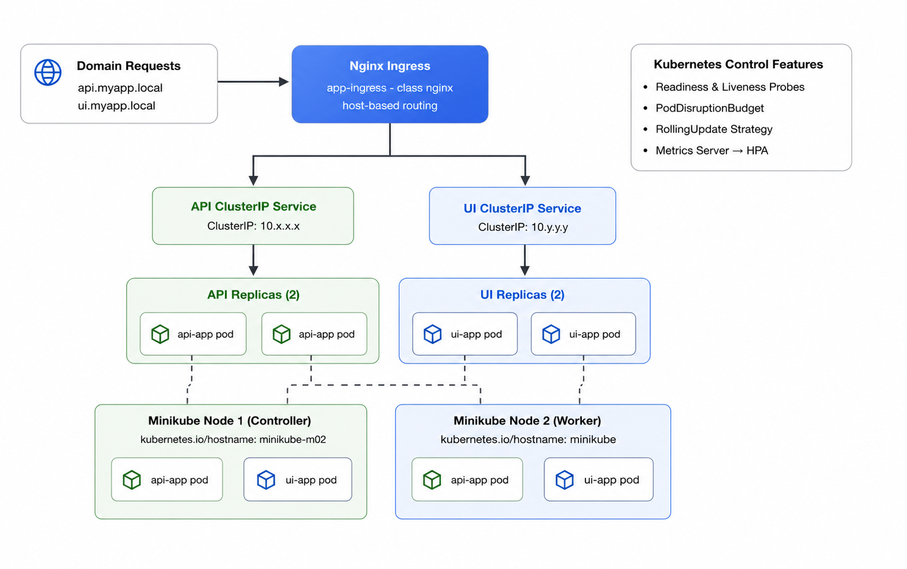

# Junior DevOps Engineer Exam – Solution

**Author:** Mark Andrei Castillo (`draiimon`)
**Exam Date:** 2026  
**Applications:**
- API Backend: FastAPI (Python)
- UI Frontend: Next.js (Node.js)

---

## Application Components: Clone the Sample Applications

The exam uses two sample applications hosted in Bitbucket. Clone both repositories
before building the Docker images or starting Docker Compose.

From the repository root on the Linux/WSL machine:

```bash
cd part2-docker

# Clone the FastAPI backend
git clone https://bitbucket.org/metawhale/fast-api-clean api-src

# Clone the Next.js frontend
git clone https://bitbucket.org/metawhale/nextjs_app ui-src
```

The resulting structure should look like this:

```text
part2-docker/
├── api/                 # Dockerfile and Python dependency definitions
├── api-src/             # cloned FastAPI application source
├── ui/                  # Dockerfile for the frontend
├── ui-src/              # cloned Next.js application source
└── docker-compose.yml
```

The Docker Compose file uses `api-src` and `ui-src` as its build contexts:

```yaml
services:
  api:
    build:
      context: ./api-src
  ui:
    build:
      context: ./ui-src
```

If the repositories have already been cloned, do not run `git clone` again.
Use `git pull` inside `api-src` or `ui-src` to update an existing checkout.

---

## Table of Contents

1. [Linux Basics](#part-1-linux-basics)
2. [Docker Containerization](#part-2-docker-containerization)
3. [CI/CD Pipeline](#part-3-cicd-pipeline)
4. [High Availability Deployment](#part-4-high-availability-deployment)

---

## Part 1: Linux Basics

See [`documentation/Part1-Linux-Basics-Documentation.md`](documentation/Part1-Linux-Basics-Documentation.md)
for the full command documentation and evidence.

Scripts:
- `part1-linux/system_health.sh` – System health monitoring script
- `part1-linux/backup.sh` – Automated timestamped backup script
- `part1-linux/log_analysis.sh` – Log analysis script

---

## Part 2: Docker Containerization

### Building and Running

```bash
# Build the API image
docker build -t api-app:latest ./part2-docker/api

# Run the API
docker run -p 8000:8000 api-app:latest

# Build the UI image
docker build -t ui-app:latest ./part2-docker/ui

# Run the UI
docker run -p 3000:3000 ui-app:latest

# Or run both with Docker Compose
cd part2-docker
docker-compose up --build
```

### Environment Variables

| Variable       | Default  | Description                    |
|----------------|----------|--------------------------------|
| `PORT`         | `8000`   | API server port                |
| `DATABASE_URL` | —        | Database connection string     |
| `NEXT_PUBLIC_API_URL` | `http://api:8000` | API URL for UI     |

---

## Part 3: CI/CD Pipeline

**Status:** Core requirements complete. The verified GitHub Actions pipeline
runs `Verify → Build → Test → Push images to Docker Hub` on the `staging`
branch, updates the staging runtime with the published images, and has
successful email-notification evidence. The optional image security scan and
live rollback exercise remain optional follow-up work.

See [`documentation/Part3-CICD-Documentation.md`](documentation/Part3-CICD-Documentation.md)
for the five official PDF-aligned tasks.

---

## Part 4: High Availability Deployment

Platform: **Kubernetes** (recommended option)

The complete Part 4 submission guide is
[`documentation/Part4-High-Availability-Documentation.md`](documentation/Part4-High-Availability-Documentation.md).
It follows the PDF's four requirement areas: redundancy, load distribution,
domain-based access, and orchestration. The selected and completed path is a
raw Kubernetes deployment on a two-node Minikube cluster.

### Architecture



This is the current Part 4 architecture diagram. It summarizes the exam's
four requirement areas: redundancy, load distribution, domain-based access,
and Kubernetes orchestration. The linked Part 4 runtime screenshots are the
authoritative evidence for exact pod placement and node names.

```
Internet
    │
    ▼
┌─────────────┐
│   Ingress   │  (nginx ingress controller)
│  Controller │  api.myapp.local / ui.myapp.local
└──────┬──────┘
       │
   ┌───┴───┐
   │       │
   ▼       ▼
┌─────┐ ┌─────┐
│ API │ │ UI  │  (2 replicas each)
│ Pod │ │ Pod │
│ Pod │ │ Pod │
└─────┘ └─────┘
```

### Deploy to Kubernetes

```bash
# Apply the namespace first, then the application manifests
kubectl apply -f part4-ha/k8s/namespace.yaml
kubectl apply -f part4-ha/k8s/

# Watch rollout
kubectl rollout status deployment/api-app -n devops-exam
kubectl rollout status deployment/ui-app -n devops-exam

# Check pods
kubectl get pods -n devops-exam -o wide
```

### Configure Local DNS

Add to `/etc/hosts`:

```
127.0.0.1  api.myapp.local
127.0.0.1  ui.myapp.local
```

Then access via:
- `http://api.myapp.local/docs` (FastAPI Swagger UI)
- `http://ui.myapp.local` (Next.js frontend)

### Testing Failover

```bash
# Get list of running pods
kubectl get pods -n devops-exam

# Kill one pod to test failover (Kubernetes will auto-restart it)
kubectl delete pod <api-pod-name> -n devops-exam

# Watch recovery in real time
kubectl get pods -n devops-exam -w
```

For reproducibility, copy the latest repository files into the local WSL
checkout and run the verifier preflight before repeating a Part 4 evidence
run. The final evidence has already been captured. For a local image:

```bash
EXPECTED_API_IMAGE=devops-api:part4-local \
  ./part4-ha/verify-runtime-evidence.sh --preflight
```

For the published image, use
`EXPECTED_API_IMAGE=draiimon112/devops-api:staging` instead. The preflight
checks that both API replicas are Ready, use one expected image, appear in the
API EndpointSlice, are not behind an active Ingress rewrite, and that
`/instance` returns HTTP 200 before any evidence loop begins.

---

## Architecture Decisions

- **Multi-stage Docker builds** – Keeps production images small and clean; build tools stay in builder stage only
- **Non-root containers** – Runs apps as unprivileged users for security
- **Kubernetes over Docker Swarm** – Better ecosystem, native auto-scaling, and industry standard
- **GitHub Actions** – Tight integration with source control, free tier, matrix builds
- **Namespace isolation** – All resources in `devops-exam` namespace for easy cleanup
- **Rolling updates** – Zero-downtime deploys with `maxUnavailable: 0`

---

## Troubleshooting

### Container won't start
```bash
docker logs <container_id>
docker inspect <container_id>
```

### Pod crashing in Kubernetes
```bash
kubectl describe pod <pod-name> -n devops-exam
kubectl logs <pod-name> -n devops-exam --previous
```

### CI/CD pipeline failing
- Check GitHub Actions logs under the **Actions** tab
- Verify all secrets are correctly set in repository settings
- Make sure Docker Hub credentials haven't expired
