# Part 2: Docker Containerization — Documentation

**Candidate:** draiimon  
**Machine:** Aloof — WSL2 (Ubuntu 24.04 on Windows)  
**Date Completed:** August 7, 2026
**Exam:** Junior DevOps Engineer Exam 2026

---

## Environment Overview

All Part 2 tasks were performed on **WSL2 (Windows Subsystem for Linux 2)**
running Ubuntu 24.04 on a Windows machine. Docker was used to build and run the
FastAPI backend, Next.js frontend, and MySQL database required by the exam.

| Item | Value |
|------|-------|
| Operating system | Ubuntu 24.04 on WSL2 |
| Username | `draiimon` |
| Hostname | `Aloof` |
| Working directory | `~/devops-exam/part2-docker` |
| Docker | Docker version `29.1.3` |
| Compose available | Legacy `docker-compose` version `1.29.2` |
| API repository | Bitbucket `metawhale/fast-api-clean` |
| UI repository | Bitbucket `metawhale/nextjs_app` |
| API container port | `8000` |
| UI container port | `3000` |
| Database image | `mysql:8.0` |
| Database internal port | `3306` |

The cloned FastAPI application uses the MySQL driver and connection format
`mysql+pymysql://root:password@db:3306/testdb`. Therefore, the final Compose
database had to be MySQL rather than the PostgreSQL container used during the
earlier failed attempt.

---

## Task 1 — API Backend Containerization

### Commands Executed

```bash
cd ~/devops-exam/part2-docker

git clone https://bitbucket.org/metawhale/fast-api-clean api-src

find api-src -maxdepth 1 -type f -print | sort

cp api/Dockerfile api-src/Dockerfile

ls -l api-src/Dockerfile api-src/requirements.txt
cat api-src/Dockerfile

docker build -t api-app:latest ./api
```

### Output

```text
API source files:
api-src/database.py
api-src/main.py
api-src/models.py
api-src/requirements.txt
api-src/schemas.py

-rw-r--r-- ... api-src/Dockerfile
-rw-r--r-- ... api-src/requirements.txt

DEPRECATED: The legacy builder is deprecated and will be removed in a future release.
Successfully built 1ca9c3c0e40e
Successfully tagged api-app:latest
```

The first independent API image build completed successfully. The legacy builder
message was recorded as a warning, not as a build failure.

### Explanation

| Command or Dockerfile line | What it does |
|----------------------------|--------------|
| `cd ~/devops-exam/part2-docker` | Enters the Part 2 project directory so all relative paths point to the correct folders. |
| `git clone ... api-src` | Downloads the FastAPI application from Bitbucket into the `api-src` build context. |
| `find api-src -maxdepth 1 -type f` | Verifies that the real API source and dependency files exist before building. |
| `cp api/Dockerfile api-src/Dockerfile` | Places the container definition inside the cloned API source directory. |
| `ls -l` | Confirms that the API Dockerfile and `requirements.txt` are present. |
| `cat api-src/Dockerfile` | Prints the complete Dockerfile for inspection. |
| `docker build -t api-app:latest ./api` | Builds and tags the independently tested API image from the original API build context. |
| `FROM python:3.11-slim AS builder` | Uses a small Python image for installing build dependencies. |
| `WORKDIR /build` | Sets the dependency build directory inside the image. |
| `apt-get install ... gcc` | Installs the compiler needed by packages that may require native compilation. |
| `COPY requirements.txt .` | Copies the dependency list before application code so the dependency layer can be cached. |
| `pip install --prefix=/install ...` | Installs Python dependencies into a separate directory for the runtime stage. |
| `FROM python:3.11-slim AS runtime` | Starts a clean runtime stage without the builder-only compiler. |
| `groupadd` and `useradd` | Create the non-root `appgroup` and `appuser` runtime identities. |
| `COPY --from=builder /install /usr/local` | Copies only the installed Python packages into the runtime image. |
| `COPY --chown=appuser:appgroup . .` | Copies the cloned application and assigns ownership to the non-root user. |
| `USER appuser` | Prevents the API process from running as root. |
| `ENV PORT=8000` and `EXPOSE 8000` | Defines and documents the FastAPI listening port. |
| `HEALTHCHECK ... localhost:8000/` | Tests the actual root endpoint exposed by the cloned API. |
| `CMD ["sh", "-c", "..."]` | Waits for the `db` service on port `3306`, then starts Uvicorn. |
| `uvicorn main:app --host 0.0.0.0` | Starts the FastAPI `app` object and makes it reachable through Docker port mapping. |

The API Dockerfile satisfies the exam requirements for a Python base image,
dependency installation, exposed port, multi-stage optimization, health check,
and non-root runtime user. The database wait loop was added because the API
must not begin database work before MySQL is reachable.

### 📸 Screenshots

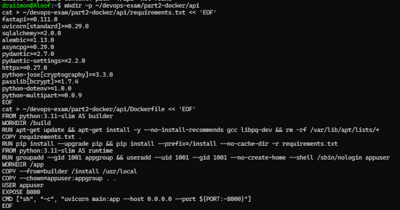

**Screenshot Explanation:** The terminal shows the initial Docker project setup,
the API/UI folders, and the creation of the Dockerfile files. This proves that
the working directories were organized before the image builds began.

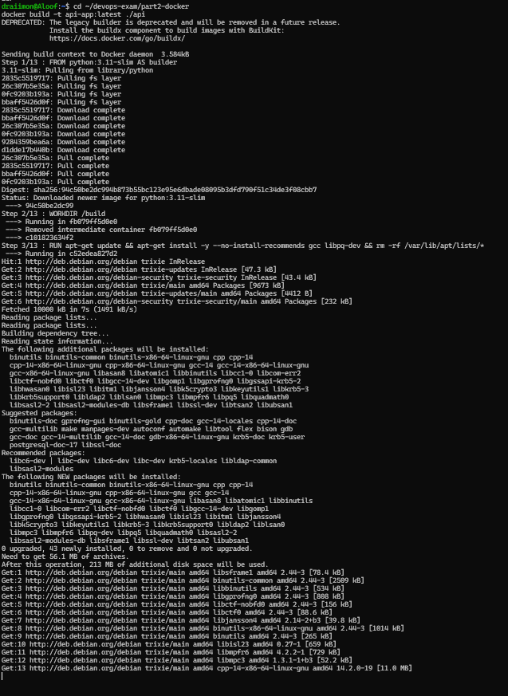

**Screenshot Explanation:** The screenshot shows the `docker build` output for the
API image, including the Python dependencies and successful image tag. This proves
that `api-app:latest` was built successfully.

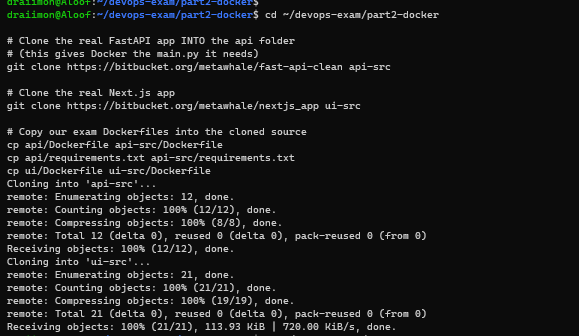

**Screenshot Explanation:** The screenshot shows the Bitbucket clone commands and
the source files retrieved for the FastAPI and Next.js applications. This proves
that the real application source was used as the Docker build context.

---

## Task 2 — UI Frontend Containerization

### Commands Executed

```bash
cd ~/devops-exam/part2-docker

git clone https://bitbucket.org/metawhale/nextjs_app ui-src

find ui-src -maxdepth 1 -type f -print | sort

cp ui/Dockerfile ui-src/Dockerfile

ls -l ui-src/Dockerfile ui-src/package.json
cat ui-src/Dockerfile

docker build -t ui-app:latest ./ui
```

### Output

```text
UI source files:
ui-src/next.config.js
ui-src/package-lock.json
ui-src/package.json

added 276 packages, and audited 277 packages in 22s
13 vulnerabilities (4 moderate, 8 high, 1 critical)

✓ Compiled successfully
✓ Generating static pages (5/5)
Successfully built 2a7aab427a68
Successfully tagged ui-app:latest
```

The UI image was built and tagged successfully. The npm vulnerability audit
notice was preserved as a dependency warning; it did not stop the production
Next.js build.

### Explanation

| Command or Dockerfile line | What it does |
|----------------------------|--------------|
| `git clone ... ui-src` | Downloads the Next.js frontend into the `ui-src` Docker build context. |
| `find ui-src -maxdepth 1 -type f` | Verifies that the Next.js package files and configuration exist. |
| `cp ui/Dockerfile ui-src/Dockerfile` | Places the UI Dockerfile alongside the cloned source. |
| `ls -l` | Confirms the Dockerfile and `package.json` are available. |
| `cat ui-src/Dockerfile` | Prints the UI Dockerfile for review before building. |
| `docker build -t ui-app:latest ./ui` | Builds and tags the independently tested UI image. |
| `FROM node:20-alpine AS builder` | Uses a small Node.js Alpine base image for the frontend build. |
| `addgroup` and `adduser` | Creates the non-root `nodejs` group and `nextjs` user. |
| `WORKDIR /app` | Sets the application directory inside the image. |
| `COPY package.json package-lock.json ./` | Copies dependency manifests first for reproducible, cacheable installs. |
| `RUN npm ci` | Installs the exact locked dependency versions from `package-lock.json`. |
| `COPY . .` | Copies the cloned Next.js application source into the image. |
| `RUN npm run build` | Creates the optimized production Next.js build. |
| `NODE_ENV=production` | Runs the frontend in production mode. |
| `NEXT_TELEMETRY_DISABLED=1` | Disables Next.js anonymous telemetry inside the container. |
| `PORT=3000` and `HOSTNAME=0.0.0.0` | Configures the listening port and makes the server reachable from Docker. |
| `USER nextjs` | Runs the Next.js server as a non-root user. |
| `EXPOSE 3000` | Documents the port used by the frontend. |
| `HEALTHCHECK ... wget -qO-` | Requests the UI root page and reports container health based on the response. |
| `CMD ["npm", "start"]` | Starts the cloned project using its production package script. |

The UI Dockerfile satisfies the exam requirements for a Node.js base image,
production build, exposed port, production environment, health check, and
non-root runtime. The final command is `npm start`, which matches the cloned
Next.js application's `package.json`.

### Build Warnings

| Warning | Meaning | Effect |
|---------|---------|--------|
| `13 vulnerabilities` | The cloned npm dependency tree contains audit findings. | The image build and Next.js production compilation still completed. |
| Outdated Browserslist data | The browser compatibility database needs maintenance. | It did not prevent compilation. |
| Next.js telemetry notice | Next.js reports its telemetry behavior. | Telemetry was disabled with `NEXT_TELEMETRY_DISABLED=1`. |

### 📸 Screenshots

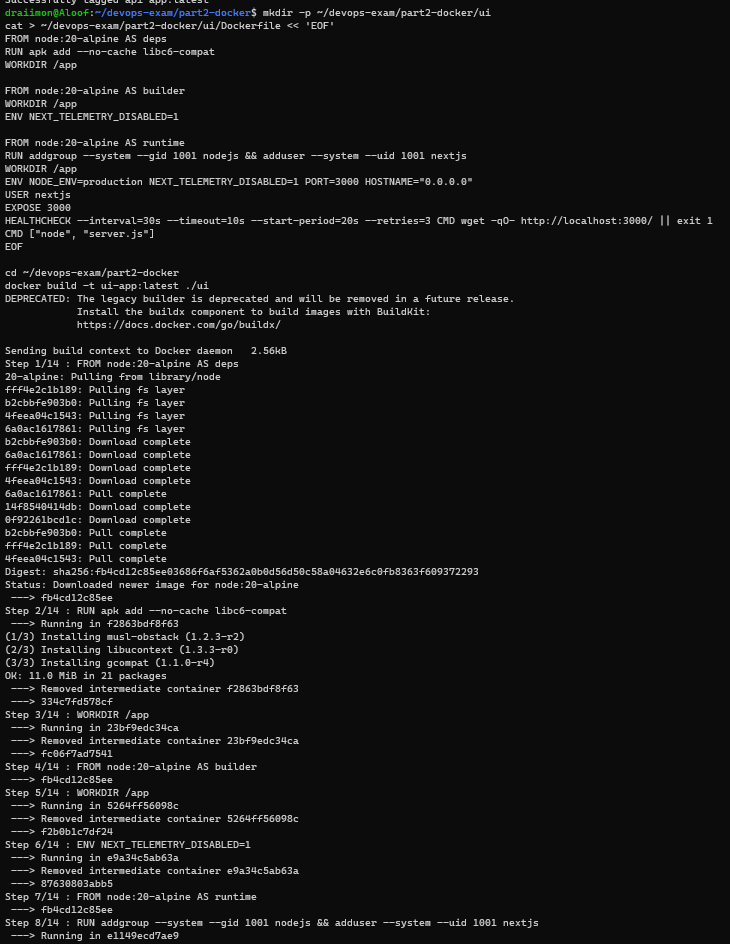

**Screenshot Explanation:** The screenshot shows the start of the UI Docker build,
including the Node.js base image and `npm ci` dependency installation. This proves
that the production build started with the locked package dependencies.

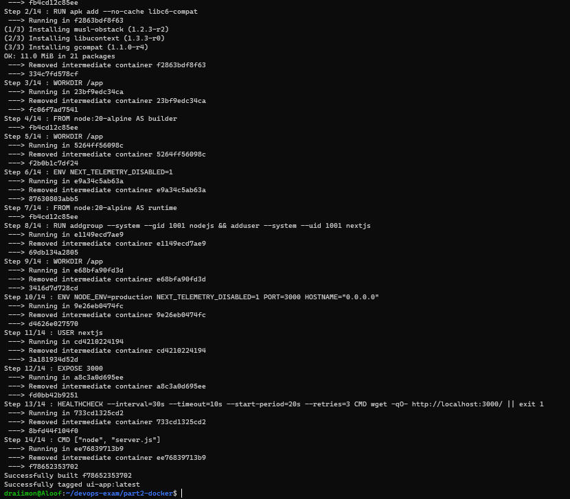

**Screenshot Explanation:** The screenshot shows the successful Next.js compilation
and image tagging after the build. This proves that `ui-app:latest` is ready for
container execution.

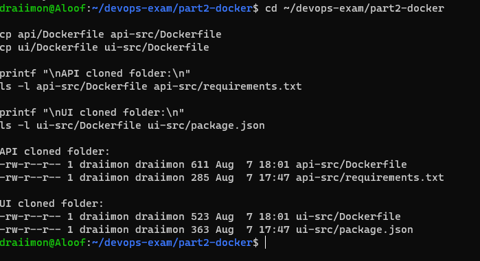

**Screenshot Explanation:** The screenshot shows the copy commands and file listing
after the Dockerfiles were placed in `api-src` and `ui-src`. This proves that the
container definitions are in the correct cloned source folders.

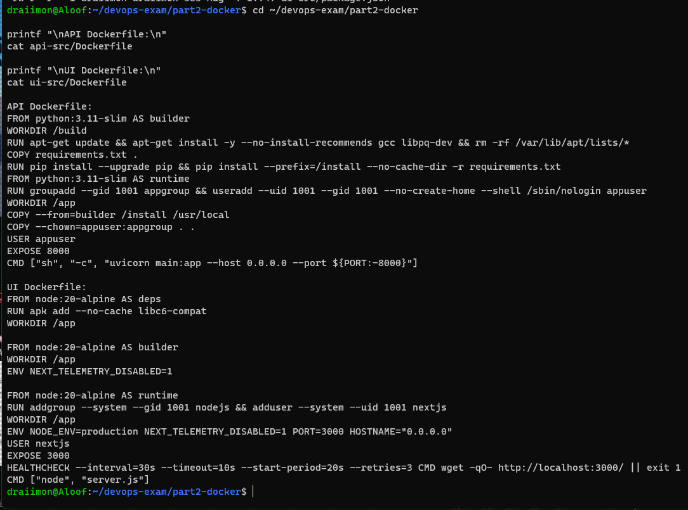

**Screenshot Explanation:** The screenshot shows the inspection output for the API
and UI Dockerfiles, including the base images, build commands, non-root users,
health checks, and startup commands. This proves that the Dockerfiles were
reviewed before the final build.

---

## Task 3 — Local Docker Build and Run

### Commands Executed

```bash
cd ~/devops-exam/part2-docker

docker build -t api-app:latest ./api
docker build -t ui-app:latest ./ui

docker images | grep -E "api-app|ui-app"

docker run -d -p 8000:8000 --name devops_api api-app:latest
docker run -d -p 3000:3000 --name devops_ui ui-app:latest

docker ps
curl http://localhost:8000/
curl http://localhost:3000/
```

### Output

```text
api-app   latest   ...
ui-app    latest   ...

# Early local execution:
devops_api   ...   Exited (255)
devops_ui    ...   Exited (255)

curl: (7) Failed to connect to localhost port 8000
curl: (7) Failed to connect to localhost port 3000
```

The first local execution was intentionally preserved because it exposed a
problem: the images were built before the real Bitbucket source was available in
the build contexts. The images existed, but the application containers exited.

After the repositories were cloned, the Dockerfiles were copied into
`api-src/` and `ui-src/`, and the images were rebuilt from the actual source.
The corrected source-based images were then used by Docker Compose in Task 4.

### Explanation

| Command or option | What it does |
|-------------------|--------------|
| `docker build -t api-app:latest ./api` | Builds the API image independently as required by the exam. |
| `docker build -t ui-app:latest ./ui` | Builds the UI image independently as required by the exam. |
| `docker images` | Lists local images and confirms that both tags were created. |
| `grep -E "api-app|ui-app"` | Filters the image list to the two application images. |
| `docker run -d` | Starts a container in detached mode. |
| `-p 8000:8000` | Maps host port `8000` to the API container port. |
| `-p 3000:3000` | Maps host port `3000` to the UI container port. |
| `--name devops_api` and `--name devops_ui` | Assigns readable names to the containers. |
| `docker ps` | Shows only containers that are still running. |
| `curl http://localhost:8000/` | Tests the API from the host. |
| `curl http://localhost:3000/` | Tests the UI from the host. |

### Problem and Solution

| Problem observed | Cause | Solution |
|------------------|-------|----------|
| API and UI containers exited with `Exit 255` | The early image contexts did not contain the real application entry points. | Clone both repositories, copy the Dockerfiles into `api-src/` and `ui-src/`, rebuild, and run the source-based images. |
| Curl could not connect to ports `8000` and `3000` | The application processes had already stopped. | Confirm container status with `docker ps`, inspect the build context, rebuild from the cloned source, and use the corrected Compose stack. |
| Legacy Docker builder deprecation notice | Docker version `29.1.3` was using the installed legacy builder. | Record it as a tooling warning; the image builds completed successfully. |

This task demonstrates both the required `docker build` and `docker run`
commands, including the actual failed attempt and the reason it was corrected
before final verification.

### 📸 Screenshots

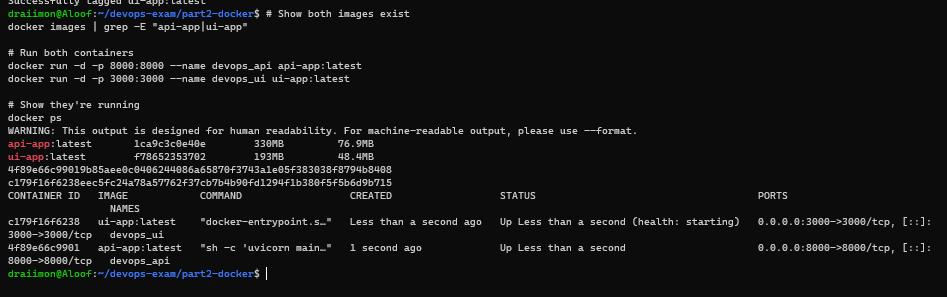

**Screenshot Explanation:** The screenshot shows the initial `docker images` and
`docker run` attempts for the API and UI. This documents the first local execution
phase before it was discovered that the real application source was missing from
the build context.

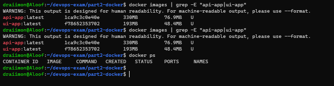

**Screenshot Explanation:** The screenshot shows the follow-up container/status
check where the containers did not remain running. This documents the failed
attempt and explains why the repositories had to be cloned before rebuilding.

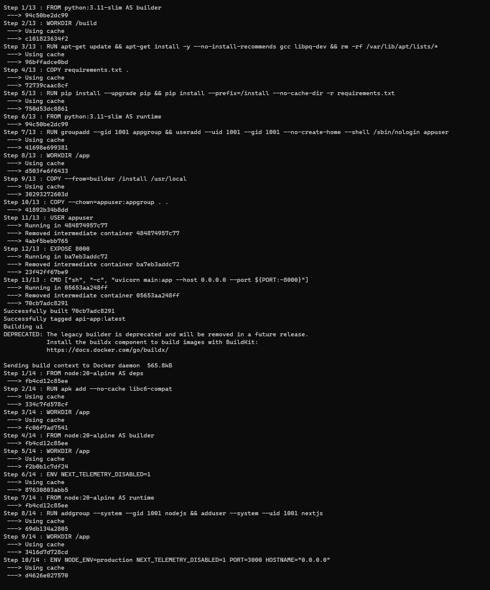

**Screenshot Explanation:** The screenshot shows the build output for both the API
and UI from the cloned source folders. This proves that the corrected,
source-based image builds completed successfully.

---

## Task 4 — Docker Compose, Networking, and Final Verification

### Commands Executed

```bash
cd ~/devops-exam/part2-docker

docker compose config
docker-compose config

docker-compose up -d
docker-compose ps

docker rm -f devops_db devops_api devops_ui 04417543e677_devops_db 2>/dev/null || true

docker-compose build
docker-compose up -d
docker-compose logs --tail=100

curl http://localhost:8000/
curl http://localhost:3000/
curl http://localhost:8000/trip

curl -X POST http://localhost:8000/trip \
  -H "Content-Type: application/json" \
  -d '{"name":"Docker Test Trip","description":"Test record from Docker","joiner_total_count":1}'

curl http://localhost:8000/trip
docker ps
```

### Output

```text
# New Compose syntax was unavailable:
docker: unknown command: docker compose

# Supported legacy command:
docker-compose config
Configuration validated

# First startup problem:
ERROR: for devops_db  'ContainerConfig'
ERROR: for db  'ContainerConfig'
KeyError: 'ContainerConfig'

# Earlier database log:
PostgreSQL 15.18
listening on ... port 5432

# Earlier application status:
devops_api   ...   Exit 255
devops_ui    ...   Exit 255

# Final API response:
{"message":"Fast Api Exam api v1"}

# Final empty trip response before creating a record:
[]

# Final UI response:
<!DOCTYPE html><html lang="en">
...
<h1>Next.js Data App</h1>
...

# Final container status:
devops_api   api-app:latest   Up (healthy)   0.0.0.0:8000->8000/tcp
devops_db    mysql:8.0        Up (healthy)   3306/tcp
devops_ui    ui-app:latest    Up (healthy)   0.0.0.0:3000->3000/tcp
```

The POST request created the `Docker Test Trip` record. The following GET request
returned the stored record, proving API-to-MySQL communication and persistence.

### Explanation

#### Compose command explanation

| Command or option | What it does |
|-------------------|--------------|
| `docker compose config` | Attempts the newer space-separated Compose syntax. It failed because the installed host only had legacy Compose. |
| `docker-compose config` | Validates and renders the Compose file using the installed `docker-compose` 1.29.2 executable. |
| `docker-compose build` | Builds the API and UI services from their cloned source contexts. |
| `docker-compose up -d` | Creates and starts the API, UI, and database services in detached mode. |
| `docker-compose ps` | Displays the status of all Compose-managed containers. |
| `docker-compose logs --tail=100` | Shows recent service logs for startup and troubleshooting. |
| `docker rm -f ...` | Removes stale containers so legacy Compose can recreate the corrected stack. |
| `docker ps` | Confirms the final running containers, health status, images, and port mappings. |

#### `docker-compose.yml`

```yaml
services:
  api:
    build:
      context: ./api-src
      dockerfile: Dockerfile
    image: api-app:latest
    container_name: devops_api
    restart: unless-stopped
    ports:
      - "8000:8000"
    environment:
      - PORT=8000
      - DB_CONNECTION_STRING=${DB_CONNECTION_STRING:-mysql+pymysql://root:password@db:3306/testdb}
      - DEBUG=${DEBUG:-false}
    depends_on:
      db:
        condition: service_started
    healthcheck:
      test: ["CMD", "python", "-c",
             "import urllib.request; urllib.request.urlopen('http://localhost:8000/')"]
      interval: 30s
      timeout: 10s
      retries: 3
      start_period: 15s
    networks:
      - app-network

  ui:
    build:
      context: ./ui-src
      dockerfile: Dockerfile
    image: ui-app:latest
    container_name: devops_ui
    restart: unless-stopped
    ports:
      - "3000:3000"
    environment:
      - NODE_ENV=production
      - NEXT_PUBLIC_API_URL=${NEXT_PUBLIC_API_URL:-http://localhost:8000}
      - PORT=3000
    depends_on:
      - api
    healthcheck:
      test: ["CMD", "wget", "-qO-", "http://localhost:3000/"]
      interval: 30s
      timeout: 10s
      retries: 3
      start_period: 20s
    networks:
      - app-network

  db:
    image: mysql:8.0
    container_name: devops_db
    restart: unless-stopped
    environment:
      - MYSQL_ROOT_PASSWORD=password
      - MYSQL_DATABASE=testdb
    volumes:
      - mysql-data:/var/lib/mysql
    healthcheck:
      test: ["CMD-SHELL", "mysqladmin ping -h localhost -uroot -p$${MYSQL_ROOT_PASSWORD} --silent"]
      interval: 10s
      timeout: 5s
      retries: 5
    networks:
      - app-network

networks:
  app-network:
    driver: bridge

volumes:
  mysql-data:
```

| Compose line or group | What it does |
|-----------------------|--------------|
| `services:` | Begins the list of containers managed by Compose. |
| `api:` | Defines the FastAPI backend service. |
| `context: ./api-src` | Builds the API from the cloned FastAPI source. |
| `image: api-app:latest` | Names and tags the API image. |
| `"8000:8000"` | Publishes the API to host port `8000`. |
| `DB_CONNECTION_STRING` | Provides the API with the MySQL connection string and the `db` service hostname. |
| `depends_on: db` | Starts the API after the database container has started. |
| API `healthcheck` | Requests the API root endpoint to determine whether it is healthy. |
| `ui:` | Defines the Next.js frontend service. |
| `context: ./ui-src` | Builds the UI from the cloned Next.js source. |
| `image: ui-app:latest` | Names and tags the UI image. |
| `"3000:3000"` | Publishes the UI to host port `3000`. |
| `NODE_ENV=production` | Runs Next.js in production mode. |
| `NEXT_PUBLIC_API_URL` | Gives the browser-side UI the host-accessible API URL. |
| `depends_on: api` | Starts the UI after the API container has started. |
| UI `healthcheck` | Uses `wget` to request the frontend root page. |
| `db:` | Defines the MySQL database service. |
| `image: mysql:8.0` | Uses the database engine compatible with `mysql+pymysql`. |
| `MYSQL_ROOT_PASSWORD` | Sets the local database root password. |
| `MYSQL_DATABASE=testdb` | Creates the database expected by the API. |
| `mysql-data:/var/lib/mysql` | Persists database records in a named volume. |
| Database `healthcheck` | Uses `mysqladmin ping` to confirm that MySQL accepts connections. |
| No database `ports` mapping | Keeps MySQL internal to the Docker network instead of exposing it to the host. |
| `app-network` with `bridge` | Allows API, UI, and database service-name communication. |

#### API and UI verification explanation

| Command | What it verifies |
|---------|------------------|
| `curl http://localhost:8000/` | Confirms that the FastAPI root endpoint responds through the published port. |
| `curl http://localhost:3000/` | Confirms that the production Next.js page responds through the published port. |
| `curl http://localhost:8000/trip` | Confirms that the API can query the database-backed route. |
| `curl -X POST ... /trip` | Creates a test trip through the running API. |
| Second `curl ... /trip` | Confirms that the created record was persisted and can be read back. |

### Problems Encountered and Solutions

| Problem or error | Evidence | Cause | Solution |
|------------------|----------|-------|----------|
| `docker: unknown command: docker compose` | New Compose command output | Only legacy `docker-compose` 1.29.2 was installed. | Use `docker-compose config`, `docker-compose build`, and `docker-compose up -d`. |
| `KeyError: 'ContainerConfig'` | First `docker-compose up -d` traceback | Legacy Compose attempted to recreate stale container metadata. | Remove stale containers and recreate the stack. |
| PostgreSQL appeared instead of MySQL | Logs showed PostgreSQL 15 on port `5432`. | An old database container remained from the earlier setup. | Use `mysql:8.0` and the API's `mysql+pymysql` connection string. |
| API/UI `Exit 255` | Compose status and failed curl requests. | Stale or incompatible containers were being used. | Clean containers, rebuild from cloned source, and start the corrected Compose stack. |
| Curl connection failures | Ports `8000` and `3000` refused connections. | The application processes were not still running. | Inspect status/logs, correct the source and database setup, then verify the healthy stack. |
| Legacy Compose `watch_events` `KeyError: 'id'` | `docker-compose up --build` log. | Old Compose event handling encountered a Docker event without the expected ID. | Use detached startup and verify with `ps`, logs, health checks, and curl. |
| `debconf` frontend warnings | API build output. | The Docker build had no interactive terminal. | Record as a non-fatal build warning; the build completed. |
| pip root warning | API builder output. | Dependencies were installed as root in the temporary builder stage. | Keep the final application process under `appuser`. |

The cleanup command removed stale containers only. The named `mysql-data` volume
was retained, so database persistence was not intentionally deleted.

### 📸 Screenshots

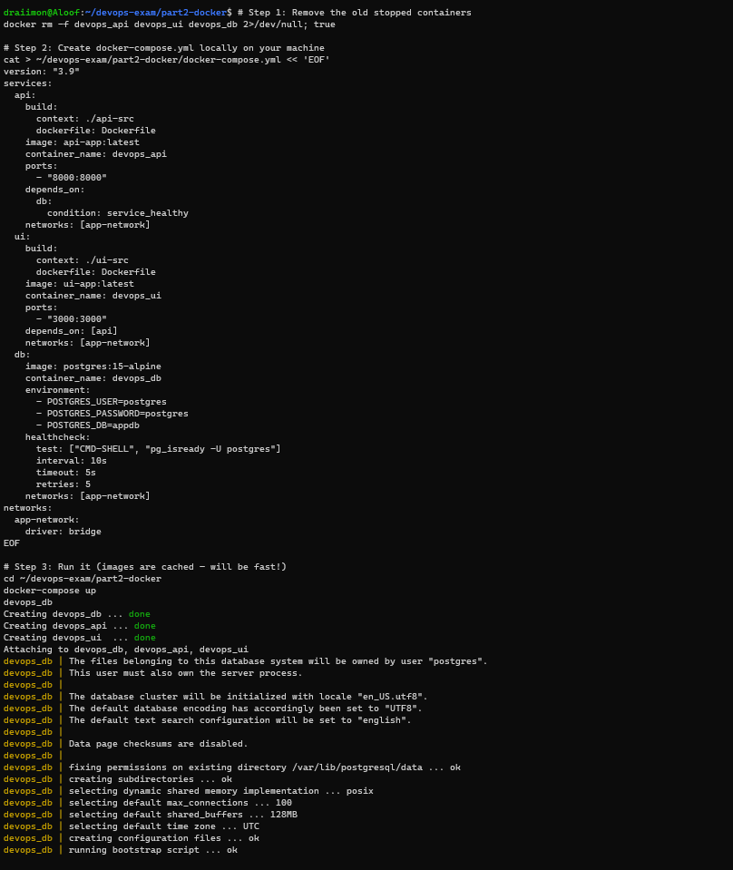

**Screenshot Explanation:** The screenshot shows the Docker Compose configuration
for the API, UI, and database services, including ports, environment values,
network, and volume. This proves that the complete local application stack was
configured.

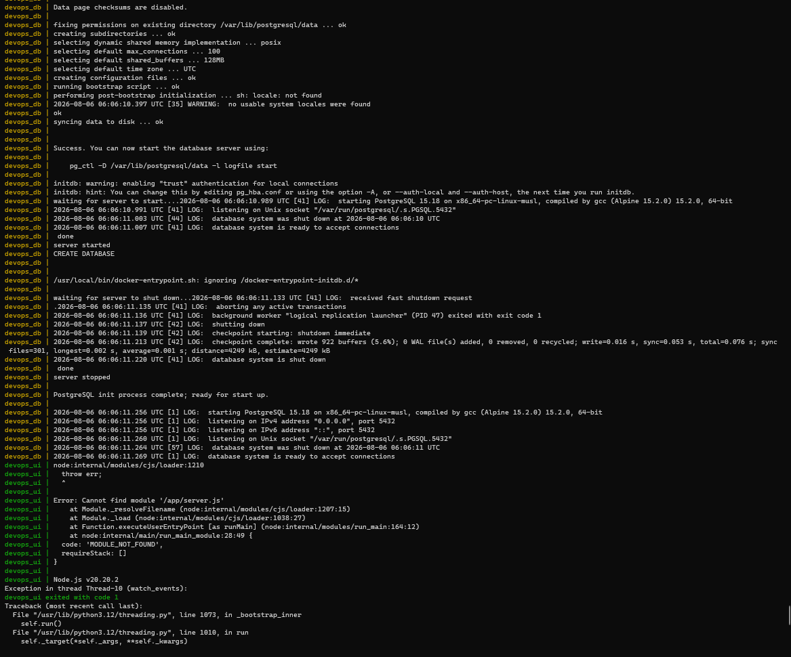

**Screenshot Explanation:** The screenshot shows the startup logs for MySQL,
FastAPI, and Next.js. This proves that the connected services started and that
the API waited for the database connection.

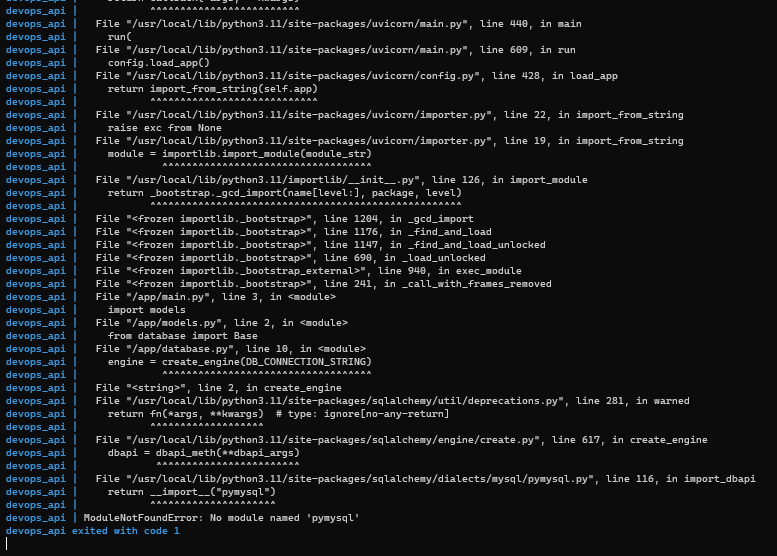

**Screenshot Explanation:** The screenshot shows the earlier Compose error and the
database diagnostic output pointing to the stale PostgreSQL setup. This documents
the actual problem encountered and why the configuration had to be changed to
MySQL.

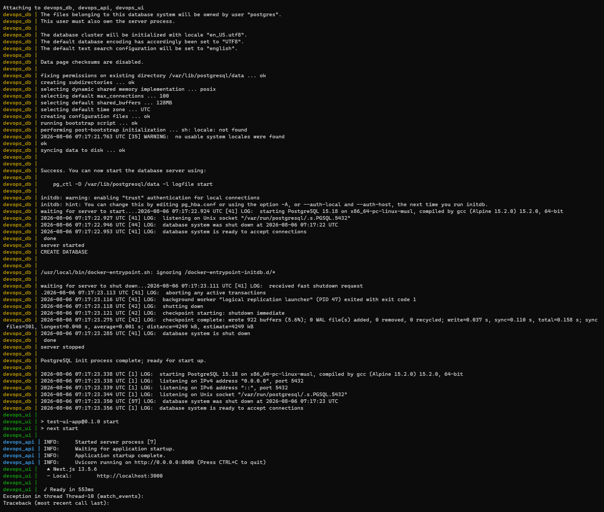

**Screenshot Explanation:** The screenshot shows the API, UI, and MySQL containers
running together. This proves that Compose networking and service startup worked
after the configuration was corrected.

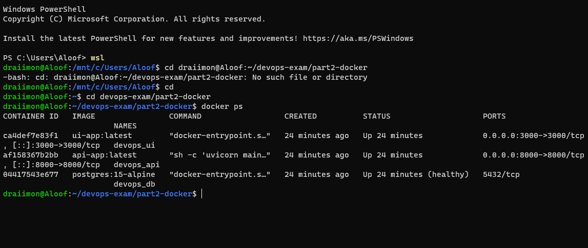

**Screenshot Explanation:** The `docker ps` output shows `devops_api`,
`devops_db`, and `devops_ui` as `Up (healthy)`, along with the API/UI port
mappings. This is the final proof that the complete containerized stack is healthy.

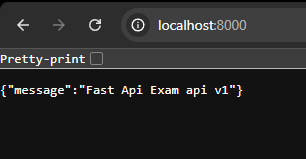

**Screenshot Explanation:** The screenshot shows the FastAPI root endpoint response
in the browser. This proves that the API is accessible through published port
`8000` from the host machine.

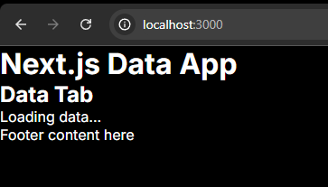

**Screenshot Explanation:** The screenshot shows the rendered Next.js application
page in the browser. This proves that the production UI is accessible and being
served correctly through published port `3000`.

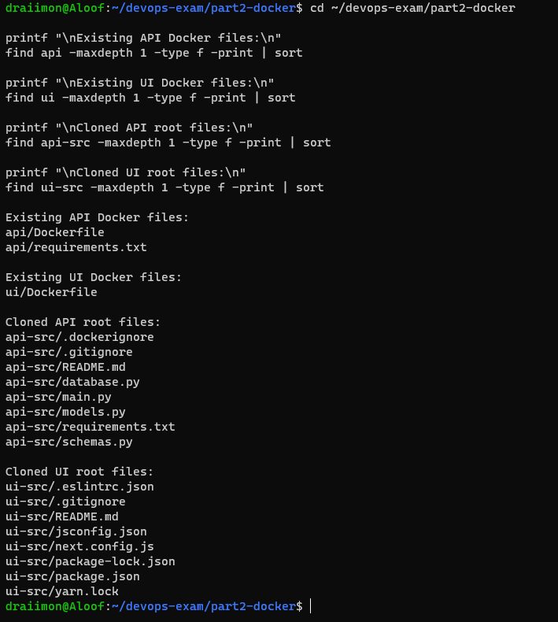

**Screenshot Explanation:** The screenshot shows the final file check for the
cloned source, Dockerfiles, and Compose project files. This proves that all files
required for the final stack verification are present.

---

## Extra Operational Guide — Stopping, Restarting, and Rerunning Containers

This section documents the normal Docker container lifecycle after the images have
already been built. Building an image and running a container are separate
operations: rebuilding is not required every time the application is stopped and
started again.

### Check the current Compose status

```bash
cd ~/devops-exam/part2-docker
docker-compose ps
```

`docker-compose ps` lists the API, UI, and database containers managed by the
Compose project, including whether each container is running and healthy.

### Stop and start the existing containers

```bash
docker-compose stop
docker-compose ps

docker-compose start
docker-compose ps
```

`docker-compose stop` gracefully stops the running containers but keeps the
containers, images, network, and named database volume. Because the containers
still exist, `docker-compose start` can start them again without rebuilding the
images.

### Stop and remove the containers, then run them again

```bash
docker-compose down
docker-compose up -d
docker-compose ps
```

`docker-compose down` stops and removes the Compose containers and network. It
does not remove the images or the named `mysql-data` volume unless the `-v`
option is explicitly added. `docker-compose up -d` recreates and starts the
services from the existing images.

### Rebuild after changing source code or a Dockerfile

```bash
docker-compose up -d --build
```

The `--build` option tells Compose to rebuild the images before starting the
services. It is needed after changing application source files, dependencies, or
Dockerfiles. It is not necessary for an ordinary stop-and-start cycle.

### Stop and restart one container

```bash
docker stop devops_api
docker-compose ps

docker start devops_api
docker-compose ps
```

This demonstrates that the API container can be stopped and started
independently while the other services remain managed by Compose.

The equivalent Compose commands are:

```bash
docker-compose stop api
docker-compose start api
```

### Force-kill a container when it does not respond

```bash
docker kill devops_api
docker-compose ps
docker start devops_api
```

`docker kill` immediately terminates the container process. It should be used
only when a normal `docker stop` does not work. A normal stop is preferred
because it gives the application time to close connections and write pending
data safely.

### Verify that the services recovered

```bash
docker-compose ps
docker-compose logs --tail=50 api
docker-compose logs --tail=50 ui
docker-compose logs --tail=50 db

curl http://localhost:8000/
curl http://localhost:3000/
curl http://localhost:8000/trip
```

The `ps` output should show the services as running and healthy. The `curl`
commands verify that the API, UI, and database-backed API route respond after
the restart.

### Docker lifecycle command summary

| Command | Purpose |
|---------|---------|
| `docker-compose build` | Builds or rebuilds the service images. |
| `docker-compose up -d` | Creates and starts the services in detached mode. |
| `docker-compose up -d --build` | Rebuilds the images, then creates and starts the services. |
| `docker-compose stop` | Stops containers without removing them. |
| `docker-compose start` | Starts existing stopped containers without rebuilding. |
| `docker-compose down` | Stops and removes containers and the Compose network. |
| `docker stop <container>` | Gracefully stops one named container. |
| `docker start <container>` | Starts one existing stopped container. |
| `docker kill <container>` | Immediately force-stops one container. |
| `docker-compose logs --tail=50` | Displays recent logs for troubleshooting. |
| `docker-compose ps` | Verifies container state and health. |

This extra guide demonstrates operational control of the completed Docker
deployment and clarifies the difference between building images, running
containers, stopping services, and rerunning the application.

---

## ✅ Part 2 — Completion Summary

| Task | Description | Status |
|------|-------------|--------|
| Task 1 | API backend cloned, Dockerfile prepared, independently built, and documented | ✅ Complete |
| Task 2 | Next.js UI cloned, Dockerfile prepared, production-built, and documented | ✅ Complete |
| Task 3 | API and UI tested with `docker build` and `docker run`, including the failed attempt and correction | ✅ Complete |
| Task 4 | Docker Compose configured with API, UI, MySQL, network, environment variables, health checks, and volume | ✅ Complete |
| Task 4 | API root endpoint verified | ✅ Complete |
| Task 4 | UI root page verified | ✅ Complete |
| Task 4 | Database-backed `/trip` endpoint verified | ✅ Complete |
| Task 4 | Test trip created and retrieved | ✅ Complete |
| Task 4 | All containers confirmed `Up (healthy)` | ✅ Complete |
| Troubleshooting | Actual errors, warnings, causes, and solutions recorded | ✅ Complete |
| Operations guide | Stop, start, down, up, kill, logs, and health verification documented | ✅ Complete |

**All Part 2 requirements were completed and documented. Part 2 — DONE ✅**

---

## 📸 Screenshot Checklist

| Screenshot | Filename | Status |
|------------|----------|--------|
| Initial Docker setup | `task02-0-setup.png` | ✅ Present |
| API image build | `task02-1-api-build.png` | ✅ Present |
| UI build start | `task02-2-ui-build-1.png` | ✅ Present |
| UI build complete | `task02-2-ui-build-2.png` | ✅ Present |
| Early local execution | `task02-3-local-execution.png` | ✅ Present |
| Local execution follow-up | `task02-3-local-execution-2.png` | ✅ Present |
| Clone and source verification | `task02-4-git-clone.png` | ✅ Present |
| Both images built from source | `task02-4-build-both.png` | ✅ Present |
| Compose configuration | `task02-4-docker-compose.png` | ✅ Present |
| Compose startup logs | `task02-4-docker-compose-2.png` | ✅ Present |
| Earlier Compose problem | `task02-4-docker-compose-3.png` | ✅ Present |
| All services running | `task02-4-all-running.png` | ✅ Present |
| Final container status | `task02-4-docker-ps.png` | ✅ Present |
| API browser test | `task02-4-api-browser.png` | ✅ Present |
| UI browser test | `task02-4-ui-browser.png` | ✅ Present |
| Source file check | `task02-5-file-check.png` | ✅ Present |
| Dockerfiles copied | `task02-6-copy-dockerfiles.png` | ✅ Present |
| Dockerfiles inspected | `task02-7-dockerfile-check.png` | ✅ Present |
