# Part 3: CI/CD Pipeline — Documentation

**Candidate:** draiimon  
**Machine:** Aloof — WSL2 (Ubuntu 24.04 on Windows)  
**Exam:** Junior DevOps Engineer Exam 2026  
**CI/CD platform:** GitHub Actions  
**Repository:** `draiimon/draiimon-devops-playground`

> **Evidence boundary:** Part 3 work was performed on the candidate's local
> WSL/Ubuntu computer. The screenshots in `documentation/screenshots/part3/`
> and the uploaded terminal outputs are the evidence source. This document
> records confirmed work only and does not mark unfinished pipeline stages as
> complete.

---

## Environment Overview

| Item | Value |
|---|---|
| Operating system | Ubuntu 24.04 on WSL2 |
| Hostname | `Aloof` |
| Working directory | `~/devops-exam` |
| Docker | `29.1.3` |
| Local Compose command | Legacy `docker-compose` `1.29.2` |
| Docker Python client | `docker-py 5.0.3` |
| Local Python | `CPython 3.12.3` |
| Local OpenSSL | `3.0.13` |
| CI/CD platform | GitHub Actions |
| Workflow file | `.github/workflows/deploy.yml` |
| Trigger branch | `staging` |

The local WSL environment does not support the `docker compose` v2
subcommand, but provides the legacy `docker-compose` command. Therefore,
`docker-compose` is used for local validation. The GitHub Actions workflow
uses `docker compose`, which is available on the GitHub-hosted runner.

### Versioning and Reproducibility

Version information is recorded because the local WSL environment and the
GitHub-hosted runner are different environments.

| Component | Version or tag | Where used |
|---|---|---|
| GitHub Actions checkout | `actions/checkout@v4` | Workflow repository checkout |
| Docker runner image | `ubuntu-latest` | GitHub Actions jobs |
| API build base image | `python:3.11-slim` | API Dockerfile |
| Database image | `mysql:8.0` | Docker Compose |
| Local Docker | `29.1.3` | WSL preflight validation |
| Local Compose | `docker-compose 1.29.2` | WSL preflight validation |
| Image tags | `${GITHUB_SHA}`, `${GITHUB_REF_NAME}` | CI build output |

The workflow uses commit-SHA and branch-name tags so that an image can be
identified by the source revision and environment branch. The
`ubuntu-latest` runner is intentionally used for the GitHub-hosted CI job;
the exact hosted runner tool versions can change independently from the
candidate's local WSL versions.

GitHub displayed a Node.js runtime deprecation warning for the checkout
action. This was recorded as a warning and did not fail the successful starter
workflow.

---

## Part 3 Requirements Status

| PDF requirement | Current evidence | Status |
|---|---|---|
| Automatic trigger on `staging` | Workflow run triggered by a push to `staging` | ✅ Confirmed |
| Optional manual trigger | `workflow_dispatch` is present | ✅ Confirmed |
| Pipeline as Code | Root `.github/workflows/deploy.yml` | ✅ Confirmed |
| Build API and UI images | GitHub Actions built both images successfully on `staging` | ✅ CI confirmed |
| Image tagging | Deploy job tagged API and UI images with commit, branch, and `latest` Docker Hub tags | ✅ CI confirmed |
| Dockerfile validation | Compose config validation completed locally | ✅ Local preflight confirmed |
| Automated tests and linting | Test job passed: UI quality checks and API/UI Docker smoke tests completed | ✅ CI confirmed |
| Container image security scan | Optional; not yet added | ⏭️ Optional |
| Staging deployment | Separate staging Compose project is running healthy containers from the published `:staging` API and UI images | ✅ Confirmed |
| Container registry/artifact storage | Deploy job completed the Docker Hub login/tag/push sequence successfully | ✅ CI confirmed |
| Rollback strategy | Immutable commit-SHA image tags provide a documented rollback path; live rollback not tested | ✅ Strategy documented |
| Success notifications | GitHub Actions email notification confirmed for a successful run | ✅ Confirmed |

**Overall status: Core Part 3 pipeline complete; success email notification
confirmed.** The
verified pipeline now runs
**Verify → Build → Test → Push images to Docker Hub** on `staging`. A separate
staging Compose runtime is now also evidenced with healthy API, UI, and database
containers using the published registry images. GitHub Actions email
notifications are enabled and successful workflow email evidence is preserved.
A failure simulation is not required for this submission and will not be
performed.

### Final Evidence-Based Handoff — August 8, 2026

The latest supplied evidence confirms:

- automatic execution on pushes to `staging`;
- optional manual execution through `workflow_dispatch`;
- successful API and UI Docker image builds;
- successful UI linting and API/UI/Compose smoke tests;
- successful Docker Hub authentication and image publishing;
- commit-SHA, branch, and `latest` image tags;
- a successful full GitHub Actions run lasting approximately 4 minutes 14 seconds;
- a successful GitHub Actions email notification for workflow run Attempt #2;
- four non-blocking Node.js 20 deprecation warnings.

The following optional items are intentionally still open:

1. The optional Docker image security scan has not been added.
2. The rollback procedure below is documented, but a live rollback test has not
   been performed.

This is the correct submission boundary: the core pipeline and registry
publishing are complete, while unverified infrastructure and integrations remain
clearly identified instead of being overstated.

---

## Task 1 — Repository and GitHub Setup

### Confirmed actions

1. Installed GitHub CLI in WSL.
2. Created a backup of the pre-Part-3 repository.
3. Verified the GitHub remote and current branch.
4. Re-cloned the repository from GitHub.
5. Detected and removed the old Part 3 documentation and nested workflow.
6. Committed the reset as `Reset Part 3 for new walkthrough`.
7. Pushed the reset to `main`.
8. Created and inspected the new root workflow at `.github/workflows/deploy.yml`.

### Evidence

The corresponding screenshots are embedded in the PDF-aligned Task 1
walkthrough below.

---

## Task 2 — Starter Workflow and Staging Trigger

The starter workflow was stored in the repository at:

```text
.github/workflows/deploy.yml
```

The workflow:

- triggers automatically on pushes to `staging`;
- supports the optional `workflow_dispatch` manual trigger;
- checks out the repository using `actions/checkout@v4`;
- prints the branch and commit information.

The starter workflow was committed locally as:

```text
c84f2ee Add initial GitHub Actions workflow
```

### Push evidence

The local push completed successfully:

```text
9642d8d..c84f2ee  staging -> staging
```

The corresponding screenshot is embedded in the PDF-aligned Task 1 walkthrough
below.

### GitHub Actions evidence

The workflow run confirmed:

- workflow: `deploy.yml`;
- branch: `staging`;
- commit: `c84f2ee`;
- status: **Success**;
- verification job: passed;
- branch and commit information: printed in the job log.

The corresponding screenshots are embedded in the PDF-aligned Task 1
walkthrough below.

GitHub displayed a Node.js 20 deprecation warning for
`actions/checkout@v4`. The warning did not fail the workflow and is recorded
as a non-blocking warning, not as a pipeline error.

---

## Task 3 — Workflow Inspection and Docker Build Stage

The workflow was inspected locally before extending it. The corresponding
screenshots are embedded in the PDF-aligned Task 2 walkthrough below.

The Compose configuration defines these build contexts:

| Service | Build context | Dockerfile |
|---|---|---|
| API | `part2-docker/api-src` | `Dockerfile` |
| UI | `part2-docker/ui-src` | `Dockerfile` |
| Database | `mysql:8.0` image | Registry image |

The workflow build job was extended to:

1. validate `part2-docker/docker-compose.yml`;
2. build the `api` and `ui` services;
3. tag images with `GITHUB_SHA`;
4. tag images with `GITHUB_REF_NAME`;
5. list the resulting images.

The local environment check is recorded in the PDF-aligned Task 2 walkthrough
below.

The final pasted local build output confirms:

```text
Successfully built 2f9c65110975
Successfully tagged api-app:latest
Successfully built 7c5044be6886
Successfully tagged ui-app:latest
```

The Next.js production build also reported `Compiled successfully` and
generated the static pages successfully. This confirms the local preflight
build for both application images. The corresponding screenshot is embedded in
the PDF-aligned Task 2 walkthrough below.

The screenshot captures the build in progress, while the pasted terminal
output records the final successful result. The legacy Docker builder
deprecation message is a warning and did not stop either build.

The separate image verification confirmed both resulting local tags:

```text
api-app:latest  2f9c65110975
ui-app:latest   7c5044be6886
```

The corresponding screenshot is embedded in the PDF-aligned Task 2 walkthrough
below.

### GitHub Actions build verification

The updated workflow was committed and pushed to the `staging` branch. The
GitHub Actions run completed successfully and verified the Docker build stage
on a clean hosted runner.

The successful run showed:

| Item | Confirmed result |
|---|---|
| Workflow | `Add Docker image build stage` |
| Branch | `staging` |
| Commit-based image tag | `55cf266e1223b89cf5d436f51c93e18915590a79` |
| API image | `api-app` built successfully |
| UI image | `ui-app` built successfully |
| API tags | Commit SHA, `latest`, and `staging` |
| UI tags | Commit SHA, `latest`, and `staging` |
| GitHub Actions status | Success |

The build log also confirms the expected production build details:

- API base image: `python:3.11-slim`
- UI base image: `node:20-alpine`
- Next.js production compilation completed successfully
- API image size: approximately `180MB`
- UI image size: approximately `722MB`

The corresponding screenshots are embedded in the PDF-aligned Task 2
walkthrough below.

### Build warnings recorded

The build completed, but the following warnings require attention in the
test/security stage:

- Docker's legacy builder is deprecated.
- `pip` was upgraded inside the API image from `24.0` to `26.2.1`.
- `pip` warned about running as root during image construction; the runtime
  container switches to the non-root `appuser`.
- `npm ci` reported 13 dependency vulnerabilities: 3 moderate, 9 high, and
  1 critical. The build still passed, but this must not be silently ignored.
- Next.js reported outdated `caniuse-lite` data.
- npm reported a newer major npm version (`10.8.2` to `12.0.2`).

These are not local build failures. The vulnerability result is especially
important for the optional security-scan decision and should not be silently
ignored.

---

## Task 4 — Test Stage: Automated Checks and Smoke Tests

### Objective

The exam PDF requires a Test Stage that runs automated tests and code-quality
checks, and that fails the pipeline when a required check fails. The cloned
applications did not include a complete API test suite, so the workflow uses
honest, executable smoke tests against the real containerized services:

- UI dependency installation and lint/code-quality checking;
- API root endpoint verification;
- API `/trip` endpoint verification;
- UI root page verification;
- Docker Compose service-status verification.

This is not a fabricated unit-test result. It checks that the built
applications can start and respond through their published ports on a fresh
GitHub-hosted runner.

### Test job dependency

The test job is declared after the build job:

```yaml
test-stage:
  name: Test applications
  needs: build-images
  runs-on: ubuntu-latest
```

| Configuration | Meaning |
|---|---|
| `name: Test applications` | Human-readable job name shown in GitHub Actions |
| `needs: build-images` | The test job starts only after the image-build job succeeds |
| `runs-on: ubuntu-latest` | The test runs on a clean GitHub-hosted Linux runner |

Each job gets a fresh runner. Therefore, the test job cannot assume that
Docker images built in the earlier job still exist locally. The test command
uses `--build` so the API and UI images are rebuilt in the test job before
starting the services.

### Test step 1 — UI dependency installation and linting

```yaml
- name: Install UI dependencies and run lint
  working-directory: part2-docker/ui-src
  run: |
    npm ci
    npm run lint
```

`working-directory` makes the commands run inside the cloned Next.js
application rather than the repository root.

- `npm ci` installs exactly the versions recorded in `package-lock.json`.
  This is preferred in CI because it is reproducible and does not rewrite the
  lock file.
- `npm run lint` executes the UI project's `next lint` script.
- If linting returns a non-zero exit code, GitHub Actions stops the job and the
  pipeline fails.

The supplied run continued to the smoke-test step and completed cleanup, so
the preceding test-stage command did not fail. The same run also shows the
Next.js production build performing “Linting and checking validity of types”.

### Test step 2 — Start the real services

```bash
set -e

docker compose \
  -f part2-docker/docker-compose.yml \
  up -d --build db api ui
```

What happens:

1. `set -e` makes the shell stop if a command fails.
2. `-f` selects the repository's Compose file.
3. `up` creates or starts the services.
4. `-d` runs them in the background so the workflow can execute HTTP checks.
5. `--build` rebuilds the API and UI images in this fresh test job.
6. `db api ui` starts MySQL, the FastAPI API, and the Next.js UI.

The log shows the runner pulling the `mysql:8.0` image in multiple filesystem
layers. `Pulling`, `Downloading`, checksum verification, extraction, and
`db Pulled` are normal first-run Docker behavior, not errors. The hosted
runner starts without the candidate's local Docker cache.

The log then confirms:

```text
api  Built
ui   Built
Network ... Created
Volume ... Created
Container devops_db Created
Container devops_api Created
Container devops_ui Created
Container devops_db Started
Container devops_api Started
Container devops_ui Started
```

This proves the test job did not merely inspect files. It rebuilt and started
the actual application stack.

### Test step 3 — Automatic cleanup registration

```bash
trap 'docker compose -f part2-docker/docker-compose.yml down -v' EXIT
```

`trap ... EXIT` schedules cleanup when the shell exits, whether the test
passes or fails. The `down -v` command stops and removes the containers,
removes the temporary network, and removes the temporary MySQL volume.

This prevents a CI runner from leaving behind application processes or test
database data. The final log confirms that all three containers, the MySQL
volume, and the Compose network were removed.

### Test step 4 — Readiness loop

```bash
echo "Waiting for API and UI services..."

for attempt in {1..30}; do
  if curl -fsS http://localhost:8000/ >/tmp/api-root.json \
    && curl -fsS http://localhost:3000/ >/tmp/ui-root.html; then
    break
  fi
  sleep 5
done
```

Containers can be “started” before the applications are ready to accept
requests. The loop gives the API and UI up to 30 attempts, waiting 5 seconds
between attempts.

The curl flags mean:

| Flag | Meaning |
|---|---|
| `-f` | Treat HTTP 4xx/5xx responses as failures |
| `-s` | Suppress progress output |
| `-S` | Still show errors when a request fails |

The two `curl: (56) Recv failure: Connection reset by peer` messages happened
while the services were still starting. They were handled by the retry loop.
They did not become a pipeline failure because a later retry succeeded.

### Test step 5 — Assertions

```bash
test -s /tmp/api-root.json
test -s /tmp/ui-root.html

grep -q "Fast Api Exam api v1" /tmp/api-root.json

curl -fsS http://localhost:8000/trip >/tmp/api-trips.json
test -s /tmp/api-trips.json
```

These commands turn responses into explicit pass/fail conditions:

- `test -s` verifies that the response file exists and is not empty.
- `grep -q` verifies that the API returned the expected application message.
- `/trip` is requested separately to verify a database-backed API route, not
  only the static root endpoint.
- `curl -f` fails on an HTTP error response.
- Because `set -e` is active, any failed assertion stops the job.

The successful output is:

```text
API root endpoint passed.
API trip endpoint passed.
UI root endpoint passed.
```

This proves:

1. The API process started.
2. The API returned the expected root response.
3. The API could reach MySQL well enough to serve `/trip`.
4. The UI process started and served its root page.

### Test step 6 — Service inspection

```bash
docker compose \
  -f part2-docker/docker-compose.yml \
  ps
```

The captured status showed:

| Service | Image | Result |
|---|---|---|
| `devops_api` | `api-app:latest` | Running; health check starting |
| `devops_db` | `mysql:8.0` | Running and healthy |
| `devops_ui` | `ui-app:latest` | Running and healthy |

The API was still marked `health: starting` at that exact instant, but its
HTTP root and `/trip` checks had already passed. This is a timing difference
between the Compose health-check schedule and the direct smoke-test request;
it is not evidence that the API test failed.

### Final Test Stage result

The supplied GitHub Actions output confirms:

- database image pulled successfully;
- API and UI images rebuilt successfully;
- database, API, and UI containers started;
- UI lint/quality step did not fail;
- API root smoke test passed;
- API `/trip` smoke test passed;
- UI root smoke test passed;
- Compose service status was printed;
- cleanup ran successfully;
- temporary containers, network, and database volume were removed.

The raw evidence is preserved at:

`evidence/part3/task13-test-stage-output.txt`

### Warnings versus failures

| Log message | Classification | Explanation |
|---|---|---|
| Docker image layers downloading | Normal operation | The clean hosted runner had to pull the MySQL base image |
| `Connection reset by peer` during first curl attempts | Recoverable startup condition | The readiness loop retried until the services were ready |
| `pip` running as root during image build | Warning | Build-stage warning; the runtime image still uses a non-root user |
| 13 npm vulnerabilities | Security finding | Important follow-up; not a build/test failure |
| Outdated `caniuse-lite` | Maintenance warning | Does not fail the application build |
| Node.js 20 deprecation warning for `actions/checkout@v4` | Platform warning | The workflow still completed successfully |
| `API root endpoint passed` / `API trip endpoint passed` / `UI root endpoint passed` | Successful assertions | The actual application checks passed |

### Learning summary

The Build Stage answers: “Can a clean runner build the images?”

The Test Stage answers: “Can those applications start and respond correctly
when run together with their database?”

The readiness loop matters because `docker compose up` only means containers
were launched. It does not guarantee that MySQL is ready, that the API has
connected to MySQL, or that Next.js is accepting HTTP requests. The smoke
tests provide that additional evidence.

The Test Stage is now **confirmed complete**. The optional Docker image
security scan is still pending, and the PDF's Deploy Stage and Notifications
requirements remain to be implemented or documented as partial work.

---

## Task 5 — Container Registry: Docker Hub Repository

The Part 3 Deploy Stage requires Docker images to be pushed to a container
registry. Docker Hub was selected as the registry for this walkthrough.

### Confirmed action

The API image repository was created under the Docker Hub namespace:

```text
draiimon112/devops-api
```

The UI image repository was also created:

```text
draiimon112/devops-ui
```

Both repositories are public and contain the published API and UI images. The
uploaded GitHub Actions runner log records successful `docker push` commands,
and the Docker Hub screenshots independently show the resulting tags.

### Evidence

The corresponding screenshots are embedded in the PDF-aligned Task 4
walkthrough below.

### Current status

Docker Hub registry publishing is **confirmed complete**. Both screenshots
show the `latest`, `staging`, and commit-SHA tags in the corresponding
repository. The additional tag-detail screenshots show the `staging` tag
manifest digest and image layers for both repositories. The screenshots do not
prove that a separate staging service was updated; that remains a distinct
requirement. No password or access token is recorded in this documentation.

---

## Task 6 — Docker Hub Personal Access Token

GitHub Actions needs permission to authenticate to Docker Hub before it can
push the API and UI images. A Docker Hub Personal Access Token (PAT) was
created for this purpose. The PAT is used as the Docker CLI password; the
Docker Hub username remains:

```text
draiimon112
```

### Docker Hub tutorial — create a PAT

1. Sign in to Docker Hub.
2. Open the profile menu and select **Account Settings**.
3. Open **Personal access tokens**.
4. Select **Generate new token**.
5. Use this description:

   ```text
   github-actions-devops
   ```

6. Select **Read & Write** permissions.
7. Generate the token.
8. Copy it immediately and store it safely; Docker Hub displays the token only
   at creation time.

The screenshot confirms the token description and its **Read & Write**
permission. It does not expose the token value.

### Evidence

The corresponding screenshot is embedded in the PDF-aligned Task 4 walkthrough
below.

### Security rule

The token must never be committed to the repository, written in the workflow
YAML, placed in documentation, or sent in chat. The next step is to save it as
an encrypted GitHub repository secret. The token itself is intentionally not
recorded in this project.

### Current status

The Docker Hub PAT has been created, but GitHub Actions authentication was not
yet verified at this point in the chronological walkthrough. Later evidence in
this document confirms that the workflow successfully logged in and pushed both
tagged images.

---

## Task 7 — GitHub Actions Docker Hub Username Secret

GitHub Actions must receive Docker Hub credentials through encrypted repository
secrets rather than hardcoded values in the workflow file.

### Tutorial — add the Docker Hub username secret

1. Open the GitHub repository.
2. Go to **Settings**.
3. Open **Secrets and variables → Actions**.
4. Select the **Secrets** tab.
5. Select **New repository secret**.
6. Set the name exactly to:

   ```text
   DOCKERHUB_USERNAME
   ```

7. Enter the Docker Hub username as the secret value.
8. Select **Add secret**.

The repository secret list now shows `DOCKERHUB_USERNAME`. GitHub hides the
secret value after it is saved, so the screenshot proves the secret name was
created without exposing the value.

### Evidence

The corresponding screenshot is embedded in the PDF-aligned Task 4 walkthrough
below.

### Security rule

Only the secret names are documented. The username secret value and Docker Hub
PAT value are not stored in this repository or in chat.

### Current status

`DOCKERHUB_USERNAME` and `DOCKERHUB_TOKEN` are confirmed as encrypted
repository secret names. The screenshot of the token secret does not expose
its value. GitHub Actions login and image push are not yet verified; image push
and staging deployment remain pending.

### Evidence — Docker Hub token secret

The corresponding screenshot is embedded in the PDF-aligned Task 4 walkthrough
above.

---

## Task 8 — Current Workflow Baseline Before Deploy Changes

The current workflow was printed from the candidate's WSL repository before
adding the Docker Hub Deploy Stage. The raw output is preserved at:

```text
evidence/part3/task19-current-workflow-output.txt
```

The output confirms that the current workflow contains these jobs:

1. `verify-workflow`
2. `build-images`
3. `test-stage`

It also confirms the existing behavior:

- automatic trigger on pushes to `staging`;
- optional `workflow_dispatch` trigger;
- Docker Compose configuration validation;
- API and UI image builds;
- commit-SHA and branch-name local image tags;
- UI linting;
- API root, API `/trip`, and UI smoke tests;
- Compose cleanup through the `EXIT` trap.

No Docker Hub login, registry image tags, `docker push`, staging update, or
Deploy job appears in this baseline output. This is useful evidence because it
clearly separates the completed Build/Test work from the next Deploy work.

### Evidence

- [Current workflow raw output](evidence/part3/task19-current-workflow-output.txt)

### Current status

The workflow is ready to be extended with a Docker Hub authentication and
image-push step. The next change must use the encrypted
`DOCKERHUB_USERNAME` and `DOCKERHUB_TOKEN` secrets and must not print either
credential.

---

## Task 9 — Draft Workflow Review: Keep Deploy After Test

The candidate printed a draft workflow after adding Docker Hub tags, login, and
push commands. The raw draft is preserved at:

```text
evidence/part3/task20-workflow-with-dockerhub-push-draft.txt
```

The Docker Hub commands use the correct encrypted secret names and the
repository names are correct. However, the draft places login and push inside
the `build-images` job. That would push images before the Test Stage runs,
which does not match the exam's required Build → Test → Deploy sequence.

There is a second CI design detail: GitHub Actions jobs use fresh runners, so
images built in `build-images` are not automatically available to a later
Deploy job. The final Deploy job must therefore build or otherwise receive the
images explicitly after the Test job succeeds.

### Review result

The draft is **not yet the final workflow**. The Docker Hub login and push
steps must be moved into a separate Deploy job that depends on `test-stage`.
No image push has been claimed from this draft.

---

## Task 10 — Workflow After Removing the Early Push

The workflow was printed again after removing the Docker Hub login and push
steps from the `build-images` job. The raw output is preserved at:

```text
evidence/part3/task21-workflow-after-removing-early-push.txt
```

This correction is valid because the workflow no longer pushes images before
the Test Stage. The Build job still validates Compose, builds the API and UI,
and displays the local images. The Test job still performs linting, smoke
tests, and service inspection.

The next local Step 9 edit removed the remaining image-tagging step from
`build-images`. In the actual WSL file, that step was named
`Tag images with commit SHA and branch` and created four local tags:

```text
api-app:${GITHUB_SHA}
ui-app:${GITHUB_SHA}
api-app:${GITHUB_REF_NAME}
ui-app:${GITHUB_REF_NAME}
```

This wording differs from an earlier draft that called the step `Tag images
for Docker Hub` and included Docker Hub namespace tags. The project record
follows the actual file that was edited, not the earlier example wording.
Both are image-tagging operations; neither is a `docker push`.

### Review result

- Early Docker Hub push: removed correctly.
- Build/Test order: preserved.
- Build-job image tagging: removed from the actual WSL workflow.
- Docker Hub image push: not implemented or claimed.
- Staging deployment: still pending.

### Step 9 local verification result

The candidate verified the actual file from:

```text
/home/draiimon/devops-exam/.github/workflows/deploy.yml
```

The command output confirmed:

```text
OK: Natanggal ang Docker Hub tagging block.
OK: Wala na ang Docker Hub tagging block.
```

`git diff --check` returned no error. The resulting order in the Build job is:

```text
Validate Docker Compose configuration
Build API and UI images
Show built images
```

The full workflow inspection also confirmed that `test-stage` still follows
`build-images`, runs UI linting, starts the database/API/UI services, waits for
the API and UI endpoints, checks the API response, checks `/trip`, and prints
the Compose service status. No test commands were removed during Step 9.

This is a successful **local file edit and verification**. It is not yet
evidence of a successful GitHub Actions run. The eventual Deploy job must
explicitly build or obtain images, tag them, log in securely, and push only
after `test-stage` succeeds.

### Step 9 commit result

After reviewing the file and passing `git diff --check`, the candidate staged
only `.github/workflows/deploy.yml` and created a local commit:

```text
Keep build stage focused on validation
```

The temporary file `deploy.yml.step9-backup` was intentionally not staged or
committed. It appeared as an untracked file after the commit, which is
expected for a local safety copy. It must not be pushed as part of the exam
repository. The commit confirms the Step 9 workflow correction is saved in
local Git history; it does not yet mean that the edited workflow has run on
GitHub Actions.

The corresponding screenshot is embedded in the PDF-aligned Task 1 walkthrough
below.

### Post-commit cleanup verification

The candidate then moved the temporary backup out of the repository:

```text
OK: Backup moved safely to /tmp.
```

The same verification output confirmed:

```text
Current branch: staging
Last commit: 7a51dac Keep build stage focused on validation
```

However, `git status --short` still showed this untracked path:

```text
?? .github/workflows/.github/
```

This means the Step 9 commit is safely saved in local Git history, but the
working tree is not completely clean yet. The nested `.github` directory must
be inspected before any push. It may be an accidental directory created while
working from inside `.github/workflows`; it must not be deleted without first
checking whether it contains a file that belongs in the project.

The corresponding screenshot is embedded in the PDF-aligned Task 1 walkthrough
below.

The safe cleanup sequence is:

```text
inspect the untracked path
→ confirm it is accidental
→ remove only that confirmed path
→ run git status again
→ push only when the status is understood
```

The screenshot is evidence of the successful local commit and backup cleanup,
but not evidence that the repository is ready to push. No Deploy job or Docker
Hub image push has been claimed from this checkpoint.

### Step 9 GitHub Actions run result

After the clean local commit was pushed to the `staging` branch, GitHub Actions
showed a successful workflow run:

| Item | Confirmed result |
|---|---|
| Workflow | `CI/CD Pipeline — 2026` |
| Branch | `staging` |
| Commit | `7a51dac` |
| Commit message | `Keep build stage focused on validation` |
| Workflow status | Success (green check) |
| Run duration shown | Approximately 2 minutes 56 seconds |
| Docker Hub upload | Not shown and not claimed |

The green workflow result confirms that GitHub accepted and successfully
executed the committed Step 9 workflow. The screenshot is workflow-level
evidence; it does not show the detailed logs for every individual step, and it
does not show `docker login`, `docker tag` for registry names, or `docker push`.
Those commands are intentionally not in the current workflow.

This run therefore confirms the current CI validation path:

```text
Verify workflow → Build Docker images → Test applications
```

Docker Hub repositories and encrypted credentials remain setup for the future
Deploy stage. The next Deploy implementation must be a separate job that
depends on `test-stage`, then explicitly builds or obtains images on its fresh
runner, tags them with the Docker Hub repository names, logs in through GitHub
Secrets, and pushes them only after tests succeed.

### Deploy job draft added locally

The candidate then added a separate local `deploy` job after `test-stage`. The
draft has the intended dependency:

```yaml
deploy:
  needs: test-stage
```

Its planned sequence is:

```text
check out repository
→ rebuild API/UI images on the fresh Deploy runner
→ log in through docker/login-action@v3
→ create Docker Hub repository tags
→ push API and UI images with commit, branch, and latest tags
```

The draft uses the encrypted secret references
`DOCKERHUB_USERNAME` and `DOCKERHUB_TOKEN`; no credential values were pasted
into the workflow. A backup was created before editing:

```text
deploy.yml.before-deploy
```

The local command completed with no `git diff --check` output, which means no
whitespace error was detected. This is only a draft and formatting check,
not yet proof that GitHub Actions accepts the YAML, that the secrets are
available to the `staging` branch, or that Docker Hub accepts the login and
push. The draft must be structurally reviewed before commit or push.

The next validation must therefore check the complete file structure, confirm
that each job appears once, confirm that `deploy` depends on `test-stage`, and
parse the YAML if a local YAML/actionlint parser is available. This validation
must not print secret values and must not contact Docker Hub.

### Deploy Stage run result

The candidate pushed the reviewed Deploy workflow to `staging`. GitHub Actions
completed the full workflow successfully:

```text
Verify workflow → Build Docker images → Test applications
→ Push images to Docker Hub
```

The GitHub Actions summary showed:

| Item | Confirmed result |
|---|---|
| Workflow run | `Add Docker Hub deploy stage #5` |
| Branch | `staging` |
| Overall status | Success |
| Total duration shown | 4 minutes 14 seconds |
| Jobs | Verify workflow, Build Docker images, Test applications, Push images to Docker Hub |
| Docker Hub job | Green/successful |
| Docker Hub credentials | Referenced through encrypted GitHub Secrets; values not exposed |

This is strong CI evidence that the Deploy job ran after the Test job and
completed successfully. The screenshot is a workflow-summary view, so it does
not show the individual `docker push` log lines or the final contents of the
Docker Hub repositories. Those details should be captured separately if
repository-level proof is required.

### Detailed Docker Hub push log evidence

The uploaded runner log provides the repository-level proof that the summary
view does not show. It is preserved in this Repl at:

```text
attached_assets/Pasted-Current-runner-version-2-336-0-Runner-Image-Provisioner_1786164927904.txt
```

The log confirms:

- the checked-out commit was
  `f5d58e1c5530c852eaf91ec930c9b238f1bea3ba`;
- `docker/login-action@v3` completed with `Login Succeeded!`;
- the API image was pushed with the commit, `staging`, and `latest` tags;
- the UI image was pushed with the commit, `staging`, and `latest` tags;
- the API image digest was
  `sha256:7a879407d3914823163176309754b5588437845273cf09e29c1ec82a5028b0bf`;
- the UI image digest was
  `sha256:97bd032de18a1a1d2d5836e0510e99ebd788fe92dd1ef6f2511d0fbdec783e`;
- each push completed with a Docker Hub digest and image size;
- Docker logout and post-job cleanup completed.

The exact UI digest in the uploaded log is:

```text
sha256:97bd032de18a1a1d2d5836e0510e99ebd788fe92dd1ef6f2511d0fbdec783e
```

The successful `Pushed` lines and the `staging` and `latest` digest lines
confirm that both repositories received the images.

### Staging Runtime Deployment Evidence

The published Docker Hub images were then started in a separate staging Compose
project on the candidate's WSL computer. The evidence is:

The corresponding screenshot is embedded in the PDF-aligned Task 4 walkthrough
below.

The screenshot confirms:

| Staging service | Image | Host port | State shown |
|---|---|---:|---|
| `devops_staging_api` | `draiimon112/devops-api:staging` | `8001` | Up; health check starting |
| `devops_staging_db` | `mysql:8.0` | `3306` | Up; healthy |
| `devops_staging_ui` | `draiimon112/devops-ui:staging` | `3001` | Up; health check starting |

The staging containers use the published registry images rather than local
source builds. The database, API, and UI are shown as healthy. This confirms
that the published `:staging` images were used to update and start the separate
staging runtime. Additional HTTP smoke-test output would strengthen the
evidence, but is not required to establish that the containers were deployed
from the registry images.

The four annotations were Node.js runtime deprecation warnings. They stated
that the actions currently target Node.js 20 and are being forced to run on
Node.js 24. The warnings appeared for `actions/checkout@v4` in the Verify,
Build, and Test jobs, and for both `actions/checkout@v4` and
`docker/login-action@v3` in the Docker Hub job. They did not fail this run, but
the action versions should be reviewed before relying on this workflow long
term.

The run confirms registry publishing, but it does not by itself confirm that a
separate staging environment was updated or that a rollback strategy exists.
Those remain separate requirements from the exam PDF.

### Inspection result for the remaining untracked path

The candidate inspected the untracked path from the WSL directory:

```text
/home/draiimon/devops-exam/.github/workflows
```

The inspection showed:

```text
.github/workflows/deploy.yml
size: 0 bytes
```

This is a nested accidental `.github/workflows` directory inside the real
`.github/workflows` directory. The real workflow is the parent file:

```text
/home/draiimon/devops-exam/.github/workflows/deploy.yml
```

The nested file is empty and is not the committed workflow. This confirms
that the untracked path can be removed as cleanup, but only that exact nested
`.github` directory should be removed. A broad `git clean` must not be used.

The corresponding screenshot is embedded in the PDF-aligned Task 1 walkthrough
below.

### Accidental nested workflow cleanup result

The candidate removed only the confirmed empty nested file and its empty parent
directories. The cleanup command completed with:

```text
OK: Natanggal lamang ang empty accidental nested .github folder.
```

The follow-up `git status --short` produced no output. In Git, an empty
short-status section means there are no uncommitted changes and no untracked
files in the working tree. The final verification still showed:

```text
7a51dac (HEAD -> staging) Keep build stage focused on validation
```

This confirms:

- the accidental nested `.github` directory is gone;
- the real `.github/workflows/deploy.yml` was not removed;
- the Step 9 workflow edit remains saved in the `staging` branch;
- the backup is outside the repository;
- the local repository is clean;
- no Docker Hub push or Deploy Stage run has been claimed yet.

The corresponding screenshot is embedded in the PDF-aligned Task 1 walkthrough
below.

This is the correct state before reviewing or adding the next Deploy-stage
change. A clean Git status does not itself prove that GitHub Actions has run;
that requires a later push and a successful Actions run.

---

## Beginner Walkthrough — Understanding the Step 9 Workflow Edit

This section explains the exact workflow that was inspected before Step 9. The
goal is not only to edit YAML successfully, but to understand what each part
does and why the Docker Hub tagging step is being removed from the Build job.

### What the workflow file is

`.github/workflows/deploy.yml` is a GitHub Actions workflow file. It is a set
of instructions that GitHub's runner executes automatically. The `.yml`
extension means the file uses YAML syntax, where indentation shows structure.
YAML indentation is significant: spaces are part of the meaning, so tabs
should not be used.

The first lines are:

```yaml
name: CI/CD Pipeline - 2026

on:
  push:
    branches:
      - staging
  workflow_dispatch:
```

Meaning:

| YAML | Beginner explanation |
|---|---|
| `name` | The display name shown in the GitHub Actions page. |
| `on` | The event that starts the workflow. |
| `push` | Start automatically after a push. |
| `branches: staging` | Only pushes to the `staging` branch start it automatically. |
| `workflow_dispatch` | Adds a button so the workflow can also be started manually. |

The workflow also declares:

```yaml
permissions:
  contents: read
```

This gives the workflow read access to repository contents. It is a
least-privilege setting: the workflow does not automatically receive broad
write permission just because it runs.

### The three jobs and their order

The inspected workflow has three jobs:

```text
verify-workflow → build-images → test-stage
```

The arrows come from the `needs` lines:

```yaml
build-images:
  needs: verify-workflow

test-stage:
  needs: build-images
```

`needs` means “do not start this job until the named job succeeds.” This is
how the workflow expresses its sequence. A job is a group of steps running on
one GitHub Actions runner.

Important: jobs normally run on fresh runners. An image created inside
`build-images` is not automatically available inside `test-stage` or a future
Deploy job. A later job must build the image again or receive it through an
explicit artifact/registry mechanism.

### Job 1 — `verify-workflow`

```yaml
verify-workflow:
  name: Verify workflow
  runs-on: ubuntu-latest
```

This gives the job a readable name and requests a clean Ubuntu runner.
Its steps check out the repository and print the branch and commit:

```yaml
- name: Check out repository
  uses: actions/checkout@v4

- name: Confirm CI/CD starts
  run: |
    echo "Part 3 CI/CD workflow started successfully."
    echo "Branch: $GITHUB_REF_NAME"
    echo "Commit: $GITHUB_SHA"
```

`uses: actions/checkout@v4` is a reusable GitHub Action that downloads the
repository into the runner. `run: |` means “run the following indented lines
as shell commands.” `$GITHUB_REF_NAME` and `$GITHUB_SHA` are GitHub-provided
environment variables containing the branch name and commit identifier.

This job does not build or deploy anything. It is an intentionally simple
first check that confirms the workflow started and the repository can be
checked out.

### Job 2 — `build-images`

The Build job first checks out the repository, then validates the Compose
file:

```yaml
- name: Validate Docker Compose configuration
  run: |
    docker compose \
      -f part2-docker/docker-compose.yml \
      config --quiet
```

Breakdown:

- `docker compose` calls Docker Compose.
- `-f part2-docker/docker-compose.yml` selects the project's Compose file.
- `config` reads and validates the Compose configuration.
- `--quiet` suppresses normal output and returns an error if the configuration
  is invalid.
- The backslash (`\`) continues one shell command onto the next line. It is
  only formatting; the shell still sees one command.

The next step builds the real API and UI images:

```yaml
- name: Build API and UI images
  run: |
    docker compose \
      -f part2-docker/docker-compose.yml \
      build api ui
```

`api` and `ui` refer to services in the Compose file. The command uses the
repository's Dockerfiles and source code to create local runner images. It
does not upload them anywhere.

The remaining Build step displays the images:

```yaml
- name: Show built images
  run: |
    docker image ls api-app
    docker image ls ui-app
```

`docker image ls` lists locally available images. These two commands are
separate because some Docker versions accept only one repository argument at a
time.

### What the removed Docker Hub block was doing

The Step 9 block looked like this:

```yaml
- name: Tag images for Docker Hub
  run: |
    docker tag api-app:latest "${{ secrets.DOCKERHUB_USERNAME }}/devops-api:${GITHUB_SHA}"
    docker tag ui-app:latest "${{ secrets.DOCKERHUB_USERNAME }}/devops-ui:${GITHUB_SHA}"

    docker tag api-app:latest "${{ secrets.DOCKERHUB_USERNAME }}/devops-api:${GITHUB_REF_NAME}"
    docker tag ui-app:latest "${{ secrets.DOCKERHUB_USERNAME }}/devops-ui:${GITHUB_REF_NAME}"

    docker tag api-app:latest "${{ secrets.DOCKERHUB_USERNAME }}/devops-api:latest"
    docker tag ui-app:latest "${{ secrets.DOCKERHUB_USERNAME }}/devops-ui:latest"
```

Read one command from right to left:

```bash
docker tag api-app:latest USERNAME/devops-api:COMMIT_ID
```

It gives the same local image a second name. It does not copy the image and
it does not upload the image. A Docker image name has this general shape:

```text
registry-or-username/repository:tag
```

In this workflow:

| Part | Meaning |
|---|---|
| `api-app:latest` | The local API image produced by Compose. |
| `${{ secrets.DOCKERHUB_USERNAME }}` | GitHub Actions securely inserts the Docker Hub username; the value is hidden. |
| `devops-api` / `devops-ui` | The Docker Hub repository names. |
| `${GITHUB_SHA}` | An exact commit-based tag for traceability. |
| `${GITHUB_REF_NAME}` | A branch-based tag such as `staging`. |
| `latest` | A moving tag that normally means the newest published image. |

There are three tags for each image because they serve different purposes:

- **Commit tag:** identifies exactly which source commit produced the image.
- **Branch tag:** identifies the branch version, such as `staging`.
- **`latest` tag:** convenient for a default/current image, but it changes over
  time and is less precise.

`tag` and `push` are different:

```text
docker tag  = give a local image another name
docker push = upload a named image to a registry
```

The removed block only performed `docker tag`. It used the Docker Hub secret
name because the final image name needed the Docker Hub namespace, but it did
not log in and did not push. Passwords and token values must never be written
into this YAML file.

### Why Step 9 removes the block

This edit is a workflow-design correction, not a claim that Docker Hub is no
longer needed. The Build job should validate that the project can build. The
Test job should validate linting and runtime behavior. Publishing belongs
after those checks:

```text
Build → Test → Deploy
```

If image tagging and publishing are placed in the Build job, the pipeline can
prepare a registry image before the application tests pass. That is the wrong
order for a safe CI/CD pipeline.

There is also a runner-isolation reason. Because a later Deploy job receives a
fresh runner, tags created in `build-images` will not magically appear there.
The eventual Deploy job must explicitly build or obtain the images, tag them,
log in using encrypted secrets, and push them only after `test-stage`
succeeds. Step 9 removes the premature tags so the workflow is ready for that
proper Deploy design. Step 9 does **not** complete the Deploy job.

### Job 3 — `test-stage`

The Test job waits for the Build job:

```yaml
test-stage:
  needs: build-images
```

It installs UI dependencies and runs lint:

```yaml
working-directory: part2-docker/ui-src
run: |
  npm ci
  npm run lint
```

`working-directory` changes into the UI source directory for that step.
`npm ci` installs the exact dependency versions from the lockfile. `npm run
lint` checks the UI source for code-quality problems.

The smoke-test step starts the services:

```yaml
docker compose \
  -f part2-docker/docker-compose.yml \
  up -d --build db api ui
```

- `up` creates and starts the services.
- `-d` runs them in the background.
- `--build` rebuilds images if needed.
- `db api ui` lists the services to start.

This line registers cleanup:

```bash
trap 'docker compose -f part2-docker/docker-compose.yml down -v' EXIT
```

It tells the shell to stop the Compose stack when the step exits, including
when a test fails. `down -v` also removes the temporary Compose volumes. This
keeps one CI run from leaving containers or test data behind for another run.

The loop repeatedly requests the API and UI until they respond or the attempts
are exhausted:

```bash
for attempt in {1..30}; do
  if curl -fsS http://localhost:8000/ >/tmp/api-root.json \
    && curl -fsS http://localhost:3000/ >/tmp/ui-root.html; then
    break
  fi
  sleep 5
done
```

`curl -f` treats HTTP errors as failures, `-sS` keeps output readable while
still showing errors, and the `&&` means both endpoints must respond
successfully. The following `test` and `grep` commands then check that files
contain data and that the expected API response is present. This is stronger
evidence than merely proving that containers started.

### Two safe ways to perform Step 9

**Nano method, useful for learning:**

```bash
nano .github/workflows/deploy.yml
```

1. Press `Ctrl + W`.
2. Search for `Tag images for Docker Hub`.
3. Press `Enter`.
4. Use `Ctrl + A` to move to the beginning of the current line.
5. Press `Ctrl + K` once for each line in that block.
6. Stop before `- name: Show built images`.
7. Press `Ctrl + O`, then `Enter` to save.
8. Press `Ctrl + X` to exit.

`Ctrl + A` does **not** select the whole file in Nano; it moves to the
beginning of the current line. `Ctrl + K` cuts one line at a time. This is
why counting lines can be error-prone.

**Safer terminal method, useful when the block boundaries are known:**

```bash
cp .github/workflows/deploy.yml .github/workflows/deploy.yml.step9-backup

python3 - <<'PY'
from pathlib import Path

file = Path(".github/workflows/deploy.yml")
text = file.read_text()
start_marker = "      - name: Tag images for Docker Hub"
end_marker = "\n      - name: Show built images"
start = text.find(start_marker)
end = text.find(end_marker, start)
if start == -1 or end == -1:
    raise SystemExit("Expected Step 9 block was not found; no edit made.")
file.write_text(text[:start] + text[end + 1:])
print("Step 9 complete; backup retained.")
PY
```

This method stops with an error rather than guessing if either boundary is
missing. It also creates a backup before editing.

### Verify before commit or push

After either method, run:

```bash
sed -n '38,68p' .github/workflows/deploy.yml
grep -n "Tag images for Docker Hub" .github/workflows/deploy.yml \
  || echo "OK: Docker Hub tagging block is absent."
git diff --check
git diff -- .github/workflows/deploy.yml
```

The expected order is:

```text
Build API and UI images
Show built images
Test applications
```

Do not commit or push until the displayed section and diff match the intended
change. A local edit proves only that the file changed; a GitHub Actions run
is needed to prove that GitHub accepted and executed the workflow.

---

## Beginner Note — Why Part 2 and Part 3 Both Build Docker Images

The successful Docker build from Part 2 and the Docker build in Part 3 serve
different purposes:

| Build | What it proves |
|---|---|
| Part 2 local build | The Dockerfiles, Compose file, and application containers work on the candidate's WSL computer |
| Part 3 GitHub Actions build | The repository can be checked out and rebuilt automatically by a clean CI runner after a push |

The local image is not uploaded automatically to GitHub Actions. The hosted
runner builds a fresh image from the repository. The local Part 3 build is a
preflight check: it catches incorrect paths or Dockerfile problems before the
workflow is pushed, while the GitHub Actions run is the official CI evidence.

Because the Part 2 build was already successful, repeating the local build is
supporting validation rather than a replacement for the Part 3 CI build.

---

## Beginner Tutorial — Nano and Terminal Quick Hacks

These shortcuts were used while editing and checking the GitHub Actions
workflow. They are useful when working in a WSL terminal without opening a
full graphical editor.

### Open a file in Nano

```bash
nano .github/workflows/deploy.yml
```

`nano` opens the file directly in the terminal. The shortcut guide is shown at
the bottom of the screen. The `^` symbol means **Ctrl**. For example, `^W`
means **Ctrl + W**.

### Find text quickly

Instead of scrolling through a long YAML file:

1. Press **Ctrl + W**.
2. Type a distinctive phrase, for example:

   ```text
   Tag images for Docker Hub
   ```

3. Press **Enter**.

Nano jumps to the matching text. This is safer and faster than trying to find
the correct section by scrolling.

### Delete a whole block line by line

To remove a block after finding its first line:

1. Press **Ctrl + A** to move to the beginning of the current line.
2. Press **Ctrl + K** once for each line that should be removed.
3. Stop when the next line is the first line that must remain.

Important: in Nano, **Ctrl + A does not select the entire file**. It moves to
the beginning of the current line. **Ctrl + K** cuts the current line and
places it in Nano's cut buffer.

### Paste a YAML block

After placing the cursor at the correct location, paste using either:

- right-click in the terminal; or
- **Shift + Insert**.

Keep YAML indentation exactly as shown. Use spaces, not tabs. A job step
usually has six spaces before `- name`, and commands under `run: |` usually
have eight or ten spaces depending on their nesting level.

### Save and exit safely

After editing:

1. Press **Ctrl + O** to write the file.
2. Press **Enter** to confirm the existing filename.
3. Press **Ctrl + X** to exit Nano.

If Nano asks whether to save changes when exiting, choose `Y`, then press
**Enter** to confirm the filename.

### Verify the exact section after editing

Do not immediately commit after leaving Nano. Print only the relevant lines:

```bash
sed -n '38,75p' .github/workflows/deploy.yml
```

For the whole workflow:

```bash
cat .github/workflows/deploy.yml
```

For a numbered view that makes indentation easier to inspect:

```bash
nl -ba .github/workflows/deploy.yml | sed -n '1,150p'
```

### Check for whitespace problems

Before committing:

```bash
git diff --check
```

No output means the whitespace check passed. If it prints a line, fix that
line before continuing.

### Review the change before committing

```bash
git diff -- .github/workflows/deploy.yml
git status --short
```

The safe beginner sequence is:

```text
Search → edit a small block → save → exit → print the section → diff check
→ review diff → commit only after the YAML is confirmed
```

### Safety rules used in this walkthrough

- Do not paste Docker Hub passwords or tokens into the workflow file.
- Do not send token values in chat or screenshots.
- Do not commit immediately after editing.
- Do not push to GitHub until the workflow structure has been reviewed.
- Treat a pasted terminal output as evidence of what was displayed, not as
  proof that a workflow run succeeded.
- A workflow edit is not a successful deployment until GitHub Actions actually
  runs it and the logs show the expected result.

---

## PDF-Aligned Part 3 Task Walkthrough

This section maps the implementation to the five Part 3 requirements in the
Junior DevOps Engineer Exam 2026. The detailed historical walkthrough below is
kept as supporting evidence; this section is the direct submission checklist.

### Task 1 — Automatic Trigger and Pipeline as Code

#### Commands Executed

```bash
cd ~/devops-exam
mkdir -p .github/workflows
cat .github/workflows/deploy.yml
git status --short
git push origin staging
```

#### Output

```text
Workflow: CI/CD Pipeline - 2026
Trigger branch: staging
Manual trigger: workflow_dispatch
Workflow run: successful
```

#### Explanation

The workflow is stored at the required root path
`.github/workflows/deploy.yml`. A push to the `staging` branch starts the
pipeline automatically. The optional `workflow_dispatch` trigger allows a
manual run from the GitHub Actions page. The `verify-workflow` job prints the
branch and commit so each run can be traced to source control.

#### 📸 Screenshots

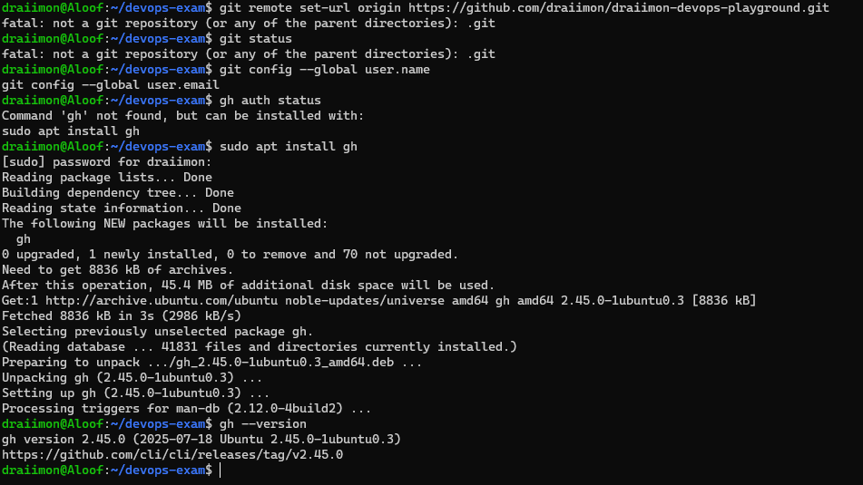

**Screenshot Explanation:** The terminal shows GitHub CLI installation and version verification in the WSL environment. This proves the tool required for repository and Actions work was available.

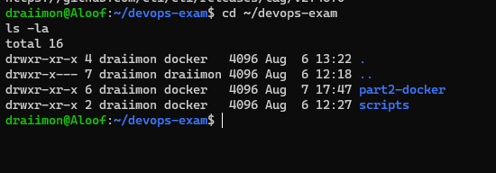

**Screenshot Explanation:** The terminal shows the initial repository directory structure. This proves the candidate confirmed the working location before changing Part 3 files.

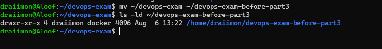

**Screenshot Explanation:** The terminal shows the backup command before the Part 3 reset. This proves the earlier project state was preserved before cleanup.

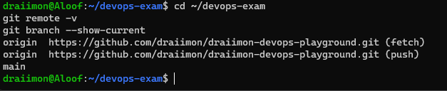

**Screenshot Explanation:** The terminal shows the configured Git remote and current branch. This proves the work was connected to the intended GitHub repository and branch.

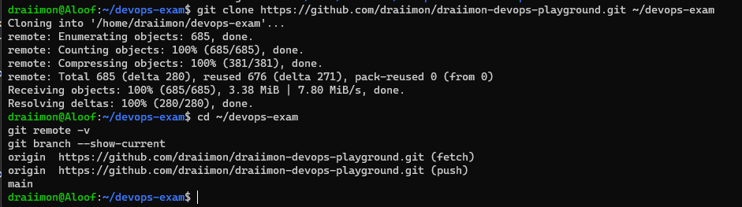

**Screenshot Explanation:** The terminal shows the repository being cloned into a clean working directory. This proves the Part 3 walkthrough started from a fresh checkout.

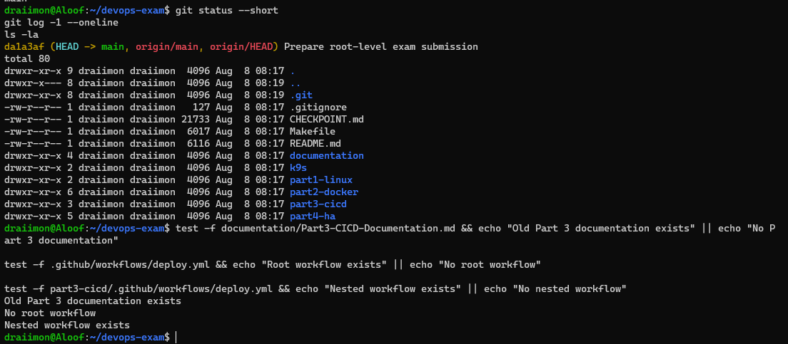

**Screenshot Explanation:** The file listing shows the previous Part 3 files and workflow locations. This proves the old documentation and nested workflow were identified before removal.

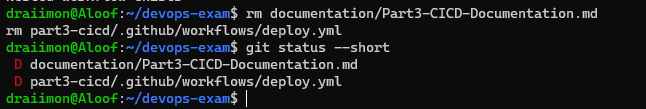

**Screenshot Explanation:** The terminal shows the targeted cleanup of the old Part 3 material. This proves the reset removed only the identified legacy files.

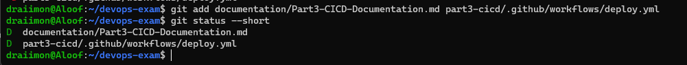

**Screenshot Explanation:** The staged-file check shows the cleanup changes before committing. This proves the candidate reviewed what Git was going to record.

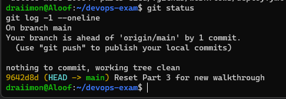

**Screenshot Explanation:** The terminal shows the clean repository status after the reset preparation. This proves no unintended files remained before the new workflow was created.

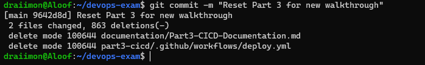

**Screenshot Explanation:** The terminal shows the commit that recorded the Part 3 reset. This proves the cleanup was saved in Git history.

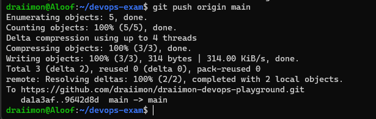

**Screenshot Explanation:** The terminal shows the reset commit being pushed to `main`. This proves the cleaned baseline was synchronized with GitHub.

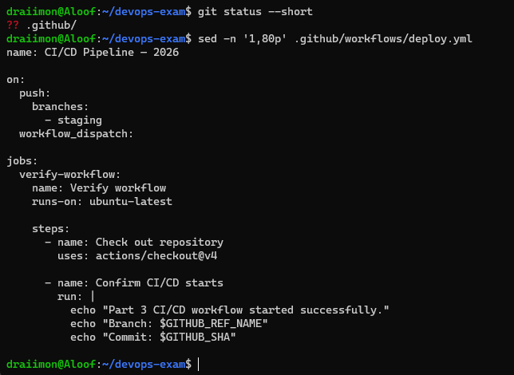

**Screenshot Explanation:** The terminal shows the root `.github/workflows/deploy.yml` being created and inspected. This proves the pipeline was implemented as repository code in the required location.

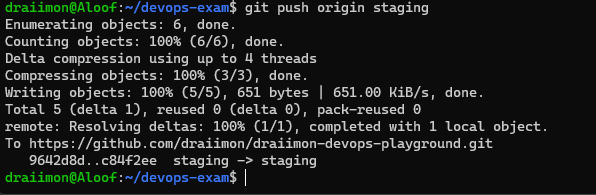

**Screenshot Explanation:** The terminal shows the successful push to the `staging` branch. This is the source-control event that triggers the automatic CI/CD workflow.

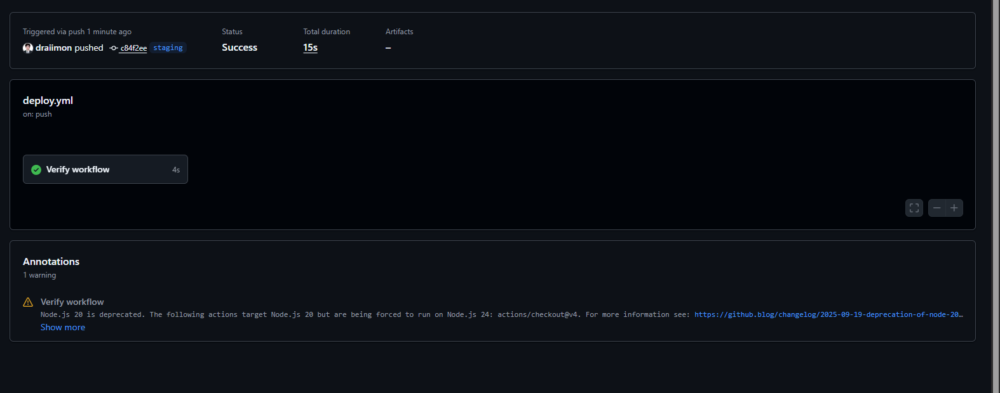

**Screenshot Explanation:** GitHub Actions shows the initial workflow run completed successfully. This proves GitHub accepted and executed the pipeline after the staging push.

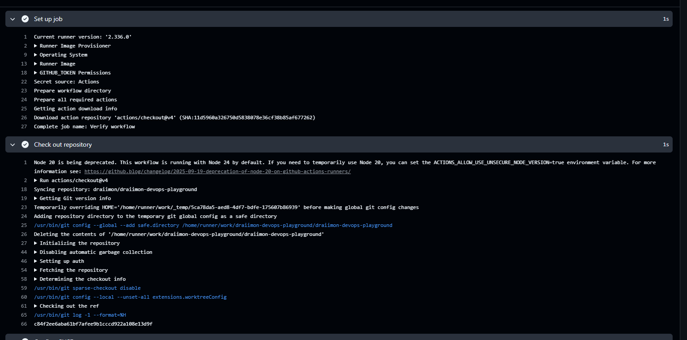

**Screenshot Explanation:** The Actions log shows the repository checkout and verification output. This proves the runner received the intended source and identified the branch and commit.

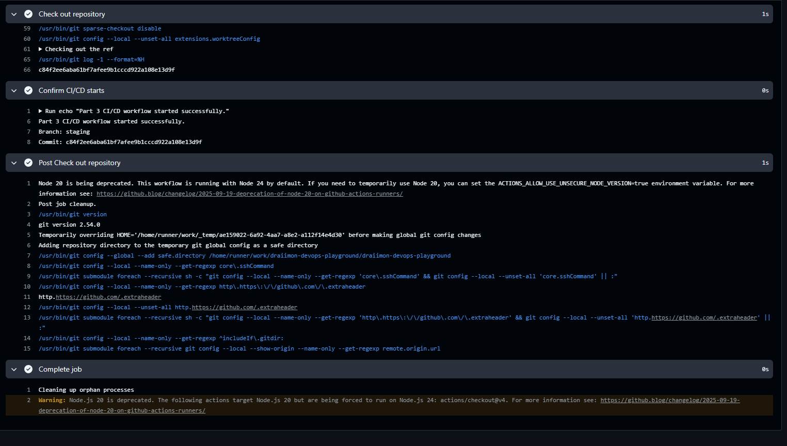

**Screenshot Explanation:** The workflow page confirms the workflow name, staging branch, and successful verification job. This proves the Pipeline-as-Code trigger worked at the workflow level.

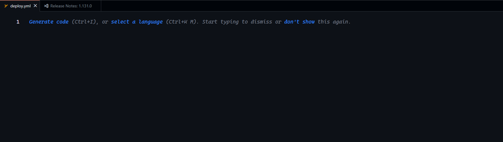

**Screenshot Explanation:** The workflow file is open in the editor before the pipeline changes. This proves the candidate worked on the root workflow file rather than an unrelated copy.

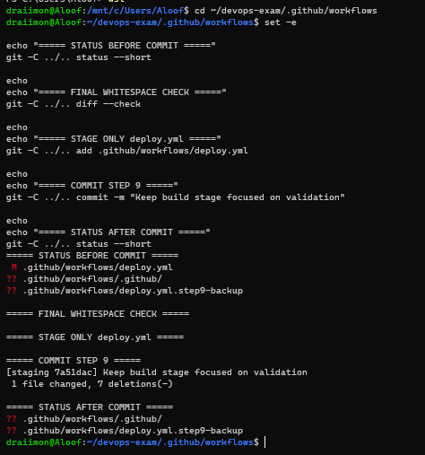

**Screenshot Explanation:** The terminal shows the Step 9 commit and Git status checks. This proves the workflow edit was committed while temporary files remained under review.

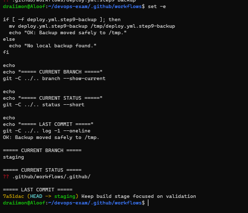

**Screenshot Explanation:** The terminal shows the branch, latest commit, and post-cleanup status. This proves the corrected workflow was saved and the temporary backup was moved outside the repository.

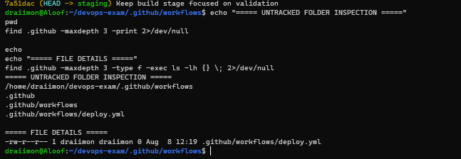

**Screenshot Explanation:** The terminal inspects the accidental nested `.github/workflows` path and its empty file. This proves the candidate verified the untracked path before deleting it.

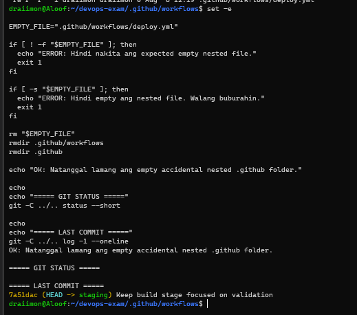

**Screenshot Explanation:** The terminal confirms only the empty accidental nested workflow folder was removed. This proves cleanup was targeted rather than a broad destructive Git clean.

### Task 2 — Build Stage

#### Commands Executed

```bash
docker-compose -f part2-docker/docker-compose.yml config --quiet
docker-compose -f part2-docker/docker-compose.yml build api ui
docker image ls api-app
docker image ls ui-app
```

The GitHub Actions Build job performs the equivalent hosted-runner checks with
`docker compose`, then tags the images with the commit SHA, the branch name,
and `latest` for Docker Hub publishing.

#### Output

```text
Successfully built api-app
Successfully tagged api-app:latest
Successfully built ui-app
Successfully tagged ui-app:latest
GitHub Actions: Build Docker images — Success
```

#### Explanation

Compose validation checks that the service definitions and Dockerfiles can be
parsed. The API and UI are built from the real cloned application source. The
commit-SHA tag provides an immutable release reference, while the `staging` and
`latest` tags support environment deployment and the current release.

#### 📸 Screenshots

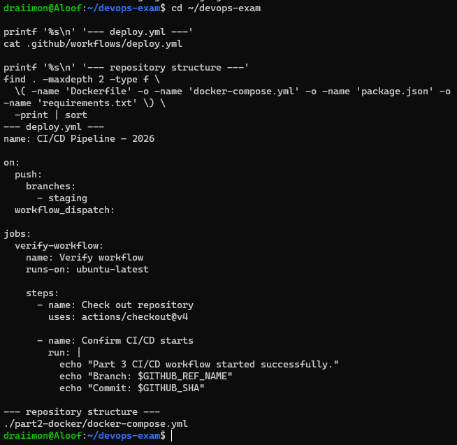

**Screenshot Explanation:** The terminal shows the first local inspection of `deploy.yml`. This proves the workflow structure was reviewed before adding later pipeline stages.

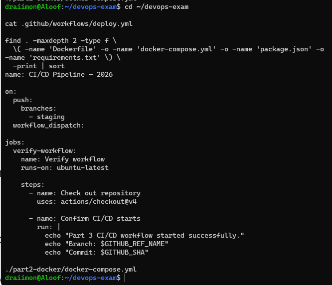

**Screenshot Explanation:** The second inspection shows the workflow after an edit or review pass. This proves the candidate checked the YAML structure incrementally.

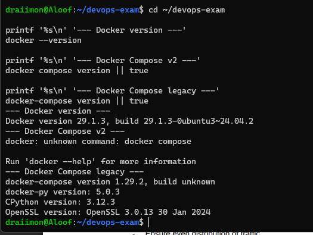

**Screenshot Explanation:** The terminal shows the local Docker and legacy Compose versions. This explains why local validation used `docker-compose` while GitHub Actions used `docker compose`.

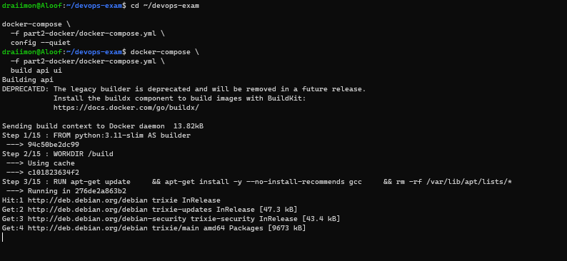

**Screenshot Explanation:** The terminal shows the API and UI image build progress. This proves both application images were built from the project Docker configuration.

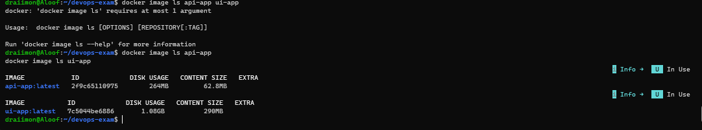

**Screenshot Explanation:** The terminal lists the resulting local API and UI images. This proves the local Build Stage produced the expected image tags.

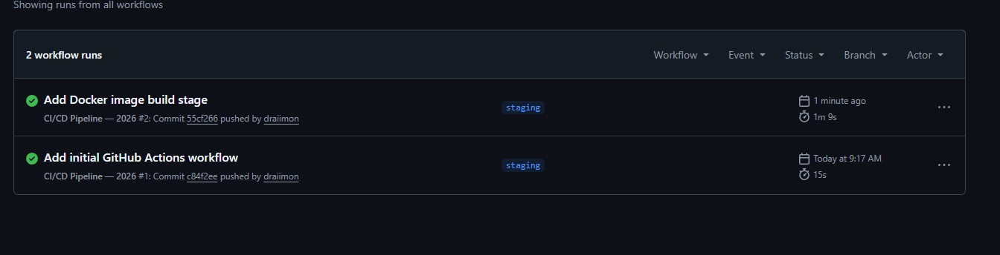

**Screenshot Explanation:** GitHub Actions shows the hosted Build job completed successfully. This proves the images could be built on a clean CI runner.

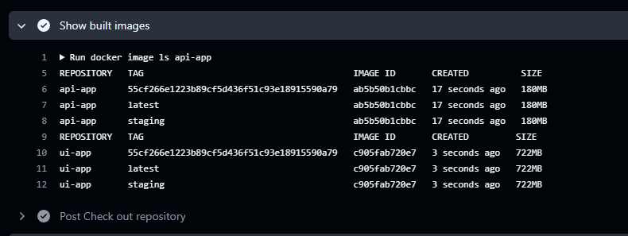

**Screenshot Explanation:** The Build job output shows the API and UI image names and tags. This proves the CI runner produced both required application images.

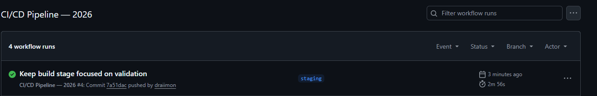

**Screenshot Explanation:** The Actions history shows the successful validation run and its `staging` branch context. This provides an additional record of the completed Build workflow.

### Task 3 — Test Stage

#### Commands Executed

```bash
npm ci
npm run lint
docker compose -f part2-docker/docker-compose.yml up -d --build db api ui
curl -fsS http://localhost:8000/
curl -fsS http://localhost:8000/trip
curl -fsS http://localhost:3000/
docker compose -f part2-docker/docker-compose.yml ps
docker compose -f part2-docker/docker-compose.yml down -v
```

#### Output

```text
API root endpoint passed.
API trip endpoint passed.
UI root endpoint passed.
Test applications — Success
```

#### Explanation

The Test job installs the locked UI dependencies and runs linting. It then
starts the real API, UI, and MySQL services, waits for the applications to
become ready, checks the API root and database-backed `/trip` endpoint, checks
the UI root page, prints service status, and cleans up the temporary containers,
network, and database volume. A failing command returns a non-zero status and
fails the job.

The Docker image security scan is optional in the exam brief. It was not added,
so it is clearly recorded as optional rather than represented as a completed
test.

#### 📸 Screenshots

- [Raw Test-stage output](evidence/part3/task13-test-stage-output.txt)

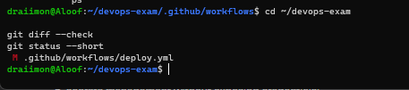

**Screenshot Explanation:** The terminal shows the workflow state before the Test Stage was finalized. This documents the validation checkpoint used before pushing the next workflow change.

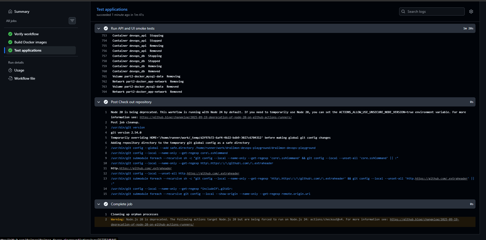

**Screenshot Explanation:** The Test job log shows containers, volumes, and networks being stopped and removed. This proves the CI test environment cleaned itself after validation.

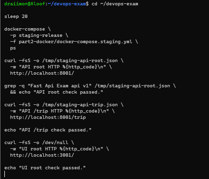

**Screenshot Explanation:** The terminal shows the API root, API `/trip`, and UI smoke-test commands used against staging. This proves the deployed services were checked through their HTTP endpoints.


**Screenshot Explanation:** The wide Actions log view shows the Test job cleanup and post-checkout steps completing successfully. This provides a second detailed view of clean runner teardown.

### Task 4 — Deploy Stage

#### Commands Executed

```bash
docker login
docker tag api-app:latest draiimon112/devops-api:${GITHUB_SHA}
docker tag ui-app:latest draiimon112/devops-ui:${GITHUB_SHA}
docker push draiimon112/devops-api:${GITHUB_SHA}
docker push draiimon112/devops-ui:${GITHUB_SHA}
docker-compose -p staging-release \
  -f part2-docker/docker-compose.staging.yml up -d
docker-compose -p staging-release \
  -f part2-docker/docker-compose.staging.yml ps
```

GitHub Actions performs the registry login through the encrypted
`DOCKERHUB_USERNAME` and `DOCKERHUB_TOKEN` secrets. The deploy job rebuilds the
images on its fresh runner, pushes the commit-SHA, `staging`, and `latest`
tags, and runs after the successful Test job.

#### Output

```text
Login Succeeded!
API image: draiimon112/devops-api:staging
UI image: draiimon112/devops-ui:staging
devops_staging_api   Up (healthy)
devops_staging_db    Up (healthy)
devops_staging_ui    Up (healthy)
```

#### Explanation

Docker Hub is the container registry and the separate staging Compose project
runs the published `:staging` images rather than local source-built images.
Commit-SHA tags provide the rollback target. If a release is unhealthy, the
last known-good commit-SHA tags can be selected, the staging services restarted,
and the API/UI smoke tests rerun. A live rollback exercise was not performed,
so the rollback item is documented as a strategy rather than claimed as a
tested event.

#### 📸 Screenshots

- [Detailed Docker Hub push log](../attached_assets/Pasted-Current-runner-version-2-336-0-Runner-Image-Provisioner_1786164927904.txt)

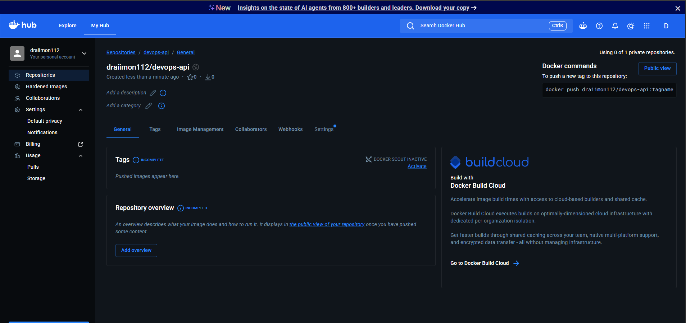

**Screenshot Explanation:** Docker Hub shows the `devops-api` repository under the candidate namespace. This proves the API image had a registry destination.

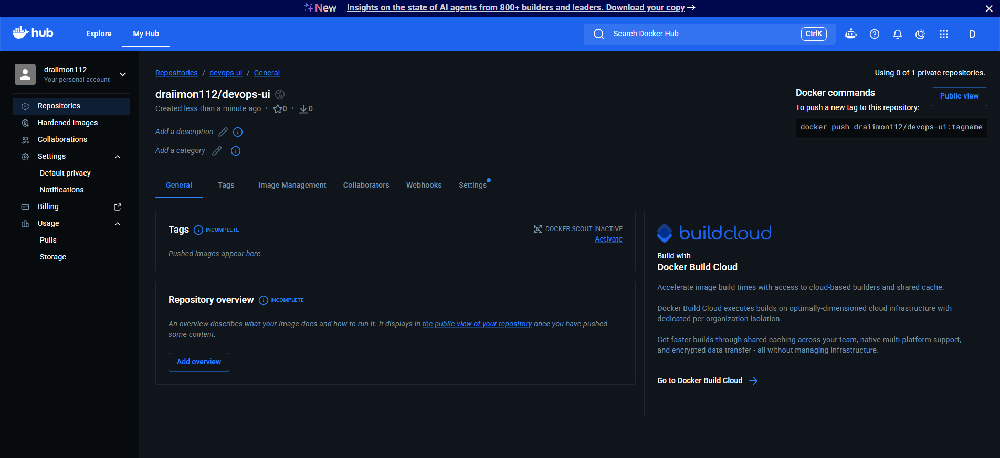

**Screenshot Explanation:** Docker Hub shows the `devops-ui` repository. This proves the UI image had its own registry destination.

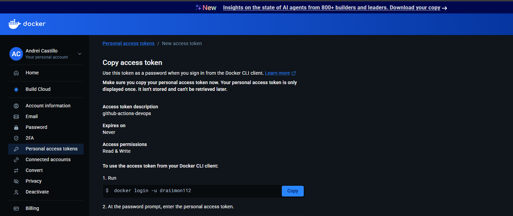

**Screenshot Explanation:** Docker Hub shows the GitHub Actions token description and Read & Write permission. The secret value is not exposed in the screenshot or documentation.

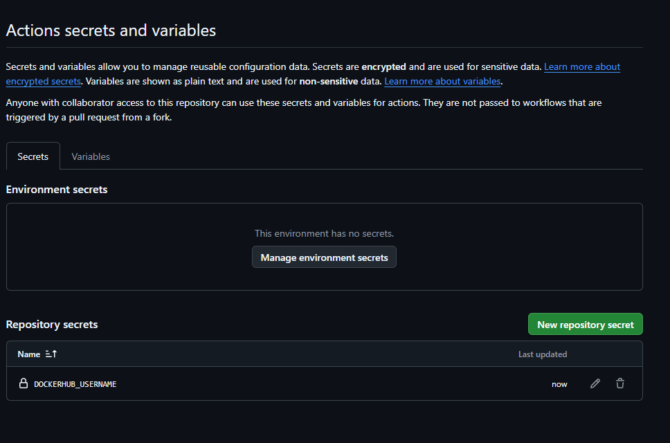

**Screenshot Explanation:** GitHub repository settings show the `DOCKERHUB_USERNAME` secret name. GitHub hides the value, proving the credential was stored without exposing it.

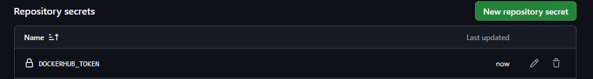

**Screenshot Explanation:** GitHub repository settings show the `DOCKERHUB_TOKEN` secret entry. The token value remains hidden and is not recorded in the project.

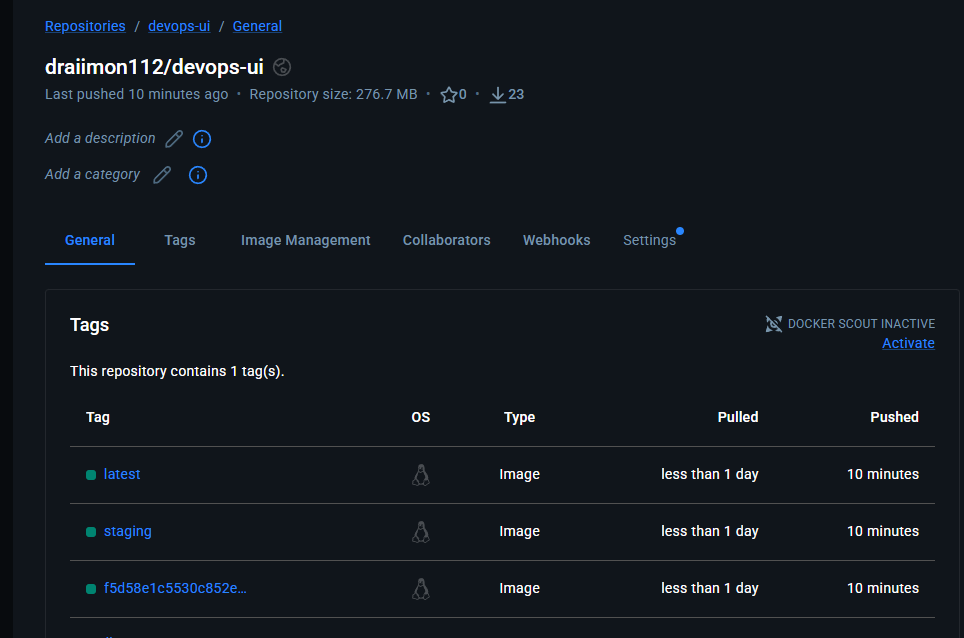

**Screenshot Explanation:** The Docker Hub UI repository shows the published commit, `staging`, and `latest` tags. This proves the UI image was pushed to the registry.

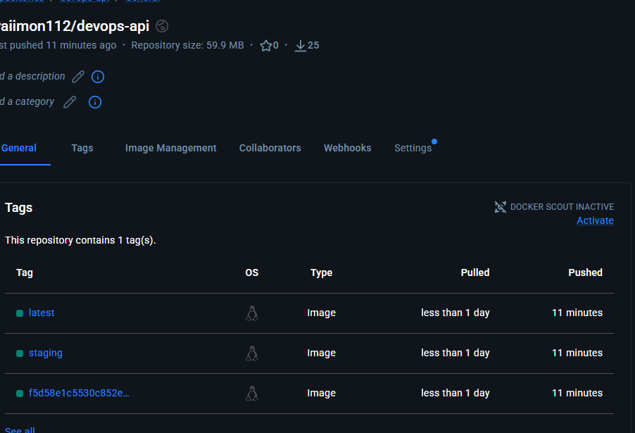

**Screenshot Explanation:** The Docker Hub API repository shows the published commit, `staging`, and `latest` tags. This proves the API image was pushed to the registry.

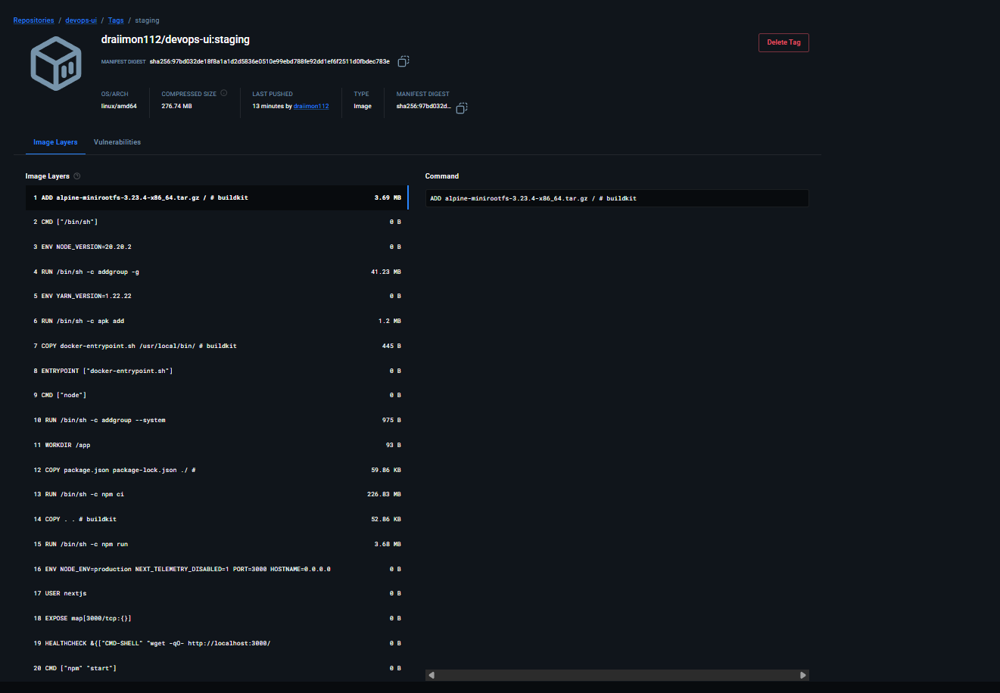

**Screenshot Explanation:** The UI `staging` tag detail page shows its manifest and image-layer information. This provides registry-level detail for the deployed UI artifact.

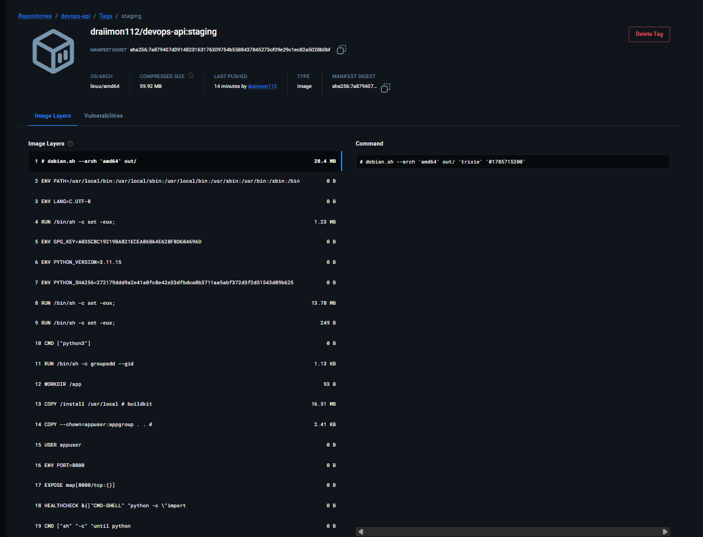

**Screenshot Explanation:** The API `staging` tag detail page shows its manifest and image-layer information. This provides registry-level detail for the deployed API artifact.

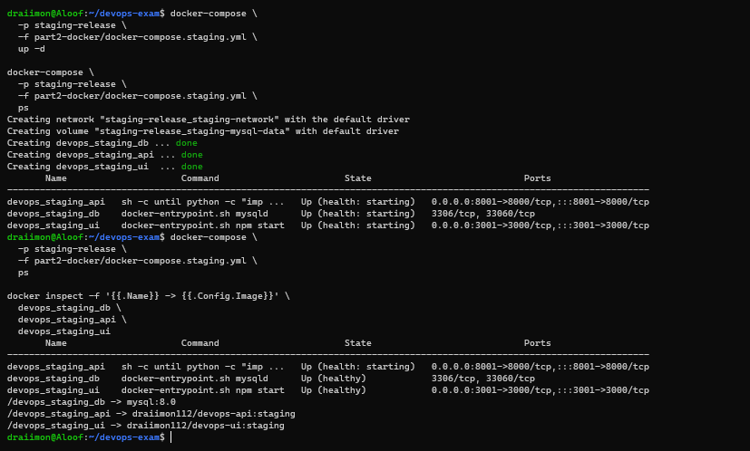

**Screenshot Explanation:** The staging Compose output shows API and UI containers using the Docker Hub `:staging` images alongside MySQL. This proves the runtime used published artifacts rather than only local builds.

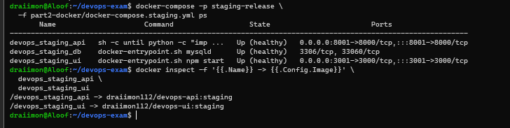

**Screenshot Explanation:** The container status shows the staging services running successfully with the published images. This confirms the staging runtime reached a healthy state.

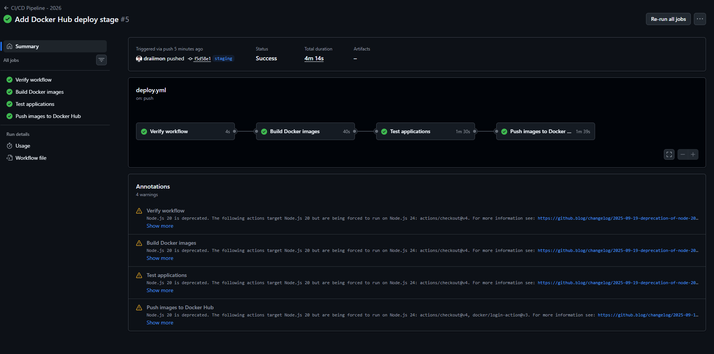

**Screenshot Explanation:** GitHub Actions shows Verify, Build, Test, and Push images to Docker Hub all succeeded. This is the complete CI/CD pipeline success evidence.

### Task 5 — Success Notifications

#### Commands Executed

```text
GitHub Settings
→ Notifications
→ System
→ Actions
→ On GitHub + Email
→ Only notify for failed workflows: unchecked
→ Save
```

The repository workflow was then run from the `staging` branch through
**Actions → CI/CD Pipeline - 2026 → Run workflow**.

#### Output

```text
[draiimon/draiimon-devops-playground] CI/CD Pipeline - 2026,
Attempt #2

CI/CD Pipeline - 2026, Attempt #2: All jobs were successful
Verify workflow — Succeeded in 4 seconds
Build Docker images — Succeeded in 39 seconds
Test applications — Succeeded in 1 minute and 45 seconds
Push images to Docker Hub — Succeeded in 1 minute and 38 seconds
```

#### Explanation

GitHub Actions email notifications are the selected free notification method.
The captured email proves that a successful pipeline notification was delivered
and includes the workflow name and every job result. The notification setting
also enables GitHub notifications. No webhook or credential is stored in the
repository.

No failure simulation is required for this submission. The workflow will not be
intentionally broken just to generate a failure email; the documented evidence
focuses on the successful notification that was actually received.

#### 📸 Screenshots

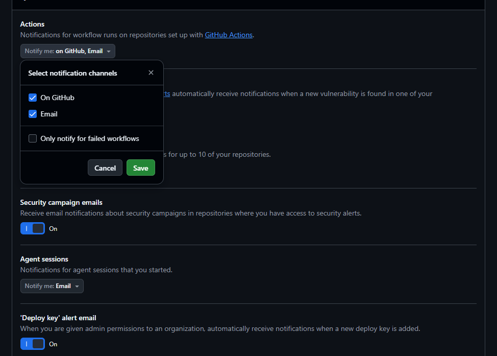

**Screenshot Explanation:** The GitHub notification settings show Actions notifications enabled for GitHub and email. This proves the selected notification channel was configured.

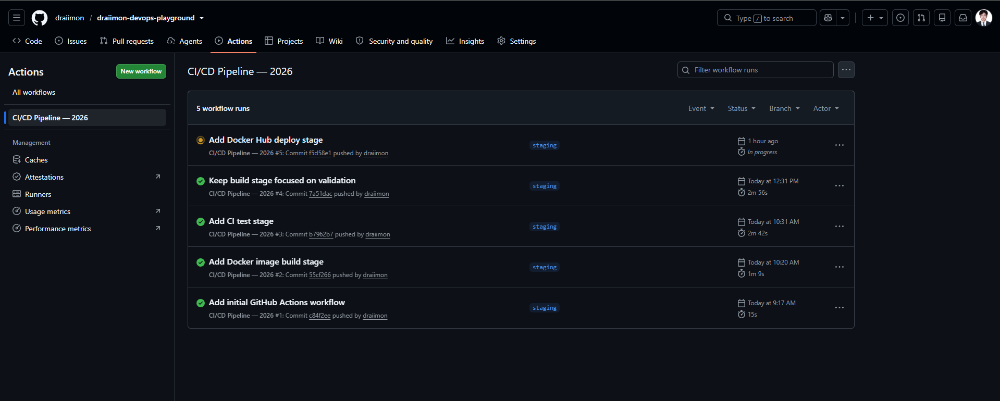

**Screenshot Explanation:** The Actions history shows successful CI/CD runs on the `staging` branch. This connects the notification evidence to an actual repository workflow run.

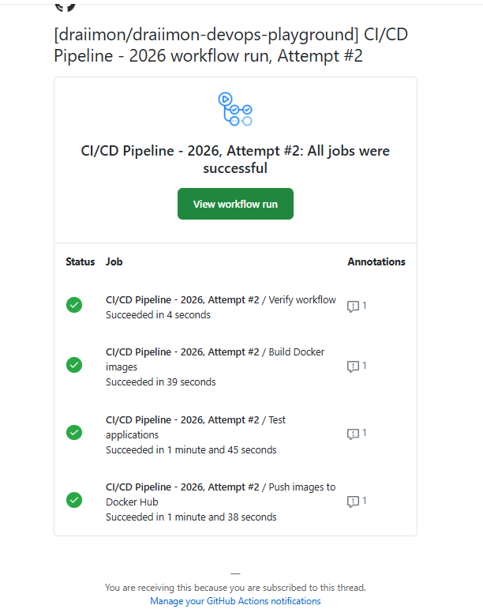

**Screenshot Explanation:** The email view shows the successful GitHub Actions notification for Attempt #2. This proves a successful workflow notification was delivered.

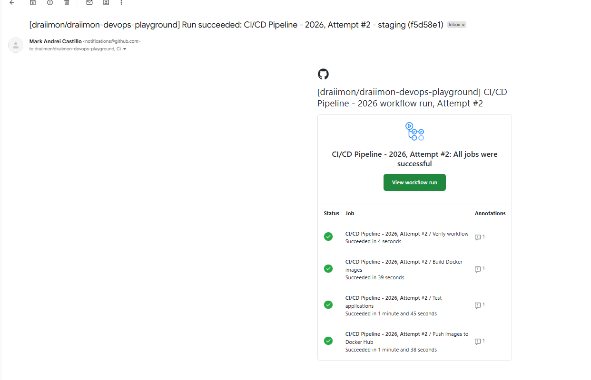

**Screenshot Explanation:** The full GitHub Actions email shows “Run succeeded: CI/CD Pipeline - 2026, Attempt #2” for the `staging` branch. It visibly lists Verify workflow, Build Docker images, Test applications, and Push images to Docker Hub as successful, providing direct email proof of the complete pipeline.

#### Notification status

| Notification requirement | Evidence | Status |
|---|---|---|
| Notification settings | GitHub Actions notifications enabled for GitHub and email | ✅ Confirmed |
| Success notification | GitHub Actions email for Attempt #2 | ✅ Confirmed |
| Failure simulation | Not required for this submission | ➖ Not applicable |

---

| Command | Purpose |
|---|---|
| `git push origin staging` | Pushes the local staging branch to GitHub and triggers Actions |
| `git diff --check` | Checks the diff for whitespace errors |
| `docker-compose ... config --quiet` | Validates the Compose configuration locally |
| `docker compose ... build api ui` | Builds API and UI images on the GitHub runner |
| `docker image tag` | Adds commit-SHA and branch tags to built images |
| `q` in `(END)` | Exits the `less` terminal viewer |

### Docker image listing note

The local command `docker image ls api-app ui-app` returned a usage error
because this Docker version accepts at most one repository argument for
`docker image ls`. This was a command-syntax issue, not a failed image build.
The images can be checked separately:

```bash
docker image ls api-app
docker image ls ui-app
```

Or together with a filtered list:

```bash
docker image ls | grep -E 'REPOSITORY|api-app|ui-app'
```

---

## Submission Status and Remaining Work

### Completed and evidenced

1. Automatic `staging` trigger and optional manual trigger.
2. Pipeline-as-code workflow stored at `.github/workflows/deploy.yml`.
3. API and UI image build, tagging, validation, linting, and smoke tests.
4. Docker Hub registry publishing through encrypted GitHub Secrets.
5. Separate staging runtime using the published `:staging` images.
6. A documented immutable-tag rollback strategy.
7. GitHub Actions success email notification.

### Optional or not performed

1. Optional Docker image security scanning.
2. Testing the rollback procedure against a live staging environment.

Part 3's required pipeline, registry, staging runtime, and success-notification
work are documented with evidence. A failure notification simulation is not
required for this submission and is intentionally not performed. The optional
image scan and live rollback exercise remain clearly separated from the required
completion items.

### Rollback Strategy — Immutable Image Tags

Every successful publish includes an image tag based on the exact
`GITHUB_SHA`, in addition to the moving `staging` and `latest` tags. If a
staging release is unhealthy, the operator should:

1. identify the last known-good commit-SHA tag;
2. update the staging service configuration to use that exact API and UI tag;
3. redeploy or restart the services using those immutable tags;
4. run the API root, API `/trip`, and UI smoke checks;
5. record the failed commit and the restored commit in the deployment log.

This avoids guessing which image was previously deployed. The strategy is
documented and technically supported by the published commit tags, but no live
rollback execution is claimed from the current evidence.

---

## Important Commands and Explanations

| Command | Purpose |
|---|---|
| `git push origin staging` | Pushes the local staging branch to GitHub and triggers Actions |
| `git diff --check` | Checks the diff for whitespace errors |
| `docker-compose ... config --quiet` | Validates the Compose configuration locally |
| `docker compose ... build api ui` | Builds API and UI images on the GitHub runner |
| `docker image tag` | Adds commit-SHA and branch tags to built images |
| `q` in `(END)` | Exits the `less` terminal viewer |

### Docker image listing note

The local command `docker image ls api-app ui-app` returned a usage error
because this Docker version accepts at most one repository argument for
`docker image ls`. This was a command-syntax issue, not a failed image build.
The images can be checked separately:

```bash
docker image ls api-app
docker image ls ui-app
```

Or together with a filtered list:

```bash
docker image ls | grep -E 'REPOSITORY|api-app|ui-app'
```

---

## Screenshot Inventory

All 49 supplied Part 3 screenshot files remain in:

```text
documentation/screenshots/part3/
```

Each screenshot is embedded exactly once in the PDF-aligned Task 1–5
walkthrough above, immediately under the task it evidences, with a
**Screenshot Explanation** directly below it. The separate gallery has been
removed so the document does not duplicate the evidence.

The raw Test Stage output, current workflow baseline, draft workflow review,
and post-correction workflow output remain preserved separately at:

`evidence/part3/task13-test-stage-output.txt`

`evidence/part3/task19-current-workflow-output.txt`

`evidence/part3/task20-workflow-with-dockerhub-push-draft.txt`

`evidence/part3/task21-workflow-after-removing-early-push.txt`