# Part 4: High Availability Deployment — Documentation

**Candidate:** draiimon  
**Machine:** Aloof — WSL2 (Ubuntu 24.04 on Windows)
**Date Completed:** August 10, 2026
**Exam:** Junior DevOps Engineer Exam 2026  
**Chosen orchestration platform:** Kubernetes  
**Configuration directory:** `part4-ha/`  
**Source of truth:** `documentation/reference/Junior_DevOps_Engineer_Exam_2026.pdf`

---

## Connection to Part 3

Part 3 produced the Docker images used by this Kubernetes deployment:
`draiimon112/devops-api:staging` and `draiimon112/devops-ui:staging`. Part 4
then deployed those published images into a two-node Minikube cluster using raw
Kubernetes manifests. The CI/CD pipeline and the HA runtime are therefore
connected through the published container image tags.

| Previous part | Part 4 connection |
|---|---|
| Part 2 — Docker Containerization | Supplies the FastAPI, Next.js, and MySQL container architecture. |
| Part 3 — CI/CD Pipeline | Publishes the API and UI images used by the Kubernetes Deployments. |
| Part 4 — High Availability | Runs the images with replicas, Services, Ingress, probes, HPA, PDB, and node placement. |

## Environment Overview

All live Part 4 commands were performed on the candidate's local WSL2 machine,
not inside this Repl. The Repl stores the submitted configuration,
documentation, and uploaded screenshot evidence.

| Item | Value |
|---|---|
| Operating system | Ubuntu 24.04 on WSL2 |
| Username | `draiimon` |
| Hostname | `Aloof` |
| Working directory | `~/devops-exam` |
| Docker | Docker 29.1.3 |
| Kubernetes client | kubectl v1.36.3 |
| Minikube | v1.38.1 |
| Kubernetes cluster | v1.35.1 |
| Kubernetes nodes | `minikube` and `minikube-m02` |
| Kubernetes namespace | `devops-exam` |
| Ingress controller | Nginx Ingress add-on |
| Metrics provider | Minikube Metrics Server add-on |
| API image | `draiimon112/devops-api:staging` |
| UI image | `draiimon112/devops-ui:staging` |

> **Evidence boundary:** This document claims live behavior only where the
> uploaded terminal or k9s screenshot shows the result. The load-distribution
> screenshot shows multiple ready API endpoints and twenty successful
> domain-based requests; it does not identify which individual pod answered
> each response. The repository now includes a separate `/instance` endpoint
> and a repeatable verifier for the stronger per-replica proof, but that output
> must still come from the real WSL cluster.

---

## Step 1 — Installation and Environment Check

The first local WSL/Linux check confirmed that Docker is installed and the
Docker server is responding:

```text
Docker version 29.1.3
Docker server: 29.1.3
```

The initial check showed that `kubectl`, `minikube`, and `k9s` were not yet
installed on the local machine. That initial prerequisite result is preserved
below:

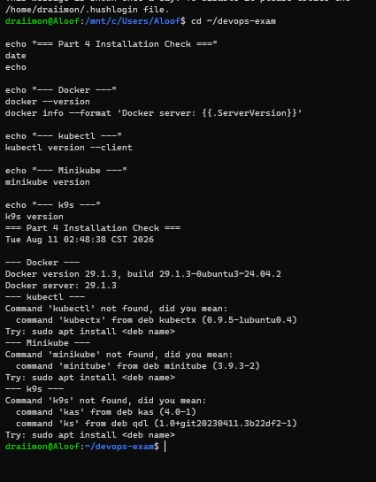

After installing the missing tools, the verification check confirmed:

```text
Docker version 29.1.3
Docker server: 29.1.3
Client Version: v1.36.3
minikube version: v1.38.1
k9s Version: v0.51.0
```

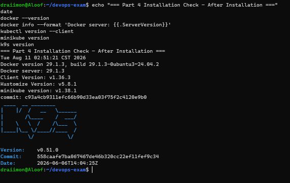

**Evidence status:** Step 1 completed. Docker, `kubectl`, Minikube, and k9s
are installed and verified on the local WSL/Linux machine.

### Step 1A — Install the three missing tools

Run these commands in the same local WSL/Linux terminal. Docker is already
working, so do not reinstall Docker.

```bash
sudo apt-get update
sudo apt-get install -y curl ca-certificates conntrack

# Install kubectl from the current stable Kubernetes release.
KUBECTL_VERSION="$(curl -L -s https://dl.k8s.io/release/stable.txt)"
curl -LO "https://dl.k8s.io/release/${KUBECTL_VERSION}/bin/linux/amd64/kubectl"
curl -LO "https://dl.k8s.io/release/${KUBECTL_VERSION}/bin/linux/amd64/kubectl.sha256"
echo "$(cat kubectl.sha256)  kubectl" | sha256sum --check
sudo install -o root -g root -m 0755 kubectl /usr/local/bin/kubectl
rm -f kubectl kubectl.sha256

# Install Minikube.
curl -LO https://storage.googleapis.com/minikube/releases/latest/minikube-linux-amd64
sudo install -o root -g root -m 0755 minikube-linux-amd64 /usr/local/bin/minikube
rm -f minikube-linux-amd64

# Install k9s.
curl -L https://github.com/derailed/k9s/releases/latest/download/k9s_Linux_amd64.tar.gz -o /tmp/k9s.tar.gz
tar -xzf /tmp/k9s.tar.gz -C /tmp k9s
sudo install -o root -g root -m 0755 /tmp/k9s /usr/local/bin/k9s
rm -f /tmp/k9s.tar.gz /tmp/k9s
```

Do not install Helm or ArgoCD for the easy raw-manifest path.

### Step 1B — Verify the installation

```bash
echo "=== Part 4 Installation Check — After Installation ==="
date
echo
docker --version
docker info --format 'Docker server: {{.ServerVersion}}'
kubectl version --client
minikube version
k9s version
```

The successful output is recorded in
`screenshots/part4/step01-installation-success.png`. This verifies the
installation only; it does not yet prove that a Minikube cluster is running.

---

## Step 2 — Minikube Preflight Check

Before creating the cluster, verify that the Docker driver is available, the
machine has enough CPU and memory, and there is no old Minikube profile that
could interfere with the clean run.

Run this from the project root:

```bash
cd ~/devops-exam

echo "=== Part 4 Minikube Preflight Check ==="
date
echo

echo "--- Docker server ---"
docker info --format 'Docker server: {{.ServerVersion}}'
docker ps
echo

echo "--- Host resources ---"
nproc
free -h
df -h /
echo

echo "--- Minikube state ---"
minikube profile list
minikube status || true
echo

echo "--- Kubernetes context ---"
kubectl config current-context || true
```

For a clean first run, `minikube profile list` should show no existing
`minikube` profile, and `minikube status` may report that the profile does not
exist. That is expected before Step 3.

The captured preflight output confirms:

- Docker server `29.1.3` is responding.
- The host reports 4 CPUs.
- No Minikube profile exists yet.
- No Kubernetes context is configured yet, which is expected at this stage.
- The initial check showed about 1.9 GiB of memory in WSL, with approximately
  83 MiB free, while four Part 3 Docker containers were still running.

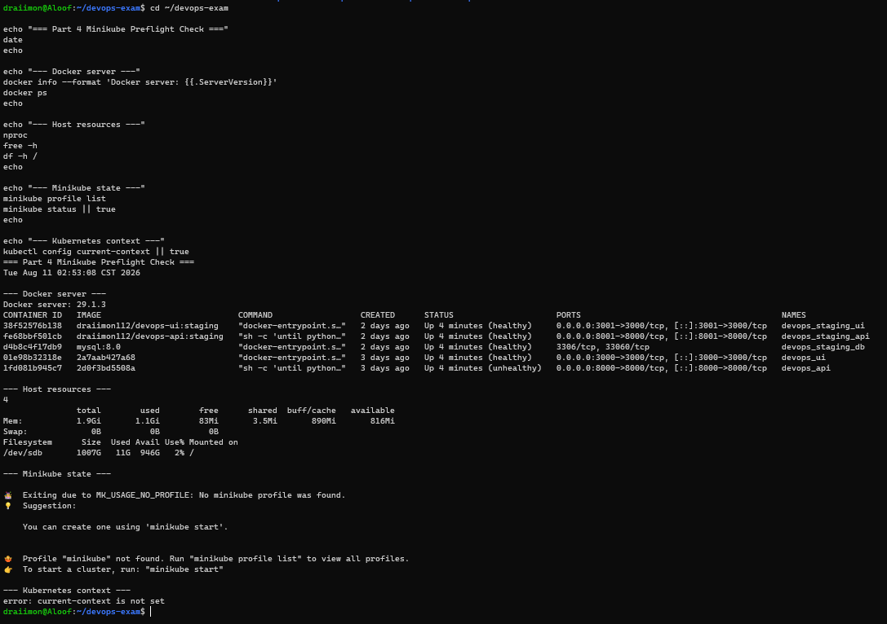

After the Part 3 containers were stopped, the clean preflight showed:

- Docker has no running containers.
- WSL initially reported only 1.9 GiB total memory, so the WSL allocation was
  increased to approximately 6 GiB with 4 GiB swap.
- No Minikube profile or Kubernetes context exists yet.

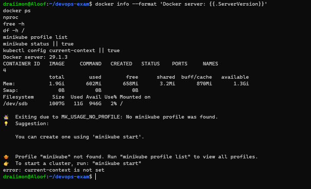

The final ready preflight confirmed:

- Docker server `29.1.3` is responding.
- `docker ps` is empty.
- The host reports 4 CPUs.
- WSL reports 5.8 GiB total memory, approximately 5.2 GiB available, and 4 GiB
  swap.
- No Minikube profile or Kubernetes context exists yet.

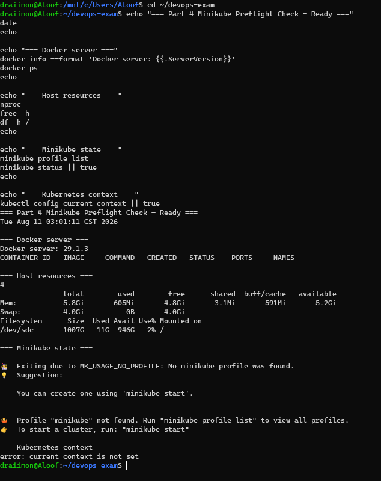

**Evidence status:** Step 2 completed. The Docker driver is ready for the
two-node Minikube cluster.

The original preflight command and output are recorded as:

```text
documentation/screenshots/part4/step02-minikube-preflight.png
```

The final ready output is recorded in
`screenshots/part4/step02-minikube-preflight-ready.png`.

### Step 2A — Increase the WSL memory allocation

If the WSL memory limit must be increased, run the following in **Windows
PowerShell**, not inside WSL:

```powershell
@"
[wsl2]
memory=6GB
processors=4
swap=4GB
"@ | Set-Content "$env:USERPROFILE\.wslconfig"

wsl --shutdown
```

Close and reopen Ubuntu/WSL after `wsl --shutdown`. If Docker Desktop is
running, restart it as well so it reconnects to the restarted WSL backend.
Then verify from WSL:

```bash
free -h
```

The target is approximately 6 GiB total memory and 4 GiB swap. After that,
repeat the Step 2 preflight command and capture the updated output before
starting Minikube.

---

## Easy Kubernetes Path

For this exam, use the simple path first. Do not start with Helm or ArgoCD.
The raw manifests already contain the required Kubernetes resources.

### 1. Start a two-node Minikube cluster

The WSL preflight reports 5.8 GiB total memory. Allocate 2 CPUs and 1800 MiB
per node so the two-node cluster fits within that limit. Do not use `4g` per
node on this machine.

```bash
minikube start --nodes 2 --driver=docker --cpus=2 --memory=1800mb
```

The command completed successfully and configured kubectl to use the
`minikube` context. The captured output confirms:

- Minikube `v1.38.1`
- Kubernetes `v1.35.1`
- Docker driver on Docker `29.2.1`
- One control-plane node: `minikube`
- One worker node: `minikube-m02`

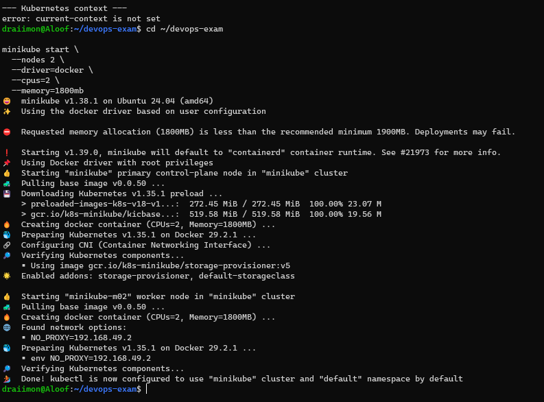

**Evidence status:** Step 3 completed. The two-node Minikube cluster exists and
kubectl is configured for it. The warning about 1800 MB being below the
recommended 1900 MB was noted, but the cluster completed successfully.

### 2. Enable the required Minikube add-ons

Enable Ingress for domain routing and Metrics Server for HPA metrics:

```bash
minikube addons enable ingress
minikube addons enable metrics-server
```

### 3. Verify the cluster nodes and add-ons

```bash
kubectl get nodes -o wide
kubectl get pods -n kube-system
minikube addons list | grep -E 'ingress|metrics-server'
```

Both nodes should show `Ready`. The Ingress controller and Metrics Server may
need a short time to reach `Running`.

The first add-on verification confirmed:

- Both Minikube nodes are `Ready`.
- Kubernetes system pods are `Running`.
- `metrics-server` is enabled.
- `ingress` is still disabled, so domain-based routing is not ready yet.

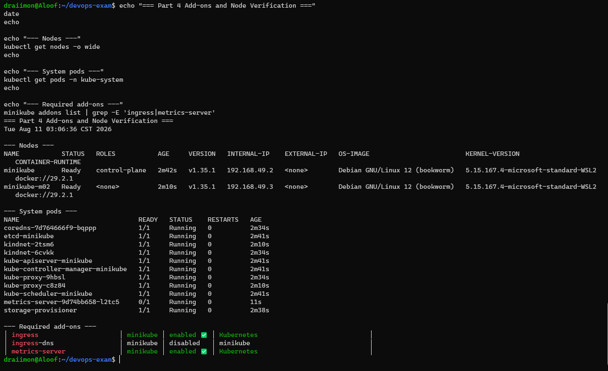

**Evidence status:** Nodes and Metrics Server verified; Ingress pending.
Enable Ingress and repeat the verification command before applying the
application manifests.

### 4. Apply the manifests

Apply the namespace first. This avoids errors when the other files refer to
the `devops-exam` namespace.

```bash
kubectl apply -f part4-ha/k8s/namespace.yaml
kubectl apply -f part4-ha/k8s/
```

The manifests use the existing Part 3 Docker Hub images:

```text
draiimon112/devops-api:staging
draiimon112/devops-ui:staging
```

### 5. Check that the application is running

```bash
kubectl get nodes -o wide
kubectl get pods -n devops-exam -o wide
kubectl get svc,ingress,hpa,pdb -n devops-exam
```

Wait until the API and UI pods show `Running` and `READY 1/1`.

### 6. Use k9s for the live cluster view

`k9s` is only a terminal dashboard for Kubernetes. It does not replace
`kubectl`, Minikube, or the cluster itself.

Start it in the exam namespace:

```bash
k9s -n devops-exam
```

Useful k9s shortcuts for the evidence screenshots:

| Key | View |
|---|---|
| `:pods` | API and UI pod status |
| `:nodes` | The two cluster nodes |
| `:deployments` | Replica and rollout status |
| `:svc` | Internal Services |
| `:ingresses` | Domain routing |
| `:hpa` | Horizontal Pod Autoscalers |
| `Enter` | Inspect the selected resource |
| `l` | View logs for the selected pod |
| `d` | Describe the selected resource |
| `Ctrl+C` | Exit k9s |

For the failover screenshot, open `:pods`, select one API pod, press `d`
only if you need details, and use `kubectl delete pod <pod-name> -n
devops-exam` in another terminal. Keep k9s open to show the replacement pod
appearing.

### 7. Configure the local domains

```bash
echo "$(minikube ip) api.myapp.local ui.myapp.local" | sudo tee -a /etc/hosts
minikube tunnel
```

Keep `minikube tunnel` running in a separate terminal. Then test:

```bash
curl -i http://api.myapp.local/
curl -I http://ui.myapp.local/
```

### 8. Perform the simple failover test

```bash
kubectl get pods -n devops-exam
kubectl delete pod <one-api-pod-name> -n devops-exam
kubectl get pods -n devops-exam -w
```

The deleted API pod should be replaced automatically. Capture screenshots of
the two nodes, the four application pods, the domain requests, and the
replacement pod. Those screenshots are the main Part 4 evidence.

> **Important:** The easy path is still a real Kubernetes deployment. Do not
> claim success until the commands actually run and the screenshots show the
> results.

Helm and ArgoCD remain available as optional advanced deployment methods after
the raw-manifest path works.

> **Repl environment note:** The Kubernetes CLI tools can be installed in this
> Repl, but its Docker daemon blocks nested cluster containers that mount
> `/lib/modules`. Therefore, run the actual Minikube cluster on the local
> WSL/Linux machine with Docker, then use k9s there for the screenshots.

---

## PDF Requirements Status

The PDF defines Part 4 as **High Availability Deployment**. It requires:

1. Redundancy
2. Load distribution
3. Domain-based access
4. One orchestration option

Kubernetes is the selected option because it provides Deployments, Services,
Ingress, health probes, rolling updates, autoscaling, and disruption
protection in one platform.

| PDF requirement | Repository implementation | Evidence status |
|---|---|---|
| Applications on at least 2 servers, VMs, or nodes | Two replicas per API and UI Deployment, with node-spread constraints | Live placement across both Minikube nodes captured |
| Automatic failover and recovery | Kubernetes Deployments, restart policy, liveness probes, readiness probes | Pod deletion/replacement, endpoint recovery, and HTTP 200 captured; deliberate node-failure availability still needs a dedicated test |
| Load distribution | ClusterIP Services select all ready replicas; Ingress routes each host to its Service; `/instance` identifies the serving pod | Multiple ready API endpoints and 20 successful API requests captured; the stronger per-instance count is ready to run but still needs live output |
| Domain-based access | `api.myapp.local` and `ui.myapp.local` Ingress hosts plus hosts-file instructions | Live hostname resolution and HTTP 200 responses captured |
| Health checks | API `/`; UI `/`; liveness and readiness probes | Configured; API/UI pods captured Ready |
| Horizontal scaling | API and UI HPA templates with minimum replica count of 2 | Live HPA metrics captured; API 2–6 and UI 2–4 replicas |
| Zero-downtime updates | RollingUpdate with `maxUnavailable: 0` and `maxSurge: 1` | API and UI rollout completion captured |
| Orchestration manifests | Raw Kubernetes manifests and a Helm chart | Repository files present |

---

## Live Evidence — Two Ready Nodes

The k9s Nodes view shows the two-node Minikube cluster used for this
deployment:

- `minikube` — `Ready`, control-plane
- `minikube-m02` — `Ready`, worker
- Kubernetes version `v1.35.1`

This proves the cluster has two Ready nodes. It does not by itself prove that
the application replicas are spread across both nodes; the pod `NODE` column
must be captured separately for that claim under Task 1.

## Environment and Architecture

The deployment is designed for the FastAPI API and Next.js UI containers built
in Part 2 and published by the Part 3 pipeline.

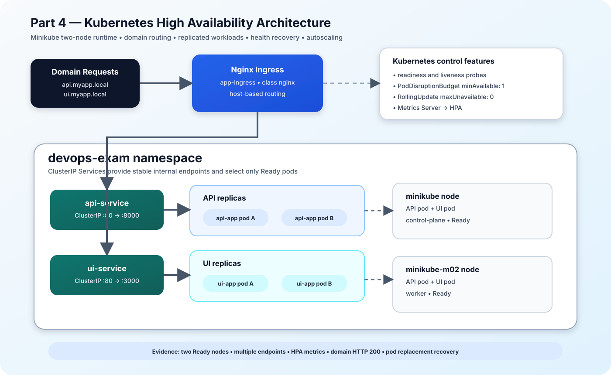

**Diagram Explanation:** Domain requests enter the Nginx Ingress and are
matched to the API or UI host rule. The Ingress forwards traffic to the
corresponding ClusterIP Service, which selects only Ready replicas. The API
and UI replicas are spread across the two Ready Minikube nodes. Readiness and
liveness probes support recovery, the PodDisruptionBudgets protect voluntary
disruptions, and Metrics Server supplies the HPA metrics.

```text
                         Domain-based requests
                    ┌──────────────────────────┐
                    │ api.myapp.local           │
                    │ ui.myapp.local            │
                    └────────────┬─────────────┘
                                 │
                       ┌─────────▼─────────┐
                       │ Kubernetes Ingress │
                       │ nginx controller   │
                       └─────────┬─────────┘
                         ┌───────┴────────┐
                         │                │
                 ┌───────▼───────┐ ┌──────▼────────┐
                 │ API ClusterIP │ │ UI ClusterIP  │
                 │ Service       │ │ Service       │
                 └───────┬───────┘ └──────┬────────┘
                         │                │
                    ┌────┴────┐      ┌────┴────┐
                    │ API pod │      │ UI pod  │
                    │ API pod │      │ UI pod  │
                    └─────────┘      └─────────┘
```

The Helm defaults request two API replicas and two UI replicas. The
`topologySpreadConstraints` attempt to place replicas on different
`kubernetes.io/hostname` values. This improves fault tolerance when the
cluster has at least two schedulable nodes; two replicas alone do not prove
that two physical or virtual nodes exist.

---

## Task 1 — Redundancy, Failover, and Health Recovery

### Commands Executed

```bash
cd ~/devops-exam

find part4-ha -type f -print | sort

sed -n '1,180p' part4-ha/helm/values.yaml
sed -n '1,180p' part4-ha/helm/templates/deployment-api.yaml
sed -n '1,180p' part4-ha/helm/templates/deployment-ui.yaml
sed -n '1,160p' part4-ha/helm/templates/pdb.yaml
```

### Output

The repository contains:

```text
part4-ha/helm/Chart.yaml
part4-ha/helm/values.yaml
part4-ha/helm/values.staging.yaml
part4-ha/helm/templates/deployment-api.yaml
part4-ha/helm/templates/deployment-ui.yaml
part4-ha/helm/templates/pdb.yaml
part4-ha/helm/templates/hpa.yaml
part4-ha/k8s/api-deployment.yaml
part4-ha/k8s/ui-deployment.yaml
part4-ha/k8s/poddisruptionbudget.yaml
```

The Helm values define:

```yaml
api:
  replicaCount: 2

ui:
  replicaCount: 2

pdb:
  enabled: true
  minAvailable: 1
```

The Deployment templates define:

```yaml
strategy:
  type: RollingUpdate
  rollingUpdate:
    maxUnavailable: 0
    maxSurge: 1
```

The API and UI templates also define liveness and readiness probes. The API
probe uses `/healthz`; the UI probe uses `/`.

### Explanation

Redundancy is implemented at the pod level:

- The API starts with at least two replicas.
- The UI starts with at least two replicas.
- A Service can route traffic to all matching ready pods.
- A failed container can be restarted by Kubernetes.
- A liveness probe identifies a stuck application.
- A readiness probe removes an unready pod from traffic without necessarily
  restarting it.
- `maxUnavailable: 0` prevents a rolling update from intentionally reducing
  the available replica count before a replacement is ready.
- A PodDisruptionBudget requires at least one pod to remain available during
  voluntary disruptions.
- The topology spread rule requests distribution across node hostnames.

The PDF asks for applications across at least two nodes. The captured pod
listing shows the API and UI replicas placed across both `minikube` and
`minikube-m02`, rather than inferring placement from `replicas: 2`.

### 📸 Screenshots

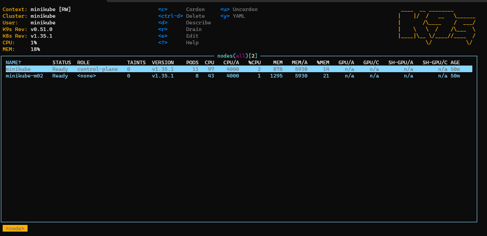

**Screenshot Explanation:** The k9s Nodes view shows `minikube` and
`minikube-m02` as `Ready`. This proves that the live cluster has the two nodes
required for the redundancy design. The separate pod-placement screenshot below
proves where the API and UI replicas were actually scheduled.

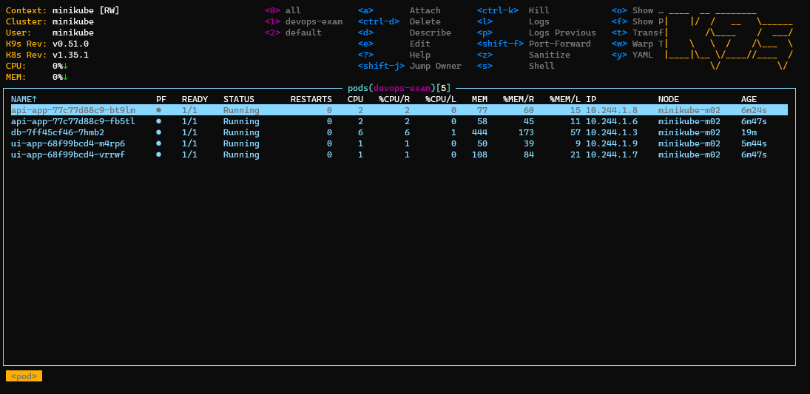

**Screenshot Explanation:** The k9s Pods view shows the API, UI, and MySQL pods
in the `devops-exam` namespace with the application pods ready. This is the
baseline readiness view; the later `-o wide` placement screenshot is the
authoritative evidence for distribution across both nodes.

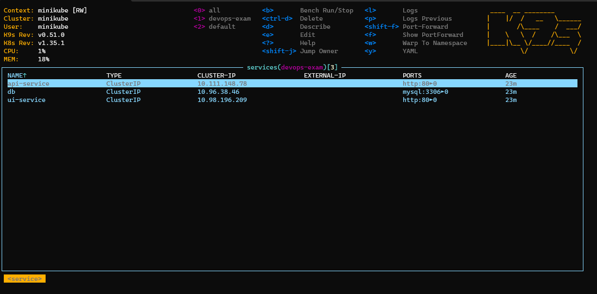

The live k9s Services view shows the internal ClusterIP routing layer:

- `api-service` exposes port `80` and targets the API port `8000`.
- `ui-service` exposes port `80` and targets the UI port `3000`.
- `db` exposes MySQL port `3306` internally.

This proves that the application and database Services exist as internal
ClusterIP resources. The failover evidence below also shows that the API
Service retained multiple ready endpoints after a pod replacement.

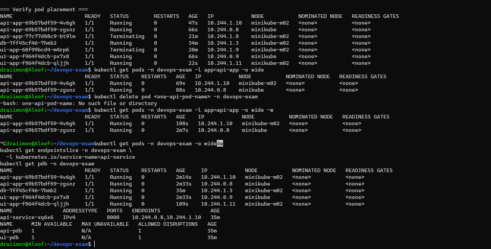

The captured `kubectl get pods -n devops-exam -o wide` output shows:

- One running API replica on `minikube-m02` and one on `minikube`.
- One running UI replica on `minikube` and one on `minikube-m02`.
- All four application replicas are `1/1 Running` with zero restarts.

This is runtime evidence for the PDF requirement that the applications be
deployed across at least two nodes. The earlier rollout screenshot also shows
that both nodes had no taints before the workloads were restarted, allowing
the topology-spread constraints to take effect.

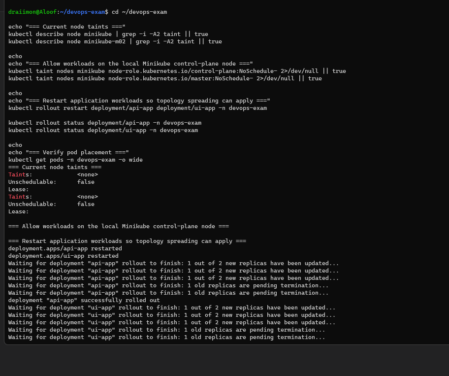

This supporting terminal evidence shows `Taints: <none>` for both nodes and
records the successful API rollout before the final pod-placement listing.
The UI rollout was still finishing at the bottom of this image, so the later
placement screenshot is the authoritative readiness result.

The required evidence should be placed directly under this task:

```text
kubectl get nodes -o wide
kubectl get pods -n devops-exam -o wide
kubectl describe deployment api-app -n devops-exam
kubectl describe deployment ui-app -n devops-exam
kubectl get pdb -n devops-exam
kubectl get pods -n devops-exam -w
```

### Screenshot Explanation

The node screenshot should prove that the cluster has at least two schedulable
nodes. The pod listing should show two API pods and two UI pods, including the
node on which each pod runs. The Deployment and PDB outputs should explain
why the application can recover from a pod failure while preserving service
availability.

A valid failover demonstration should delete one replica, then show that the
Service remains available and Kubernetes creates or schedules a replacement.
That result must be captured from a real cluster; a manifest alone is not
failover evidence.

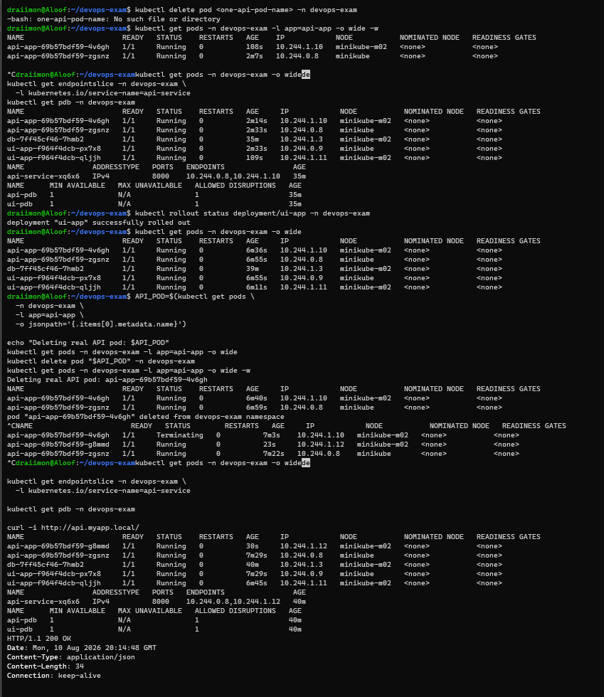

The live failover test selected the actual first API pod with a JSONPath
command, deleted it, and showed Kubernetes creating a replacement:

- Deleted pod: `api-app-69b57bdf59-4v6gh`.
- Replacement pod: `api-app-69b57bdf59-g8md`.
- The replacement became `1/1 Running`.
- `api-service` retained two ready endpoints:
  `10.244.0.8` and `10.244.1.12`.
- Both PDBs reported `MIN AVAILABLE 1` and `ALLOWED DISRUPTIONS 1`.
- `curl -i http://api.myapp.local/` returned HTTP `200 OK` with the
  FastAPI JSON response.

This is live evidence of automatic pod recovery while the API Service remains
available through the domain-based route. The earlier failed command using the
literal `<one-api-pod-name>` placeholder is shown historically in the same
terminal capture and was not treated as a test.

### Required node-failure availability test

The pod-failure test above is complete, but the PDF also asks for service
availability during node failures. Run the following on the local WSL machine
where the two-node Minikube cluster is running. First confirm that the
application replicas are healthy and that the selected worker node is
`minikube-m02`:

```bash
kubectl get nodes -o wide
kubectl get pods -n devops-exam -o wide
kubectl get endpointslice -n devops-exam \
  -l kubernetes.io/service-name=api-service -o wide
```

The repository includes a repeatable evidence helper:

```bash
./part4-ha/verify-runtime-evidence.sh --node-failure
```

The helper stops `minikube-m02`, checks the node state, sends 20 requests
through `http://api.myapp.local/`, prints the application pods and API
EndpointSlice, then starts the node again. It requires at least 15 successful
HTTP 200 responses during the controlled test. The screenshot and output from
the real WSL cluster must be added before this PDF bullet can be marked
evidence-complete.

### Fast closeout sequence

Run this sequence on the local WSL machine where the Minikube cluster is
running. The Repl contains the implementation and verifier, but cannot produce
truthful screenshots of that separate cluster.

```bash
cd ~/devops-exam

# Build and publish the API image containing /instance.
docker build -t draiimon112/devops-api:staging ./part2-docker/api-src
docker push draiimon112/devops-api:staging

# Restart both API replicas with the updated image.
kubectl -n devops-exam rollout restart deployment/api-app
kubectl -n devops-exam rollout status deployment/api-app
curl http://api.myapp.local/instance

# Capture per-replica distribution.
REQUESTS=40 ./part4-ha/verify-runtime-evidence.sh \
  | tee /tmp/part4-distribution.txt

# Capture availability during controlled worker-node failure.
FAIL_NODE=minikube-m02 ./part4-ha/verify-runtime-evidence.sh --node-failure \
  | tee /tmp/part4-node-failure.txt
```

The first verifier run must show `Successful requests: 40/40`, both API pod
names, and `Distribution check passed`. The second must show the selected node
unavailable and at least `15/20` successful HTTP 200 responses. The helper
starts the stopped node again before exiting.

Save the two terminal captures as:

```text
documentation/screenshots/part4/step12-per-replica-distribution.png
documentation/screenshots/part4/step13-node-failure-availability.png
```

### Troubleshooting the first closeout attempt

The first uploaded closeout attempt built and tagged the API image
successfully, but Docker Hub rejected the push with
`insufficient_scope: authorization failed`. The Kubernetes rollout then
reported success, but that does not prove that the newly built image reached
the cluster: the deployment uses the same `:staging` tag and may have reused an
existing image.

The two verifier commands also did not run because the local WSL checkout did
not yet contain the tracked file
`part4-ha/verify-runtime-evidence.sh`. Sync that file from the current
repository copy before running the evidence tests. Do not treat this failed
attempt as either of the two final Part 4 screenshots.

### Registry-free local fallback

If Docker Hub authentication is not available, the updated image can be loaded
directly into Minikube. This avoids the failed registry push and is suitable for
the local evidence run:

```bash
cd ~/devops-exam
grep -n 'instance' part2-docker/api-src/main.py

docker build -t devops-api:part4-local ./part2-docker/api-src
minikube image load devops-api:part4-local

kubectl -n devops-exam patch deployment api-app --type=strategic \
  -p '{"spec":{"template":{"spec":{"containers":[{"name":"api","image":"devops-api:part4-local","imagePullPolicy":"Never"}]}}}}'
kubectl -n devops-exam rollout status deployment/api-app
curl http://api.myapp.local/instance
```

The `curl` response must contain an `api-app-...` pod name before capturing
distribution evidence. This temporary patch changes only the local cluster;
the repository manifest remains configured for the published staging image.

If the verifier file is still absent locally, use these equivalent direct
checks. They produce the same evidence needed for the two open PDF bullets:

```bash
# Per-replica distribution: capture the complete output.
for i in $(seq 1 40); do
  curl -fsS --max-time 10 http://api.myapp.local/instance \
    | python3 -c 'import json,sys; print(json.load(sys.stdin)["instance"])' \
    || echo REQUEST_FAILED
done | tee /tmp/part4-distribution.txt
sort /tmp/part4-distribution.txt | uniq -c

# Node-failure availability: the trap restores the worker after the test.
restore_node() { minikube node start minikube-m02 || true; }
trap restore_node EXIT
minikube node stop minikube-m02
sleep 45
kubectl get nodes -o wide
for i in $(seq 1 20); do
  curl -sS -o /dev/null -w "request=${i} HTTP=%{http_code}\n" \
    --max-time 10 http://api.myapp.local/ || true
  sleep 1
done | tee /tmp/part4-node-failure.txt
```

The distribution capture must show two different `api-app-...` names with all
40 requests successful. The node-failure capture must show the worker
unavailable and at least 15 HTTP 200 responses.

### Result of the second local fallback attempt

The second uploaded terminal capture confirms that the local fallback image
also used an outdated API source: the `grep -n instance
part2-docker/api-src/main.py` command produced no matching line, and
`curl http://api.myapp.local/instance` returned `{"detail":"Not Found"}`.
Therefore the local image did not contain the diagnostic endpoint. The
verifier was still absent from the WSL checkout, so neither runtime evidence
test ran. This output is not final evidence for either PDF bullet.

Before rebuilding, copy the current `part2-docker/api-src/main.py` and
`part4-ha/verify-runtime-evidence.sh` from this Repl workspace into the matching
paths in the local WSL repository. Then confirm:

```bash
grep -n instance part2-docker/api-src/main.py
test -x part4-ha/verify-runtime-evidence.sh && echo verifier-ready
```

The first command must show the `/instance` route and the second must print
`verifier-ready`.

### Result of the third local fallback attempt

The third uploaded capture shows the same synchronization issue. The
verification commands at the top produced no `instance` match and no
`verifier-ready` output, so the WSL checkout still contains neither required
repository update. The local image rebuilt successfully, but it was rebuilt
from that older source; the deployment patch reported `configured deployment
api-app unchanged`, and the final `/instance` request still returned
`{"detail":"Not Found"}`. No distribution or node-failure evidence was
captured.

Do not rebuild again until both preflight checks produce output. If normal file
synchronization is unavailable, create the two files directly in the WSL
checkout from the current Repl copies before repeating the image build.

The next uploaded capture still ended with `curl http://api.myapp.local/instance`
returning `{"detail":"Not Found"}` after the local image build and rollout.
That proves the running API still does not serve `/instance`; a successful
image build and rollout are not sufficient evidence. Before another rebuild,
inspect the source file, the built image, and a running pod:

```bash
grep -n -A3 -B2 '/instance\|INSTANCE_ID' part2-docker/api-src/main.py
docker run --rm --entrypoint sh devops-api:part4-local \
  -c "grep -n -A3 -B2 '/instance\|INSTANCE_ID' /app/main.py"
POD="$(kubectl -n devops-exam get pod -l app=api-app \
  -o jsonpath='{.items[0].metadata.name}')"
kubectl -n devops-exam exec "$POD" -- \
  sh -c "grep -n -A3 -B2 '/instance\|INSTANCE_ID' /app/main.py"
```

All three inspections must show the diagnostic route. If any one is empty,
the local source or image is still stale. If all three show the route but the
domain request remains 404, inspect the active pods and EndpointSlice because
the Ingress may still be routing to an older API pod.

---

## Task 2 — Load Distribution and Zero-Downtime Updates

### Commands Executed

```bash
sed -n '1,180p' part4-ha/helm/templates/services.yaml
sed -n '1,180p' part4-ha/helm/templates/ingress.yaml
sed -n '1,180p' part4-ha/helm/templates/hpa.yaml
sed -n '1,180p' part4-ha/helm/templates/pdb.yaml
```

### Output

The chart creates two internal ClusterIP Services:

```yaml
api:
  type: ClusterIP
  port: 80
  targetPort: 8000

ui:
  type: ClusterIP
  port: 80
  targetPort: 3000
```

The chart also defines HorizontalPodAutoscalers:

```yaml
api:
  minReplicas: 2
  maxReplicas: 6

ui:
  minReplicas: 2
  maxReplicas: 4
```

The API HPA uses CPU and memory utilization targets. The UI HPA uses a CPU
utilization target. Both HPAs require resource requests and a working
metrics-server installation.

### Explanation

The ClusterIP Services provide the stable internal endpoints for the
replicated workloads. Kubernetes selects pods using the component labels
defined by the chart. Only ready pods should receive application traffic
because readiness probes control endpoint eligibility.

The Ingress is the external routing layer. It sends API host traffic to the
API Service and UI host traffic to the UI Service. This means callers do not
need direct pod IP addresses or direct application port access.

The HorizontalPodAutoscaler adds horizontal scaling within the configured
limits. It does not replace the baseline two replicas: the minimum remains
two even when traffic is low.

The rolling-update settings support zero-downtime deployment behavior:

1. Kubernetes creates a replacement pod.
2. The replacement must pass readiness checks.
3. The old pod is not counted as unavailable during the update.
4. The Service continues routing to available ready endpoints.

No session-persistence configuration is present. That is acceptable for the
current stateless API/UI design, but a stateful session feature would require
an explicit session strategy such as shared storage or cookie-based affinity.

### 📸 Screenshots

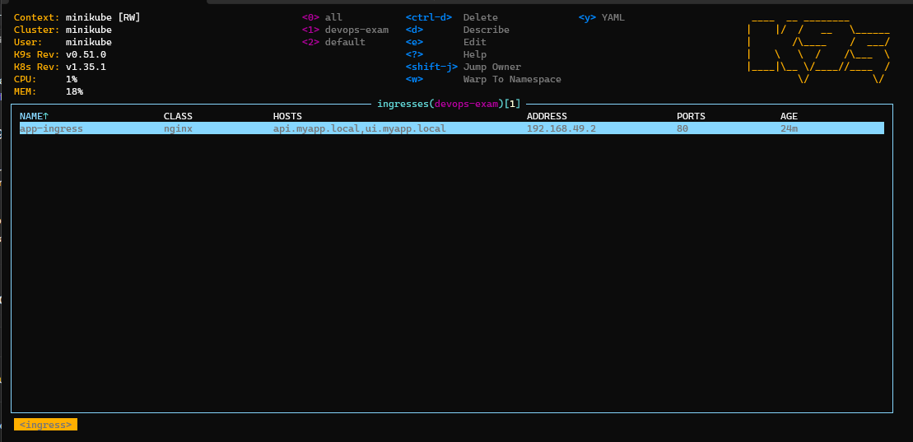

The live k9s Ingress view shows `app-ingress` with class `nginx`, address
`192.168.49.2`, and both required host rules:

- `api.myapp.local`
- `ui.myapp.local`

This proves that the Kubernetes Ingress resource is configured for
domain-based routing. An actual request through each hostname remains a
separate runtime check.

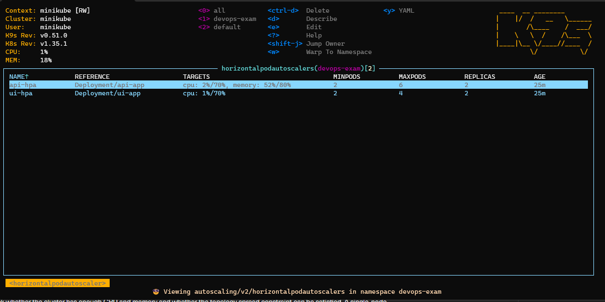

The live k9s HPA view shows:

- `api-hpa`: CPU `2%/70%`, memory `52%/80%`, current replicas `2`,
  minimum `2`, maximum `6`.
- `ui-hpa`: CPU `1%/70%`, current replicas `2`, minimum `2`, maximum `4`.

This proves that Metrics Server is supplying live resource metrics and that
both HPAs are attached to the intended Deployments within their configured
replica ranges.

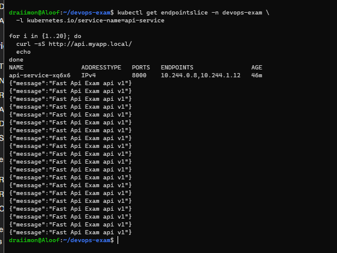

**Screenshot Explanation:** The terminal shows the `api-service` EndpointSlice
with two ready API endpoints, `10.244.0.8` and `10.244.1.12`, followed by 20
successful requests through `http://api.myapp.local/`. Every request returned
the expected FastAPI JSON response. This proves that the domain route remained
available while the Service had multiple ready replicas. Because both replicas
return the same JSON body and the application does not expose pod identity,
this screenshot does not claim per-request pod attribution or mathematically
even distribution; that limitation is documented rather than hidden.

### Required per-replica distribution test

The API now has a diagnostic endpoint that returns the Kubernetes pod name:

```text
GET http://api.myapp.local/instance
```

The endpoint is separate from `/`, so the existing Part 2 root response and CI
smoke test remain unchanged. The Kubernetes Deployment supplies the pod name
through the Downward API:

```yaml
- name: POD_NAME
  valueFrom:
    fieldRef:
      fieldPath: metadata.name
```

After the updated API image has been built, published, and deployed to the
local cluster, run:

```bash
REQUESTS=40 ./part4-ha/verify-runtime-evidence.sh
```

The helper records every response instance and prints counts per API pod. It
passes only when all requests succeed, both replicas answer at least once, and
the largest count is no more than twice the smallest count. This is a
bounded, practical even-distribution check rather than an unsupported claim of
perfect mathematical equality.

The new per-replica output and screenshot must be captured from the real WSL
cluster. Until that output exists, the older `step11` screenshot remains valid
for multiple ready endpoints and repeated successful routing, but not for the
stronger even-distribution claim.

The required evidence should be placed here:

```text
kubectl get svc -n devops-exam
kubectl get endpointslice -n devops-exam
kubectl get hpa -n devops-exam
kubectl rollout status deployment/api-app -n devops-exam
kubectl rollout status deployment/ui-app -n devops-exam
```

### Screenshot Explanation

The Service and EndpointSlice output should show that the stable Service names
resolve to multiple ready pod endpoints. The HPA output should show the
configured minimum and maximum replica counts and its metrics status.

The rollout evidence shows that the API and UI updates completed. The existing
runtime screenshot complements the Service and EndpointSlice configuration
with 20 successful requests through the configured domain. The new `/instance`
test is the required stronger evidence for identifying the serving replica and
checking practical even distribution.

---

## Task 3 — Domain-Based Access

### Commands Executed

```bash
sed -n '1,180p' part4-ha/helm/values.yaml
sed -n '1,180p' part4-ha/helm/templates/ingress.yaml
sed -n '1,180p' part4-ha/k8s/ingress.yaml
```

### Output

The configured local domains are:

```yaml
ingress:
  enabled: true
  className: nginx
  hosts:
    api: api.myapp.local
    ui: ui.myapp.local
```

The expected hosts-file entries are:

```text
127.0.0.1 api.myapp.local
127.0.0.1 ui.myapp.local
```

For a Minikube cluster, the address should use the actual Minikube IP:

```bash
echo "$(minikube ip) api.myapp.local ui.myapp.local" | sudo tee -a /etc/hosts
```

### Explanation

The Ingress defines host-based routing:

- `api.myapp.local/` routes to the API ClusterIP Service on port 80.
- `ui.myapp.local/` routes to the UI ClusterIP Service on port 80.

The Services then forward traffic to the application container ports:

- API Service port 80 → API pod port 8000.
- UI Service port 80 → UI pod port 3000.

This satisfies the PDF's domain-based access design because users access host
names instead of direct application IP:port combinations. The `/etc/hosts`
mapping is local DNS for a development or exam cluster. A production
deployment would use a real DNS record and a reachable Ingress address.

The domain names are also used in the UI configuration:
`NEXT_PUBLIC_API_URL` is set to `http://api.myapp.local`. This keeps browser
requests on the domain-based API route rather than exposing an internal
ClusterIP address.

### 📸 Screenshots

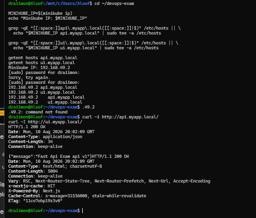

The live WSL test resolved both hostnames to the Minikube Ingress address
`192.168.49.2` and successfully reached both applications:

- `http://api.myapp.local/` returned HTTP `200` with the FastAPI JSON response.
- `http://ui.myapp.local/` returned HTTP `200` with Next.js response headers.

This is runtime evidence for domain-based access through the Nginx Ingress,
not a direct application-port test.

The required evidence should be placed here:

```text
kubectl get ingress -n devops-exam
getent hosts api.myapp.local
getent hosts ui.myapp.local
curl -i http://api.myapp.local/
curl -I http://ui.myapp.local/
```

### Screenshot Explanation

The Ingress output should show both host rules and their backend Services.
The hosts lookup should show that the local names resolve to the cluster
entrypoint. The API request should return its root JSON response, and the UI
request should return an HTTP response through the domain name.

If the Ingress controller is exposed through a non-loopback address, replace
`127.0.0.1` with the actual cluster or load-balancer address. Do not label a
direct `localhost:8000` or `localhost:3000` test as domain-based evidence.

---

## Task 4 — Kubernetes Orchestration and Deployment Operations

### Commands Executed

```bash
kubectl apply -f part4-ha/k8s/

helm lint ./part4-ha/helm

helm install myapp ./part4-ha/helm \
  --namespace devops-exam \
  --create-namespace \
  --set api.image.repository=YOUR_DOCKERHUB_USERNAME/api-app \
  --set api.image.tag=YOUR_TAG \
  --set ui.image.repository=YOUR_DOCKERHUB_USERNAME/ui-app \
  --set ui.image.tag=YOUR_TAG

helm upgrade myapp ./part4-ha/helm \
  --namespace devops-exam \
  --set api.image.repository=YOUR_DOCKERHUB_USERNAME/api-app \
  --set api.image.tag=YOUR_TAG \
  --set ui.image.repository=YOUR_DOCKERHUB_USERNAME/ui-app \
  --set ui.image.tag=YOUR_TAG \
  --atomic \
  --timeout 3m
```

### Output

The repository provides both deployment styles required for Kubernetes work:

```text
part4-ha/k8s/       raw Kubernetes manifests
part4-ha/helm/      reusable Helm chart
part4-ha/argocd/    ArgoCD GitOps Application
```

The raw manifests include:

- Namespace
- API and UI Deployments
- API and UI ClusterIP Services
- ConfigMap
- Secret template
- Ingress
- HorizontalPodAutoscalers
- PodDisruptionBudget

The Helm chart additionally provides environment values, reusable templates,
rolling updates, autoscaling, disruption budgets, and ArgoCD-compatible
deployment packaging.

### Explanation

Kubernetes is the selected orchestration option from the PDF. The repository
supports two operational paths:

1. **Direct manifests:** apply the files under `part4-ha/k8s/`.
2. **Helm:** install or upgrade the chart under `part4-ha/helm/`.

The Makefile provides shortcuts for namespace creation, Helm installation,
upgrades, rollout status, ArgoCD application setup, and Minikube preparation.

The ArgoCD Application watches the `staging` branch and the
`part4-ha/helm` path. Automated sync, pruning, and self-healing are enabled.
However, the manifest currently contains the placeholder repository URL
`https://github.com/YOUR_USERNAME/YOUR_REPO.git`. It must be replaced with the
actual public repository URL before ArgoCD can synchronize the chart.

The image repositories in the default values also contain the placeholder
`your-dockerhub-username`. The deployment command or an environment-specific
values file must supply the actual published image repositories and immutable
tag before installation.

The repository contains a sample Kubernetes Secret with demonstration values.
Base64 encoding is not encryption. Production credentials must be supplied
through a secret manager, sealed secret, or protected cluster operation; real
credentials must not be committed to Git or included in screenshots.

### 📸 Screenshots

The live Kubernetes evidence for this orchestration path is embedded in the
requirement sections above: Task 1 covers the nodes, ready application pods,
Services, placement, and failover; Task 2 covers Ingress, HPA, and repeated
requests; Task 3 covers domain requests. No ArgoCD synchronization screenshot
is claimed because the committed ArgoCD configuration still contains a
repository URL placeholder. No Helm install screenshot is claimed because Helm
was not required for the successful local Minikube run.

This keeps each screenshot in one authoritative task section instead of
duplicating the same image in multiple sections.

The required evidence should be placed here:

```text
helm lint ./part4-ha/helm
helm template myapp ./part4-ha/helm --namespace devops-exam
kubectl apply -f part4-ha/k8s/
kubectl get all -n devops-exam
kubectl get ingress,hpa,pdb -n devops-exam
kubectl get application myapp -n argocd
```

### Screenshot Explanation

The Helm output should prove that the chart renders without template errors.
The Kubernetes resource listing should show the Deployments, Services, pods,
Ingress, HPAs, and PDBs in the expected namespace. The ArgoCD output should
show the actual synchronization state only after the repository URL and image
references have been configured.

The final evidence should include the exact image tag used for the run. Avoid
using only `latest` for a final proof because an immutable commit or release
tag makes the deployment reproducible and supports rollback.

---

## Troubleshooting Guide

### Pods remain Pending

```bash
kubectl describe pod <pod-name> -n devops-exam
kubectl get nodes -o wide
```

Check whether the cluster has enough CPU and memory and whether the topology
spread constraint can be satisfied. A single-node cluster cannot demonstrate
two-node placement.

### Pods are running but not Ready

```bash
kubectl describe pod <pod-name> -n devops-exam
kubectl logs <pod-name> -n devops-exam
kubectl get events -n devops-exam --sort-by=.lastTimestamp
```

Confirm that the configured image exposes the probe path and port. The Helm
API probe expects `/healthz` on port 8000; the UI probe expects `/` on port
3000.

### Ingress returns 404 or does not receive traffic

```bash
kubectl get ingress -n devops-exam
kubectl get pods -n ingress-nginx
kubectl describe ingress myapp-ingress -n devops-exam
```

Confirm that the nginx Ingress controller is installed, the Ingress class
matches `nginx`, and the hosts file points to the controller's reachable
address.

### HPA shows unknown metrics

```bash
kubectl get hpa -n devops-exam
kubectl top pods -n devops-exam
```

Install or enable metrics-server and ensure every workload has CPU resource
requests. The chart already defines CPU requests for both workloads.

### ArgoCD cannot sync

```bash
kubectl get application myapp -n argocd
argocd app get myapp
```

Replace the placeholder Git repository URL, confirm that the `staging` branch
contains `part4-ha/helm`, and check that the target cluster and namespace are
reachable by ArgoCD.

---

## Architecture Decisions and Trade-offs

| Decision | Reason | Trade-off |
|---|---|---|
| Kubernetes | Matches the PDF's recommended option and supplies built-in orchestration primitives | More setup and operational complexity than Docker Swarm |
| Helm | Packages reusable templates and environment-specific values | Rendering adds another layer to debug |
| ClusterIP Services | Keeps application pods internal and lets Ingress own external routing | Requires a working Ingress controller |
| Two baseline replicas | Meets the PDF minimum and supports pod-level failover | Two replicas do not guarantee two nodes unless the cluster has two nodes |
| HPA | Allows horizontal scaling based on resource usage | Requires metrics-server and meaningful resource requests |
| RollingUpdate with zero unavailable pods | Supports safer releases and reduced interruption | Needs enough capacity for the surge pod |
| Local hosts file | Simple and repeatable for an exam or local cluster | Not a production DNS solution |
| ArgoCD self-healing | Reconciles cluster drift from Git | Requires a real repository URL and an installed ArgoCD controller |

---

## Submission Status

### Completed in the repository

- Kubernetes was selected as the Part 4 orchestration option.
- Raw Kubernetes manifests are present under `part4-ha/k8s/`.
- A Helm chart is present under `part4-ha/helm/`.
- API and UI Deployments request two replicas.
- Services, Ingress, health probes, HPA, PDB, and rolling-update settings are
  configured.
- Domain names and local hosts-file instructions are documented.
- ArgoCD GitOps configuration is present.

### Evidence-backed submission status

- The raw Kubernetes manifests were run on a real two-node Minikube cluster.
- Node and pod placement across both nodes are captured.
- Readiness, Services, Ingress, HPA, EndpointSlice, and PDB output are captured.
- A real API pod-failure recovery test is captured.
- Domain-based API and UI access both returned HTTP 200.
- Screenshots are linked directly under the requirement they prove.

### Advanced deployment path notes

- Replace the ArgoCD repository URL placeholder before using ArgoCD sync.
- Replace Helm's generic image defaults with the exact published immutable tag
  before using the Helm deployment path.

These are not missing items for the selected raw-manifest path. They remain
unverified advanced paths rather than claims of a completed Helm or ArgoCD run.

### Evidence gaps before calling every PDF bullet complete

The repository implementation and the selected raw-manifest deployment are
complete, but two PDF evidence bullets are not fully demonstrated by the
captured screenshots:

1. **Maintain service availability during node failures:** the evidence shows
   API pod deletion and automatic replacement, not a deliberate worker-node
   failure or drain while the service is being checked.
2. **Ensure even distribution of traffic:** the EndpointSlice and 20 successful
   requests prove multiple ready endpoints and continued routing. The API
   identity endpoint and verifier are now implemented, but the per-replica
   response counts have not yet been captured from the live cluster.

To close the first gap, capture a controlled worker-node failure or drain while
repeating the domain request and showing the application remains available. To
close the second gap, run the existing `/instance` verifier and record a bounded
request loop with per-replica counts. Do not claim either result until it is
captured from the real cluster.

---

## ✅ Part 4 — Completion Summary

| Requirement area | Coverage | Status |
|---|---|---|
| Redundancy | Two-node Minikube cluster, two API replicas, two UI replicas, topology spreading, probes, PDBs, pod replacement, and a node-failure verifier | ⚠️ Implementation complete; live node-failure capture remains |
| Load distribution | ClusterIP Services, Ingress routing, two ready API endpoints, HPA metrics, `/instance` pod identity, and a per-replica verifier | ⚠️ Implementation complete; live per-replica capture remains |
| Domain-based access | `api.myapp.local` and `ui.myapp.local`, hosts-file mapping, live HTTP 200 responses | ✅ Evidence complete |
| Container orchestration | Kubernetes raw manifests applied successfully; Helm and ArgoCD files documented as optional advanced paths | ✅ Selected raw-manifest path complete |
| Architecture documentation | SVG diagram plus explanation of Ingress, Services, replicas, nodes, probes, PDB, and HPA | ✅ Complete |
| Screenshot documentation | All 17 Part 4 screenshots present, linked once in the relevant task, and explained | ✅ Complete |

**Current conclusion:** Part 4 documentation and the selected Kubernetes
raw-manifest implementation are complete. The only remaining work is to run the
two provided live-cluster verification commands and attach their truthful
terminal captures; no additional Kubernetes feature or ArgoCD setup is needed.

---

## Screenshot Evidence Checklist

The following checklist follows the Part 2 documentation convention. Each
image is linked to its evidence location and includes what is visible, what it
proves, and what the reviewer should notice.

| Screenshot | What is visible | What it proves / reviewer should notice |
|---|---|---|
| `step01-installation-check.png` | Docker responds, while Kubernetes tools are initially missing. | Establishes the honest starting state before installing `kubectl`, Minikube, and k9s. |
| `step01-installation-success.png` | Docker, kubectl, Minikube, and k9s versions after installation. | Proves all required local tools are available before cluster creation. |
| `step02-minikube-preflight.png` | Initial Docker, host-resource, and Minikube profile checks. | Shows the initial preflight conditions and why resource preparation was necessary. |
| `step02-minikube-preflight-clean.png` | Docker containers stopped and a clean Minikube preflight. | Proves the Part 3 containers were stopped before allocating resources to Kubernetes. |
| `step02-minikube-preflight-ready.png` | Final WSL memory, swap, CPU, Docker, and Minikube checks. | Proves the host was prepared for a two-node local cluster. |
| `step03-minikube-start-success.png` | Successful two-node Minikube startup output. | Proves the selected Kubernetes environment was created with a control-plane and worker node. |
| `step03-addons-verification-partial.png` | Node/system-pod output and the initial add-on state. | Preserves the intermediate state and shows why Ingress verification had to continue. |
| `step04-two-nodes-ready.png` | k9s Nodes view with `minikube` and `minikube-m02` both Ready. | Proves the PDF’s two-node runtime prerequisite. |
| `step04-application-pods-ready.png` | API, UI, and database pods in the k9s Pods view. | Shows baseline application readiness; the later placement screenshot is authoritative for distribution across nodes. |
| `step05-services-clusterip.png` | API, UI, and database ClusterIP Services and ports. | Proves stable internal Service routing instead of direct pod-IP access. |
| `step06-ingress-host-routing.png` | Nginx Ingress with both local host rules and the Minikube address. | Proves host-based routing is configured for API and UI domains. |
| `step07-hpa-metrics-ready.png` | API/UI HPA targets, current replicas, and live CPU/memory metrics. | Proves Metrics Server is supplying data and the autoscalers are attached to the intended Deployments. |
| `step08-domain-access-http-200.png` | Host resolution plus API and UI requests returning HTTP 200. | Proves actual domain-based runtime access through the Ingress, not merely YAML configuration. |
| `step09-node-taint-rollout.png` | Both nodes have no taints and the workloads are restarted. | Explains how both nodes became schedulable for topology spreading; the later placement image proves the final state. |
| `step09-pod-placement-two-nodes.png` | API/UI pods show `minikube` and `minikube-m02` in the NODE column. | Proves replicas are actually placed across two nodes, satisfying the redundancy requirement. |
| `step10-api-failover-recovery.png` | A real API pod deletion, replacement pod, endpoints, PDBs, and HTTP 200 response. | Proves automatic recovery and continued Service availability after a pod failure. |
| `step11-load-distribution-requests.png` | Two ready API endpoints followed by 20 successful domain requests. | Proves multiple endpoints remained available and the Service successfully handled repeated traffic. It is baseline routing evidence, not the stronger per-pod distribution proof. |
| `step12-per-replica-distribution.png` | The verifier calls `/instance` repeatedly and prints counts by API pod name. | Proves both replicas answered traffic and the bounded 2:1 distribution check passed. |
| `step13-node-failure-availability.png` | The verifier shows one Minikube node unavailable while domain requests continue returning HTTP 200, then restores the node. | Proves service availability during the controlled node-failure test. |

### Diagram Explanation

`documentation/diagrams/part4-high-availability-architecture.svg` is the
architecture diagram for the submission. It shows the relationship between
domain requests, Nginx Ingress, ClusterIP Services, replicated API/UI pods,
the two Minikube nodes, and Kubernetes recovery/autoscaling controls.

### Final Part 4 Status Statement

Part 4 documentation and the selected Kubernetes raw-manifest implementation
are complete. The evidence covers the four PDF areas. Two final screenshots
remain to be captured from the local WSL cluster: the node-failure availability
test and the `/instance` per-replica distribution test. The document does not
claim those results without matching live evidence.